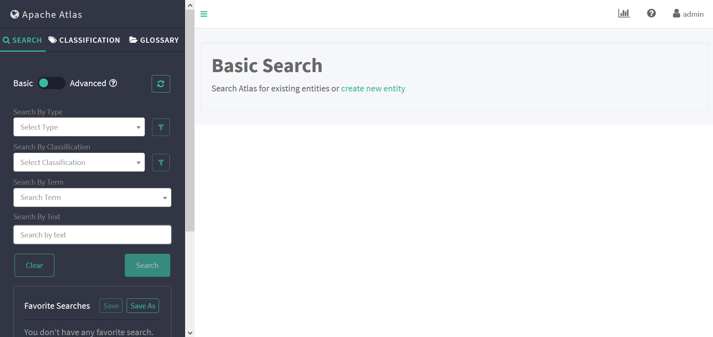
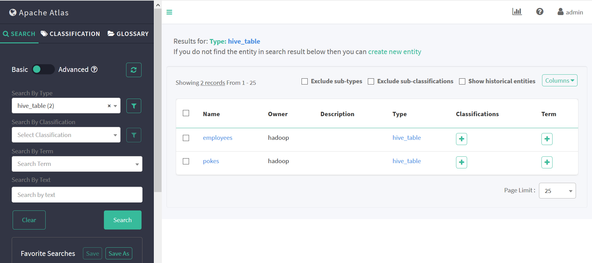
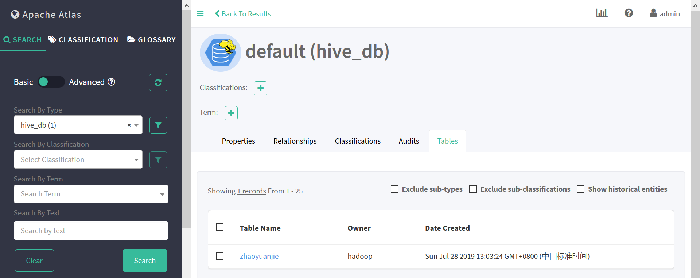

Atlas编译
----------

本次Atlas编译版本为2.0.0，下载地址为https://www.apache.org/dyn/closer.cgi/atlas/2.0.0/apache-atlas-2.0.0-sources.tar.gz

系统环境准备：
1.0 编译操作系统版本为ubuntu 1804，对apt源进行更新。

.. code-block:: console

 root@ubuntu:/home/cecgw# uname -a
 Linux ubuntu 4.15.0-50-generic #54-Ubuntu SMP Mon May 6 18:46:08 UTC 2019 x86_64 x86_64 x86_64 GNU/Linux
 root@ubuntu:/home/cecgw# apt-get update &&dist-upgrade # 对apt源进行更新。
 
.. end

1.1 编译过程中必要的软件包,java,python,npm(5.5.1),maven,node-grunt-cli,node-sass需提前安装好. 

上述版本可通过查看下述文件获取.

.. code-block:: console

	root@ubuntu:~/apache-atlas-sources-2.0.0# vi pom.xml
	
	    <node-for-v2.version>v8.9.0</node-for-v2.version>
        <npm-for-v2.version>5.5.1</npm-for-v2.version>

.. end

安装相关软件指令如下：

.. code-block:: console

	apt-get maven  # 安装maven
	root@ubuntu:/home/cecgw# dpkg -l |grep maven
	ii  maven                                 3.6.0-1~18.04.1                   all          Java software project management and comprehension tool
	-----------------------------------------------
	apt-get install npm # 安装npm
	root@ubuntu:/home/cecgw# node -v
	v8.10.0
	-----------------------------------------------
	npm -g install npm@5.5.1 # 安装npm 指定版本
	
	root@ubuntu:/home/cecgw# npm -v
    5.5.1
	
	npm install --unsafe-perm node-sass # 安装node-sass 主要用于dashboard编译使用.
	-----------------------------------------------
	
	apt install node-grunt-cli # 安装node-grunt-cli，主要用于dashboard编译使用.

.. end

 为提高编译包下载速度，添加maven源。
 
.. code-block:: console
 
 root@ubuntu:/home/cecgw# vi /etc/maven/settings.xml
     <mirrors>
    <!-- mirror
     | Specifies a repository mirror site to use instead of a given repository. The repository that
     | this mirror serves has an ID that matches the mirrorOf element of this mirror. IDs are used
     | for inheritance and direct lookup purposes, and must be unique across the set of mirrors.
     |
    <mirror>
      <id>mirrorId</id>
      <mirrorOf>repositoryId</mirrorOf>
      <name>Human Readable Name for this Mirror.</name>
      <url>http://my.repository.com/repo/path</url>
    </mirror>
     -->
    <mirror>
      <id>aliyun</id>
      <mirrorOf>central</mirrorOf>
      <name>aliyun</name>
      <url>http://maven.aliyun.com/nexus/content/groups/public</url>
    </mirror>
    <mirror>
      <id>UK</id>
      <name>UK Central</name>
      <url>http://uk.maven.org/maven2</url>
      <mirrorOf>central</mirrorOf>
    </mirror>
    <mirror>
      <id>repo2</id>
      <mirrorOf>central</mirrorOf>
      <name>Human Readable Name for this Mirror.</name>
      <url>http://repo2.maven.org/maven2</url>
    </mirror>
    <mirror>
        <id>repo1</id>
        <mirrorOf>central</mirrorOf>
        <name>Human Readable Name for this Mirror.</name>
        <url>http://repo1.maven.org/maven2</url>
    </mirror>
    <mirror>
        <id>repo</id>
        <mirrorOf>central</mirrorOf>
        <name>Human Readable Name for this Mirror.</name>
        <url>http://repo.maven.apache.org/maven2</url>
    </mirror>
  </mirrors>
    <profiles>	
      <profile>
       <id>Hortonworks</id>
      <repositories>
       <repository>
         <id>hortonworks-nexus</id>
         <name>nexus repo</name>
         <url>http://nexus-private.hortonworks.com/nexus/content/groups/public/</url>
       </repository>
      </repositories>
    </profile>
   </profiles>
   
.. end 

1.2 将 apache-atlas-2.0.0-sources.tar.gz 解压到/root目录下，使用root用户进行编译。

1.2.1添加环境变量.

.. code-block:: console

   root@ubuntu:~/apache-atlas-sources-2.0.0# export MAVEN_OPTS="-Xms2g -Xmx2g"

.. end 

1.2.2 编译dashboardv2

   由于dashboardv2项目编译过程中问题较多，我们可先编译dashboardv2项目，再编译其他项目.
   
.. code-block:: console   
   
   root@ubuntu:~/apache-atlas-sources-2.0.0# mvn  -DskipTests package -Pdist -PHortonworks -rf:atlas-dashboardv2
   编译成功后，会显示编译成功信息.   然后修改 atlas文件下 pom.xml文件，将dashboardv2项目模块注释,编译其他模块。
   vi /root/apache-atlas-sources-2.0.0/pom.xml
   
       <modules>
        .....
        <module>repository</module>
        <module>authorization</module>
        <module>dashboardv2</module> #编译成功后，将该行删除.
        <module>webapp</module>
        <module>docs</module>

        <module>addons/hdfs-model</module>
        <module>plugin-classloader</module>
        <module>addons/hive-bridge-shim</module>
        <module>addons/hive-bridge</module>
        <module>addons/falcon-bridge-shim</module>
        <module>addons/falcon-bridge</module>
        <module>addons/sqoop-bridge-shim</module>
        <module>addons/sqoop-bridge</module>
        <module>addons/storm-bridge-shim</module>
        <module>addons/storm-bridge</module>
		......
        </modules>
  
.. end 

1.2.3 编译其他组件.编译过程注意下文note描述.

.. code-block:: console  

	root@ubuntu:~/apache-atlas-sources-2.0.0# mvn clean -DskipTests install 

.. end 

顺利执行完成后，应该会有success状态。

1.2.4 打包文件.

将pom.xml 还原到初始状态，将原本删除的<module>dashboardv2</module>添加. 然后执行.

.. code-block:: console  

	root@ubuntu:~/apache-atlas-sources-2.0.0# mvn  -DskipTests package -Pdist,embedded-hbase-solr #该打包文件包含hbase和solr组件安装包，如果，选择使用自行安装的hbase以及solr请执行 mvn -DskipTests package -Pdist
	[INFO] Apache Atlas Server Build Tools 1.0 ................ SUCCESS [  2.268 s]
	[INFO] apache-atlas 2.0.0 ................................. SUCCESS [  5.547 s]
	[INFO] Apache Atlas Test Utility Tools 2.0.0 .............. SUCCESS [  8.631 s]
	[INFO] Apache Atlas Integration 2.0.0 ..................... SUCCESS [  4.710 s]
	[INFO] Apache Atlas Common 2.0.0 .......................... SUCCESS [  4.063 s]
	[INFO] Apache Atlas Client 2.0.0 .......................... SUCCESS [  0.804 s]
	[INFO] atlas-client-common 2.0.0 .......................... SUCCESS [  1.240 s]
	[INFO] atlas-client-v1 2.0.0 .............................. SUCCESS [  1.006 s]
	[INFO] Apache Atlas Server API 2.0.0 ...................... SUCCESS [  3.351 s]
	[INFO] Apache Atlas Notification 2.0.0 .................... SUCCESS [  5.354 s]
	[INFO] atlas-client-v2 2.0.0 .............................. SUCCESS [  3.755 s]
	[INFO] Apache Atlas Graph Database Projects 2.0.0 ......... SUCCESS [  0.142 s]
	[INFO] Apache Atlas Graph Database API 2.0.0 .............. SUCCESS [  1.545 s]
	[INFO] Graph Database Common Code 2.0.0 ................... SUCCESS [  1.191 s]
	[INFO] Apache Atlas JanusGraph-HBase2 Module 2.0.0 ........ SUCCESS [  2.059 s]
	[INFO] Apache Atlas JanusGraph DB Impl 2.0.0 .............. SUCCESS [  6.928 s]
	[INFO] Apache Atlas Graph Database Implementation Dependencies 2.0.0 SUCCESS [  2.655 s]
	[INFO] Apache Atlas Authorization 2.0.0 ................... SUCCESS [  1.940 s]
	[INFO] Apache Atlas Repository 2.0.0 ...................... SUCCESS [ 14.292 s]
	[INFO] Apache Atlas UI 2.0.0 .............................. SUCCESS [ 41.285 s]
	[INFO] Apache Atlas Web Application 2.0.0 ................. SUCCESS [01:11 min]
	[INFO] Apache Atlas Documentation 2.0.0 ................... SUCCESS [  6.766 s]
	[INFO] Apache Atlas FileSystem Model 2.0.0 ................ SUCCESS [  4.857 s]
	[INFO] Apache Atlas Plugin Classloader 2.0.0 .............. SUCCESS [  1.573 s]
	[INFO] Apache Atlas Hive Bridge Shim 2.0.0 ................ SUCCESS [  5.321 s]
	[INFO] Apache Atlas Hive Bridge 2.0.0 ..................... SUCCESS [ 11.865 s]
	[INFO] Apache Atlas Falcon Bridge Shim 2.0.0 .............. SUCCESS [  2.053 s]
	[INFO] Apache Atlas Falcon Bridge 2.0.0 ................... SUCCESS [  1.518 s]
	[INFO] Apache Atlas Sqoop Bridge Shim 2.0.0 ............... SUCCESS [  0.262 s]
	[INFO] Apache Atlas Sqoop Bridge 2.0.0 .................... SUCCESS [ 11.136 s]
	[INFO] Apache Atlas Storm Bridge Shim 2.0.0 ............... SUCCESS [  0.480 s]
	[INFO] Apache Atlas Storm Bridge 2.0.0 .................... SUCCESS [  3.020 s]
	[INFO] Apache Atlas Hbase Bridge Shim 2.0.0 ............... SUCCESS [  3.116 s]
	[INFO] Apache Atlas Hbase Bridge 2.0.0 .................... SUCCESS [  7.801 s]
	[INFO] Apache HBase - Testing Util 2.0.0 .................. SUCCESS [  5.112 s]
	[INFO] Apache Atlas Kafka Bridge 2.0.0 .................... SUCCESS [  2.390 s]
	[INFO] Apache Atlas Distribution 2.0.0 .................... SUCCESS [08:39 min]
	[INFO] ------------------------------------------------------------------------
	[INFO] BUILD SUCCESS

.. end 

执行完毕后，显示信息如下：

  .. figure:: image/atlas-compile-success.png
   :width: 80%
   :align: center
   :alt: atlas-compile-success

   

.. note::
  1-如果在编译过程中，出现下载不了或者停顿的情况，如若在编译过程中遇到下载不了某些依赖包，可以手动下载后放到指定的目录；也可以暂停编 译，清除（rm -rf）停顿位置的locker文件，再重新从当前步骤编译，编译器会自动从其他源下载。继续编译命令为： mvn compile package assembly:assembly install -DskipTests -Drat.skip=true  -rf :dashboardv2 （继续编译项）
  
  

编译完成后，会在~/apache-atlas-sources-2.0.0/distro/target目录下生成应的tar包。即atlas安装包。

.. code-block:: console

	root@ubuntu:~/apache-atlas-sources-2.0.0/distro/target# ls
	antrun                                 apache-atlas-2.0.0-kafka-hook         archive-tmp             hbase.temp
	apache-atlas-2.0.0-bin                 apache-atlas-2.0.0-kafka-hook.tar.gz  atlas-distro-2.0.0.jar  maven-archiver
	apache-atlas-2.0.0-bin.tar.gz          apache-atlas-2.0.0-server             bin                     maven-shared-archive-resources
	apache-atlas-2.0.0-falcon-hook         apache-atlas-2.0.0-server.tar.gz      checkstyle-cachefile    META-INF
	apache-atlas-2.0.0-falcon-hook.tar.gz  apache-atlas-2.0.0-sources.tar.gz     checkstyle-checker.xml  rat.txt
	apache-atlas-2.0.0-hbase-hook          apache-atlas-2.0.0-sqoop-hook         checkstyle-header.txt   solr
	apache-atlas-2.0.0-hbase-hook.tar.gz   apache-atlas-2.0.0-sqoop-hook.tar.gz  checkstyle-result.xml   solr.temp
	apache-atlas-2.0.0-hive-hook           apache-atlas-2.0.0-storm-hook         conf                    test-classes
	apache-atlas-2.0.0-hive-hook.tar.gz    apache-atlas-2.0.0-storm-hook.tar.gz  hbase

.. end

至此，编译完成，得到部署atlas的基本安装包。

   
1.3 部署拓扑.

.. code-block:: console

                         atlas-server-node             allinone-bigdata-node       kafka-node
	java                        √                              √
	hadoop-namenode                                            √
	hadoop-datanode                                            √
	hive-server2                                               √                          
	hive-metadata                                              √                       
	hive-mysql                                                 √
	solr                        √                        
	zookeeper            √(for solr&&hbase)               √(for bigdata)           √(for kafka)
    kafka                                                                               √
	hbase                       √
	titan                       √
	atlas-hive-hook                                            √
	
.. end

Atlas安装
---------

软件准备：ranger-server端 需要安装python,java,zookeeper.(kafka及其使用的zookeeper可单独机器安装)

1.0 安装java,配置root及cecgw用户java环境变量.(过程略)

1.1 安装kafka,zookeeper.(过程略)

1.3 检查操作系统limits参数，并调整.

.. code-block:: console

	cecgw@ranger-server:/opt/zookeeper-3.4.12/bin$ ulimit -a
	core file size          (blocks, -c) 0
	data seg size           (kbytes, -d) unlimited
	scheduling priority             (-e) 0
	file size               (blocks, -f) unlimited
	pending signals                 (-i) 23753
	max locked memory       (kbytes, -l) 16384
	max memory size         (kbytes, -m) unlimited
	open files                      (-n) 1024
	pipe size            (512 bytes, -p) 8
	POSIX message queues     (bytes, -q) 819200
	real-time priority              (-r) 0
	stack size              (kbytes, -s) 8192
	cpu time               (seconds, -t) unlimited
	max user processes              (-u) 23753
	virtual memory          (kbytes, -v) unlimited
	file locks                      (-x) unlimited

.. end

调整limits参数.

.. code-block:: console

	使用root 用户修改：

	vi /etc/security/limits.conf  #在文件尾添加：
	cecgw soft nofile 65535
	cecgw hard nofile 65535
	cecgw soft nproc 65535
	cecgw hard nproc 65535
	
	vi vi /etc/pam.d/su # 确保如下未被注释
    session    required   pam_limits.so

    退出当前shell,重新使用cecgw用户连入检查.

	Last login: Wed Jul 24 09:33:31 2019 from 192.168.121.1
	cecgw@ranger-server:~$ ulimit -a
	core file size          (blocks, -c) 0
	data seg size           (kbytes, -d) unlimited
	scheduling priority             (-e) 0
	file size               (blocks, -f) unlimited
	pending signals                 (-i) 23753
	max locked memory       (kbytes, -l) 16384
	max memory size         (kbytes, -m) unlimited
	open files                      (-n) 65535
	pipe size            (512 bytes, -p) 8
	POSIX message queues     (bytes, -q) 819200
	real-time priority              (-r) 0
	stack size              (kbytes, -s) 8192
	cpu time               (seconds, -t) unlimited
	max user processes              (-u) 65535
	virtual memory          (kbytes, -v) unlimited
	file locks                      (-x) unlimited

.. end

1.4 解压apache-atlas-2.0.0-server.tar.gz到安装目录.

.. code-block:: console

	root@ubuntu:/opt# tar -xzvf /home/cecgw/apache-atlas-2.0.0-server.tar.gz -C .
	
.. end

1.5 配置atlas-server端配置文件.

.. code-block:: console

	ubuntu@atlas:/opt/apache-atlas-2.0.0/conf$ vi atlas-application.properties 
	ubuntu@atlas:/opt/apache-atlas-2.0.0/conf$ grep -vE  '^#|^$' atlas-application.properties 
	atlas.graph.storage.backend=hbase2
	atlas.graph.storage.hbase.table=apache_atlas_janus
	atlas.graph.storage.hostname=localhost # 选择自带的hbase安装
	atlas.graph.storage.hbase.regions-per-server=1
	atlas.graph.storage.lock.wait-time=10000
	atlas.EntityAuditRepository.impl=org.apache.atlas.repository.audit.HBaseBasedAuditRepository
	atlas.graph.index.search.backend=solr
	atlas.graph.index.search.solr.mode=cloud # 选自带的solr安装.
	atlas.graph.index.search.solr.zookeeper-url=localhost:2181 #自带zookeeper安装
	atlas.graph.index.search.solr.zookeeper-connect-timeout=60000
	atlas.graph.index.search.solr.zookeeper-session-timeout=60000
	atlas.graph.index.search.solr.wait-searcher=true
	atlas.graph.index.search.max-result-set-size=150
	atlas.notification.embedded=false # 不使用自带的kafka
	atlas.kafka.data=${sys:atlas.home}/data/kafka
	atlas.kafka.zookeeper.connect=slaver-4:2181 # kafka 使用的zookeeper节点及端口
	atlas.kafka.bootstrap.servers=slaver-4:9092 # kafka 安装节点
	atlas.kafka.zookeeper.session.timeout.ms=400
	atlas.kafka.zookeeper.connection.timeout.ms=200
	atlas.kafka.zookeeper.sync.time.ms=20
	atlas.kafka.auto.commit.interval.ms=1000
	atlas.kafka.hook.group.id=atlas # kafka group id
	atlas.kafka.enable.auto.commit=true
	atlas.kafka.auto.offset.reset=earliest
	atlas.kafka.session.timeout.ms=30000
	atlas.kafka.offsets.topic.replication.factor=1
	atlas.kafka.poll.timeout.ms=1000
	atlas.notification.create.topics=true
	atlas.notification.replicas=1
	atlas.notification.topics=ATLAS_HOOK,ATLAS_ENTITIES # 日志发现topic以及标签topic
	atlas.notification.log.failed.messages=true
	atlas.notification.consumer.retry.interval=500
	atlas.notification.hook.retry.interval=1000
	atlas.server.http.port=21000 # atlas server端口
	atlas.enableTLS=false
	atlas.authentication.method.kerberos=false
	atlas.authentication.method.file=true
	atlas.authentication.method.ldap.type=none
	atlas.authentication.method.file.filename=${sys:atlas.home}/conf/users-credentials.properties
	atlas.rest.address=http://0.0.0.0:21000
	atlas.audit.hbase.tablename=apache_atlas_entity_audit 
	atlas.audit.zookeeper.session.timeout.ms=1000
	atlas.audit.hbase.zookeeper.quorum=localhost:2181 # hbase zookeeper端口
	atlas.server.ha.enabled=false
	atlas.authorizer.impl=simple
	atlas.authorizer.simple.authz.policy.file=atlas-simple-authz-policy.json
	atlas.rest-csrf.enabled=true
	atlas.rest-csrf.browser-useragents-regex=^Mozilla.*,^Opera.*,^Chrome.*
	atlas.rest-csrf.methods-to-ignore=GET,OPTIONS,HEAD,TRACE
	atlas.rest-csrf.custom-header=X-XSRF-HEADER
	atlas.metric.query.cache.ttlInSecs=900
	atlas.search.gremlin.enable=false
	
	######## Hive Hook Configs ####### 
	atlas.hook.hive.synchronous=false 
	atlas.hook.hive.numRetries=3 
	atlas.hook.hive.queueSize=10000 
	atlas.cluster.name=primary	#需要与atlas-hook 配置一致.
	
.. end

1.6 启动kafka,并创建topic.

1.6.1 启动kafka.

.. code-block:: console

	cecgw@ubuntu:/opt/kafka/bin$ ./kafka-server-start.sh ../config/server.properties 1>/dev/null 2>&1 &
	[1] 38990
	cecgw@ubuntu:/opt/kafka/bin$ ps -aux|grep kafka
	cecgw     38990 74.3  5.2 3147036 321372 pts/1  Sl   13:40   0:08 /usr/lib/jdk/bin/java -Xmx1G -Xms1G -server -XX:+UseG1GC -XX:MaxGCPauseMillis=20 -XX:InitiatingHeapOccupancyPercent=35 -XX:+ExplicitGCInvokesConcurrent -Djava.awt.headless=true -Xloggc:/opt/kafka/bin/../logs/kafkaServer-gc.log -verbose:gc -XX:+PrintGCDetails -XX:+PrintGCDateStamps -XX:+PrintGCTimeStamps -XX:+UseGCLogFileRotation -XX:NumberOfGCLogFiles=10 -XX:GCLogFileSize=100M -Dcom.sun.management.jmxremote -Dcom.sun.management.jmxremote.authenticate=false -Dcom.sun.management.jmxremote.ssl=false -Dkafka.logs.dir=/opt/kafka/bin/../logs -Dlog4j.configuration=file:./../config/log4j.properties -cp .:/usr/lib/jdk/lib:/usr/lib/jdk/jre/lib:/opt/kafka/bin/../libs/aopalliance-repackaged-2.5.0-b32.jar:/opt/kafka/bin/../libs/argparse4j-0.7.0.jar:/opt/kafka/bin/../libs/commons-lang3-3.5.jar:/opt/kafka/bin/../libs/connect-api-1.1.0.jar:/opt/kafka/bin/../libs/connect-file-1.1.0.jar:/opt/kafka/bin/../libs/connect-json-1.1.0.jar:/opt/kafka/bin/../libs/connect-runtime-1.1.0.jar:/opt/kafka/bin/../libs/connect-transforms-1.1.0.jar:/opt/kafka/bin/../libs/guava-20.0.jar:/opt/kafka/bin/../libs/hk2-api-2.5.0-b32.jar:/opt/kafka/bin/../libs/hk2-locator-2.5.0-b32.jar:/opt/kafka/bin/../libs/hk2-utils-2.5.0-b32.jar:/opt/kafka/bin/../libs/jackson-annotations-2.9.4.jar:/opt/kafka/bin/../libs/jackson-core-2.9.4.jar:/opt/kafka/bin/../libs/jackson-databind-2.9.4.jar:/opt/kafka/bin/../libs/jackson-jaxrs-base-2.9.4.jar:/opt/kafka/bin/../libs/jackson-jaxrs-json-provider-2.9.4.jar:/opt/kafka/bin/../libs/jackson-module-jaxb-annotations-2.9.4.jar:/opt/kafka/bin/../libs/javassist-3.20.0-GA.jar:/opt/kafka/bin/../libs/javassist-3.21.0-GA.jar:/opt/kafka/bin/../libs/javax.annotation-api-1.2.jar:/opt/kafka/bin/../libs/javax.inject-1.jar:/opt/kafka/bin/../libs/javax.inject-2.5.0-b32.jar:/opt/kafka/bin/../libs/javax.servlet-api-3.1.0.jar:/opt/kafka/bin/../libs/javax.ws.rs-api-2.0.1.jar:/opt/kafka/bin/../libs/jersey-client-2.25.1.jar:/opt/kafka/bin/../libs/jersey-common-2.25.1.jar:/opt/kafka/bin/../libs/jersey-container-servlet-2.25.1.jar:/opt/kafka/bin/../libs/jersey-container-servlet-core-2.25.1.jar:/opt/kafka/bin/../libs/jersey-guava-2.25.1.jar:/opt/kafka/bin/../libs/jersey-media-jaxb-2.25.1.jar:/opt/kafka/bin/../libs/jersey-server-2.25.1.jar:/opt/kafka/bin/../libs/jetty-client-9.2.24.v20180105.jar:/opt/kafka/bin/../libs/jetty-continuation-9.2.24.v20180105.jar:/opt/kafka/bin/../libs/jetty-http-9.2.24.v20180105.jar:/opt/kafka/bin/../libs/jetty-io-9.2.24.v20180105.jar:/opt/kafka/bin/../libs/jetty-security-9.2.24.v20180105.jar:/opt/kafka/bin/../libs/jetty-server-9.2.24.v20180105.jar:/opt/kafka/bin/../libs/jetty-servlet-9.2.24.v20180105.jar:/opt/kafka/bin/../libs/jetty-servlets-9.2.24.v20180105.jar:/opt/kafka/bin/../libs/jetty-util-9.2.24.v20180105.jar:/opt/kafka/bin/../libs/jopt-simple-5.0.4.jar:/opt/kafka/bin/../libs/kafka_2.12-1.1.0.jar:/opt/kafka/bin/../libs/kafka_2.12-1.1.0-sources.jar:/opt/kafka/bin/../libs/kafka_2.12-1.1.0-test-sources.jar:/opt/kafka/bin/../libs/kafka-clients-1.1.0.jar:/opt/kafka/bin/../libs/kafka-log4j-appender-1.1.0.jar:/opt/kafka/bin/../libs/kafka-streams-1.1.0.jar:/opt/kafka/bin/../libs/kafka-streams-examples-1.1.0.jar:/opt/kafka/bin/../libs/kafka-streams-test-utils-1.1.0.jar:/opt/kafka/bin/../libs/kafka-tools-1.1.0.jar:/opt/kafk/bin/../libs/log4j-1.2.17.jar:/opt/kafka/bin/../libs/lz4-java-1.4.jar:/opt/kafka/bin/../libs/maven-artifact-3.5.2.jar:/opt/kafka/bin/../libs/metrics-core-2.2.0.jar:/opt/kafka/bin/../libs/osgi-resource-locator-1.0.1.jar:/opt/kafka/bin/../libs/plexus-utils-3.1.0.jar:/opt/kafka/bin/../libs/reflections-0.9.11.jar:/opt/kafka/bin/../libs/rocksdbjni-5.7.3.jar:/opt/kafka/bin/../libs/scala-library-2.12.4.jar:/opt/kafka/bin/../libs/scala-logging_2.12-3.7.2.jar:/opt/kafka/bin/../libs/scala-reflect-2.12.4.jar:/opt/kafka/bin/../libs/slf4j-api-1.7.25.jar:/opt/kafka/bin/../libs/slf4j-log4j12-1.7.25.jar:/opt/kafka/bin/../libs/snappy-java-1.1.7.1.jar:/opt/kafka/bin/../libs/validation-api-1.1.0.Final.jar:/opt/kafka/bin/../libs/zkclient-0.10.jar:/opt/kafka/bin/../libs/zookeeper-3.4.10.jar kafka.Kafka ../config/server.properties
	
.. end

1.6.2创建TOPIC-ATLAS_HOOK、TOPIC-ATLAS_ENTITIES并检查状态.

.. code-block:: console

    创建TOPIC-ATLAS_HOOK
	cecgw@ubuntu:/opt/kafka/bin$ ./kafka-topics.sh --create --zookeeper slaver-4:2181 --topic ATLAS_HOOK --replication-factor 1 --partitions 1 
	WARNING: Due to limitations in metric names, topics with a period ('.') or underscore ('_') could collide. To avoid issues it is best to use either, but not both.
	Created topic "ATLAS_HOOK".
	
	创建TOPIC-ATLAS_ENTITIES
	cecgw@ubuntu:/opt/kafka/bin$ ./kafka-topics.sh --create --zookeeper slaver-4:2181 --topic ATLAS_ENTITIES --replication-factor 1 --partitions 1
	WARNING: Due to limitations in metric names, topics with a period ('.') or underscore ('_') could collide. To avoid issues it is best to use either, but not both.
	Created topic "ATLAS_ENTITIES".
		
	检查创建TOPIC状态
	cecgw@ubuntu:/opt/kafka/bin$ ./kafka-topics.sh --zookeeper slaver-4:2181 --list
	ATLAS_ENTITIES
	ATLAS_HOOK

.. end

1.7 合理配置hbase 配置文件.

.. code-block:: console

	ubuntu@atlas:/opt/apache-atlas-2.0.0/hbase/conf$ grep -vE  '^#|^$' hbase-env.sh 
	export HBASE_HEAPSIZE=4G # 根据当前服务器内存配置.
	export HBASE_OPTS="$HBASE_OPTS -XX:+UseConcMarkSweepGC"
	export HBASE_OPTS="$HBASE_OPTS -Xmx4g -Xms4g -Xmn256m -XX:+UseCompressedOops -XX:+UseParNewGC -XX:+UseConcMarkSweepGC  -XX:+CMSClassUnloadingEnabled -XX:+UseCMSCompactAtFullCollection -XX:CMSFullGCsBeforeCompaction=0 -XX:+CMSParallelRemarkEnabled  -XX:CMSInitiatingOccupancyFraction=75 -XX:SoftRefLRUPolicyMSPerMB=0"
	export HBASE_PID_DIR=/opt/apache-atlas-2.0.0/hbase/pid
	export JAVA_HOME=/usr/lib/jdk
	
.. end

1.8 修改文件执行权限，并启动server.(初次启动速度会比较慢，自动创建solr索引以及hbase表结构).

.. code-block:: console

	root@ubuntu:/opt# chown -R cecgw:cecgw apache-atlas-2.0.0/
	cecgw@ubuntu:/opt/apache-atlas-2.0.0/bin$ ./atlas_start.py 
	configured for local hbase.
	hbase started.
	configured for local solr.
	solr started.
	setting up solr collections...
	starting atlas on host localhost
	starting atlas on port 21000
	....................................
	Apache Atlas Server started!!!
	
.. end

启动成功后，可通过 http:21000端口访问，使用admin:admin登录.

1.9 检查kafka消费者信息情况.启动成功后，ATLAS TOPIC 增加一个atlas消费者.

.. code-block:: console

	cecgw@atlas:~$ netstat -anp|grep 9092 # 启动server服务前.
	(Not all processes could be identified, non-owned process info
	 will not be shown, you would have to be root to see it all.)
	tcp6       0      0 :::9092                 :::*                    LISTEN      3512/java           
	tcp6       0      0 192.168.121.130:58548   192.168.121.130:9092    ESTABLISHED 3512/java           
	tcp6       0      0 192.168.121.130:9092    192.168.121.130:58548   ESTABLISHED 3512/java           
	cecgw@atlas:~$ netstat -anp|grep 9092 # 启动server服务后.
	(Not all processes could be identified, non-owned process info
	 will not be shown, you would have to be root to see it all.)
	tcp        0      0 192.168.121.130:59250   192.168.121.130:9092    ESTABLISHED 16371/java          
	tcp        0      0 192.168.121.130:59248   192.168.121.130:9092    ESTABLISHED 16371/java          
	tcp        0      0 192.168.121.130:59254   192.168.121.130:9092    ESTABLISHED 16371/java          
	tcp6       0      0 :::9092                 :::*                    LISTEN      3512/java           
	tcp6       0      0 192.168.121.130:9092    192.168.121.130:59252   ESTABLISHED 3512/java           
	tcp6       0      0 192.168.121.130:9092    192.168.121.130:59248   ESTABLISHED 3512/java           
	tcp6       0      0 192.168.121.130:9092    192.168.121.130:59250   ESTABLISHED 3512/java           
	tcp6       0      0 192.168.121.130:59252   192.168.121.130:9092    ESTABLISHED 3512/java           
	tcp6       0      0 192.168.121.130:9092    192.168.121.130:59254   ESTABLISHED 3512/java  

	cecgw@ubuntu:/opt/kafka/bin$ ./kafka-consumer-groups.sh --new-consumer --bootstrap-server slaver-4:9092 --list ATLAS_HOOK
	The [new-consumer] option is deprecated and will be removed in a future major release.The new consumer is used by default if the [bootstrap-server] option is provided.
	Note: This will not show information about old Zookeeper-based consumers.
	atlas

.. end

.. note::

  注意使用域名解析，否则kafka客户端对broker连接会有问题.或者通过配置kafka config文件解决kafka域名解析问题.

Atlas使用
---------

我们将以hive为例，展示Atlas使用.

前置条件，安装大数据集群.

atlas-hive-hook服务安装及使用
+++++++++++++++++++++++++++++

1.0 在hive-server2节点修改hive配置文件.

.. code-block:: console

	root@ubuntu:/opt/hive/conf# vi hive-site.xml 
	增加文件如下：
	<property>
      <name>hive.exec.post.hooks</name>
      <value>org.apache.atlas.hive.hook.HiveHook</value>
    </property>

.. end

1.1 解压apache-atlas-2.0.0-hive-hook.tar.gz到指定目录.

.. code-block:: console

	tar -xzvf apache-atlas-2.0.0-hive-hook.tar.gz 
	mv apache-atlas-hive-hook-2.0.0/ atlas-hive-hook
	
.. end

1.2 将atlas配置文件拷贝到hive-conf文件目录.

.. code-block:: console

    scp cecgw@xx.xx.xx.xx:/opt/apache-atlas-2.0.0/conf/atlas-application.properties .
    root@ubuntu:/opt/hive/conf# grep -vE  '^#|^$' atlas-application.properties 
	root@ubuntu:/opt/hive/conf# grep -vE  '^#|^$' atlas-application.properties 
	atlas.graph.storage.backend=hbase2
	atlas.graph.storage.hbase.table=apache_atlas_janus
	atlas.graph.storage.hostname=localhost
	atlas.graph.storage.hbase.regions-per-server=1
	atlas.graph.storage.lock.wait-time=10000
	atlas.EntityAuditRepository.impl=org.apache.atlas.repository.audit.HBaseBasedAuditRepository
	atlas.graph.index.search.backend=solr
	atlas.graph.index.search.solr.mode=cloud
	atlas.graph.index.search.solr.zookeeper-url=localhost:2181
	atlas.graph.index.search.solr.zookeeper-connect-timeout=60000
	atlas.graph.index.search.solr.zookeeper-session-timeout=60000
	atlas.graph.index.search.solr.wait-searcher=true
	atlas.graph.index.search.max-result-set-size=150
	atlas.notification.embedded=false
	atlas.kafka.data=/opt/kafka/logs/atlas
	atlas.kafka.zookeeper.connect=atlas:2183
	atlas.kafka.bootstrap.servers=atlas:9092
	atlas.kafka.zookeeper.session.timeout.ms=400
	atlas.kafka.zookeeper.connection.timeout.ms=200
	atlas.kafka.zookeeper.sync.time.ms=20
	atlas.kafka.auto.commit.interval.ms=1000
	atlas.kafka.hook.group.id=atlas
	atlas.kafka.enable.auto.commit=true
	atlas.kafka.auto.offset.reset=earliest
	atlas.kafka.session.timeout.ms=30000
	atlas.kafka.offsets.topic.replication.factor=1
	atlas.kafka.poll.timeout.ms=1000
	atlas.notification.create.topics=true
	atlas.notification.replicas=1
	atlas.notification.topics=ATLAS_HOOK,ATLAS_ENTITIES
	atlas.notification.log.failed.messages=true
	atlas.notification.consumer.retry.interval=500
	atlas.notification.hook.retry.interval=1000
	atlas.enableTLS=false
	atlas.authentication.method.kerberos=false
	atlas.authentication.method.file=true
	atlas.authentication.method.ldap.type=none
	atlas.authentication.method.file.filename=${sys:atlas.home}/conf/users-credentials.properties
	atlas.rest.address=http://atlas:21000
	atlas.audit.hbase.tablename=apache_atlas_entity_audit
	atlas.audit.zookeeper.session.timeout.ms=1000
	atlas.audit.hbase.zookeeper.quorum=localhost:2181
	atlas.server.ha.enabled=false
	atlas.authorizer.impl=simple
	atlas.authorizer.simple.authz.policy.file=atlas-simple-authz-policy.json
	atlas.rest-csrf.enabled=true
	atlas.rest-csrf.browser-useragents-regex=^Mozilla.*,^Opera.*,^Chrome.*
	atlas.rest-csrf.methods-to-ignore=GET,OPTIONS,HEAD,TRACE
	atlas.rest-csrf.custom-header=X-XSRF-HEADER
	atlas.metric.query.cache.ttlInSecs=900
	atlas.search.gremlin.enable=false
	atlas.hook.hive.synchronous=false 
	atlas.hook.hive.numRetries=3 
	atlas.hook.hive.queueSize=10000 
	atlas.cluster.name=primary

.. end

1.3 配置hive-hook文件到hive环境变量。

.. code-block:: console

	root@ubuntu:/opt/hive/conf# vi hive-env.sh
	root@ubuntu:/opt/hive/conf# grep -vE  '^#|^$' hive-env.sh
	HADOOP_HOME=/opt/hadoop-2.7.7
	export JAVA_HOME=/usr/lib/jdk
	export HADOOP_HOME=/opt/hadoop-2.7.7
	export HIVE_AUX_JARS_PATH=/opt/atlas-hive-hook/hook/hive
	

.. end

1.4 修改相关文件权限至hive运行用户权限.

.. code-block:: console

	root@ubuntu:/opt/atlas-hive-hook# chown -R hadoop:hadoop /opt/atlas-hive-hook && ll
	total 16
	drwxr-xr-x  4 hadoop hadoop 4096 Jun  7 17:08 ./
	drwxr-xr-x 15 root   root   4096 Jun 24 09:47 ../
	drwxr-xr-x  3 hadoop hadoop 4096 Jun  1 00:17 hook/
	drwxr-xr-x  2 hadoop hadoop 4096 May 31 21:05 hook-bin/
	

.. end

1.5 重启hive.

.. code-block:: console

	hadoop@ubuntu:/opt/hive/bin$ hive --service metastore 1>/dev/null 2>&1 &
	[1] 7899
	hadoop@ubuntu:/opt/hive/bin$ hive --service hiveserver2 1>/dev/null 2>&1 &
	[2] 7976
	hadoop@ubuntu:/opt/hive/bin$ netstat -anp|grep 10002
	(Not all processes could be identified, non-owned process info
	 will not be shown, you would have to be root to see it all.)
	tcp        0      0 0.0.0.0:10002           0.0.0.0:*               LISTEN      7976/java       
	hadoop@ubuntu:/opt/hive/bin$ 
	hadoop@ubuntu:/opt/hive/bin$ 
	hadoop@ubuntu:/opt/hive/bin$ netstat -anp|grep 10000
	(Not all processes could be identified, non-owned process info
	 will not be shown, you would have to be root to see it all.)
	tcp        0      0 0.0.0.0:10000           0.0.0.0:*               LISTEN      7976/java     

.. end

1.6 验证hive元数据发现功能.

.. code-block:: console

	hadoop@ubuntu:/opt/atlas-hive-hook/hook-bin$ ./import-hive.sh 
	Using Hive configuration directory [/opt/hive/conf]
	Log file for import is /opt/atlas-hive-hook/logs/import-hive.log
	2019-07-25T15:09:48,421 INFO [main] org.apache.atlas.ApplicationProperties - Looking for atlas-application.properties in classpath
	2019-07-25T15:09:48,426 INFO [main] org.apache.atlas.ApplicationProperties - Loading atlas-application.properties from file:/opt/hive/conf/atlas-application.properties
	2019-07-25T15:09:48,485 INFO [main] org.apache.atlas.ApplicationProperties - Using graphdb backend 'janus'
	2019-07-25T15:09:48,491 INFO [main] org.apache.atlas.ApplicationProperties - Using storage backend 'hbase2'
	2019-07-25T15:09:48,491 INFO [main] org.apache.atlas.ApplicationProperties - Using index backend 'solr'
	2019-07-25T15:09:48,492 INFO [main] org.apache.atlas.ApplicationProperties - Setting solr-wait-searcher property 'true'
	2019-07-25T15:09:48,492 INFO [main] org.apache.atlas.ApplicationProperties - Setting index.search.map-name property 'false'
	2019-07-25T15:09:48,492 INFO [main] org.apache.atlas.ApplicationProperties - Property (set to default) atlas.graph.cache.db-cache = true
	2019-07-25T15:09:48,493 INFO [main] org.apache.atlas.ApplicationProperties - Property (set to default) atlas.graph.cache.db-cache-clean-wait = 20
	2019-07-25T15:09:48,493 INFO [main] org.apache.atlas.ApplicationProperties - Property (set to default) atlas.graph.cache.db-cache-size = 0.5
	2019-07-25T15:09:48,493 INFO [main] org.apache.atlas.ApplicationProperties - Property (set to default) atlas.graph.cache.tx-cache-size = 15000
	2019-07-25T15:09:48,493 INFO [main] org.apache.atlas.ApplicationProperties - Property (set to default) atlas.graph.cache.tx-dirty-size = 120
	Enter username for atlas :- admin
	Enter password for atlas :- 
	2019-07-25T15:09:53,868 INFO [main] org.apache.atlas.AtlasBaseClient - Client has only one service URL, will use that for all actions: http://192.168.121.130:21000
	2019-07-25T15:09:53,889 INFO [main] org.apache.hadoop.hive.conf.HiveConf - Found configuration file file:/opt/hive/conf/hive-site.xml
	2019-07-25T15:09:56,900 WARN [main] org.apache.hadoop.util.NativeCodeLoader - Unable to load native-hadoop library for your platform... using builtin-java classes where applicable
	2019-07-25T15:09:57,059 INFO [main] org.apache.hadoop.hive.metastore.HiveMetaStore - 0: Opening raw store with implementation class:org.apache.hadoop.hive.metastore.ObjectStore
	2019-07-25T15:09:57,218 INFO [main] org.apache.hadoop.hive.metastore.ObjectStore - ObjectStore, initialize called
	2019-07-25T15:09:57,583 INFO [main] DataNucleus.Persistence - Property hive.metastore.integral.jdo.pushdown unknown - will be ignored
	2019-07-25T15:09:57,584 INFO [main] DataNucleus.Persistence - Property datanucleus.cache.level2 unknown - will be ignored
	2019-07-25T15:09:59,819 INFO [main] org.apache.hadoop.hive.metastore.ObjectStore - Setting MetaStore object pin classes with hive.metastore.cache.pinobjtypes="Table,StorageDescriptor,SerDeInfo,Partition,Database,Type,FieldSchema,Order"
	2019-07-25T15:10:05,888 INFO [main] org.apache.hadoop.hive.metastore.MetaStoreDirectSql - Using direct SQL, underlying DB is MYSQL
	2019-07-25T15:10:05,890 INFO [main] org.apache.hadoop.hive.metastore.ObjectStore - Initialized ObjectStore
	2019-07-25T15:10:06,154 INFO [main] org.apache.hadoop.hive.metastore.HiveMetaStore - Added admin role in metastore
	2019-07-25T15:10:06,158 INFO [main] org.apache.hadoop.hive.metastore.HiveMetaStore - Added public role in metastore
	2019-07-25T15:10:06,204 INFO [main] org.apache.hadoop.hive.metastore.HiveMetaStore - No user is added in admin role, since config is empty
	2019-07-25T15:10:06,584 INFO [main] org.apache.hadoop.hive.metastore.HiveMetaStore - 0: get_all_functions
	2019-07-25T15:10:06,586 INFO [main] org.apache.hadoop.hive.metastore.HiveMetaStore.audit - ugi=hadoop	ip=unknown-ip-addr	cmd=get_all_functions	
	2019-07-25T15:10:06,597 INFO [main] org.apache.atlas.hive.bridge.HiveMetaStoreBridge - Importing Hive metadata
	2019-07-25T15:10:06,597 INFO [main] org.apache.hadoop.hive.metastore.HiveMetaStore - 0: get_all_databases
	2019-07-25T15:10:06,597 INFO [main] org.apache.hadoop.hive.metastore.HiveMetaStore.audit - ugi=hadoop	ip=unknown-ip-addr	cmd=get_all_databases	
	2019-07-25T15:10:06,606 INFO [main] org.apache.atlas.hive.bridge.HiveMetaStoreBridge - Found 1 databases
	2019-07-25T15:10:06,607 INFO [main] org.apache.hadoop.hive.metastore.HiveMetaStore - 0: get_database: default
	2019-07-25T15:10:06,607 INFO [main] org.apache.hadoop.hive.metastore.HiveMetaStore.audit - ugi=hadoop	ip=unknown-ip-addr	cmd=get_database: default	
	2019-07-25T15:10:07,238 INFO [main] org.apache.atlas.AtlasBaseClient - method=GET path=api/atlas/v2/entity/uniqueAttribute/type/ contentType=application/json; charset=UTF-8 accept=application/json status=404
	2019-07-25T15:10:09,455 INFO [main] org.apache.atlas.AtlasBaseClient - method=POST path=api/atlas/v2/entity/ contentType=application/json; charset=UTF-8 accept=application/json status=200
	2019-07-25T15:10:09,622 INFO [main] org.apache.atlas.AtlasBaseClient - method=GET path=api/atlas/v2/entity/guid/ contentType=application/json; charset=UTF-8 accept=application/json status=200
	2019-07-25T15:10:09,635 INFO [main] org.apache.atlas.hive.bridge.HiveMetaStoreBridge - Created hive_db entity: name=default@primary, guid=db69d50e-7fa8-4ca9-bcfc-00e740a20231
	2019-07-25T15:10:09,666 INFO [main] org.apache.hadoop.hive.metastore.HiveMetaStore - 0: get_tables: db=default pat=.*
	2019-07-25T15:10:09,666 INFO [main] org.apache.hadoop.hive.metastore.HiveMetaStore.audit - ugi=hadoop	ip=unknown-ip-addr	cmd=get_tables: db=default pat=.*	
	2019-07-25T15:10:09,690 INFO [main] org.apache.atlas.hive.bridge.HiveMetaStoreBridge - Found 2 tables to import in database default
	2019-07-25T15:10:09,693 INFO [main] org.apache.hadoop.hive.metastore.HiveMetaStore - 0: get_table : db=default tbl=employees
	2019-07-25T15:10:09,693 INFO [main] org.apache.hadoop.hive.metastore.HiveMetaStore.audit - ugi=hadoop	ip=unknown-ip-addr	cmd=get_table : db=default tbl=employees	
	2019-07-25T15:10:09,853 INFO [main] org.apache.atlas.AtlasBaseClient - method=GET path=api/atlas/v2/entity/uniqueAttribute/type/ contentType=application/json; charset=UTF-8 accept=application/json status=404
	2019-07-25T15:10:24,358 INFO [main] org.apache.atlas.AtlasBaseClient - method=POST path=api/atlas/v2/entity/ contentType=application/json; charset=UTF-8 accept=application/json status=200
	2019-07-25T15:10:24,580 INFO [main] org.apache.atlas.AtlasBaseClient - method=GET path=api/atlas/v2/entity/guid/ contentType=application/json; charset=UTF-8 accept=application/json status=200
	2019-07-25T15:10:24,596 INFO [main] org.apache.atlas.hive.bridge.HiveMetaStoreBridge - Created hive_table entity: name=default.employees@primary, guid=39426640-1a0d-4776-a7dd-e004b5f77fc6
	2019-07-25T15:10:24,596 INFO [main] org.apache.hadoop.hive.metastore.HiveMetaStore - 0: get_table : db=default tbl=pokes
	2019-07-25T15:10:24,596 INFO [main] org.apache.hadoop.hive.metastore.HiveMetaStore.audit - ugi=hadoop	ip=unknown-ip-addr	cmd=get_table : db=default tbl=pokes	
	2019-07-25T15:10:24,643 INFO [main] org.apache.atlas.AtlasBaseClient - method=GET path=api/atlas/v2/entity/uniqueAttribute/type/ contentType=application/json; charset=UTF-8 accept=application/json status=404
	2019-07-25T15:10:28,583 INFO [main] org.apache.atlas.AtlasBaseClient - method=POST path=api/atlas/v2/entity/ contentType=application/json; charset=UTF-8 accept=application/json status=200
	2019-07-25T15:10:28,761 INFO [main] org.apache.atlas.AtlasBaseClient - method=GET path=api/atlas/v2/entity/guid/ contentType=application/json; charset=UTF-8 accept=application/json status=200
	2019-07-25T15:10:28,763 INFO [main] org.apache.atlas.hive.bridge.HiveMetaStoreBridge - Created hive_table entity: name=default.pokes@primary, guid=700e6071-e5bc-4f4d-a909-ad75c6a22abd
	2019-07-25T15:10:28,763 INFO [main] org.apache.atlas.hive.bridge.HiveMetaStoreBridge - Successfully imported 2 tables from database default
	Hive Meta Data imported successfully!!!

.. end

控制台端可以查看如下信息.

1.6 验证hive元数据实时发现功能.

.. code-block:: console

	hadoop@ubuntu:/opt/hive/bin$ hive

	Logging initialized using configuration in file:/opt/hive/conf/hive-log4j2.properties Async: true
	Hive-on-MR is deprecated in Hive 2 and may not be available in the future versions. Consider using a different execution engine (i.e. spark, tez) or using Hive 1.X releases.
	hive> CREATE TABLE zhaoyuanjie (foo INT, bar STRING);
	OK
	Time taken: 9.846 seconds
	hive>
	
	hadoop@ubuntu:/opt/hive/bin$ beeline -n hadoop -u jdbc:hive2://localhost:10000
	Connecting to jdbc:hive2://localhost:10000
	Connected to: Apache Hive (version 2.3.4)
	Driver: Hive JDBC (version 2.3.4)
	Transaction isolation: TRANSACTION_REPEATABLE_READ
	Beeline version 2.3.4 by Apache Hive
	0: jdbc:hive2://localhost:10000> CREATE TABLE employees (ssn INT, name STRING);
		
.. end

1.7 进一步可通过join 合并验证数据血缘.

1.8 进一步通过tag验证与ranger联动.

   
