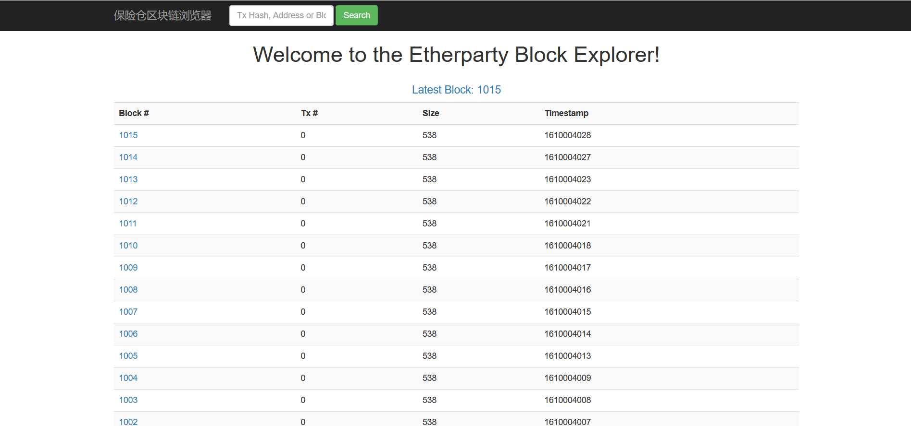
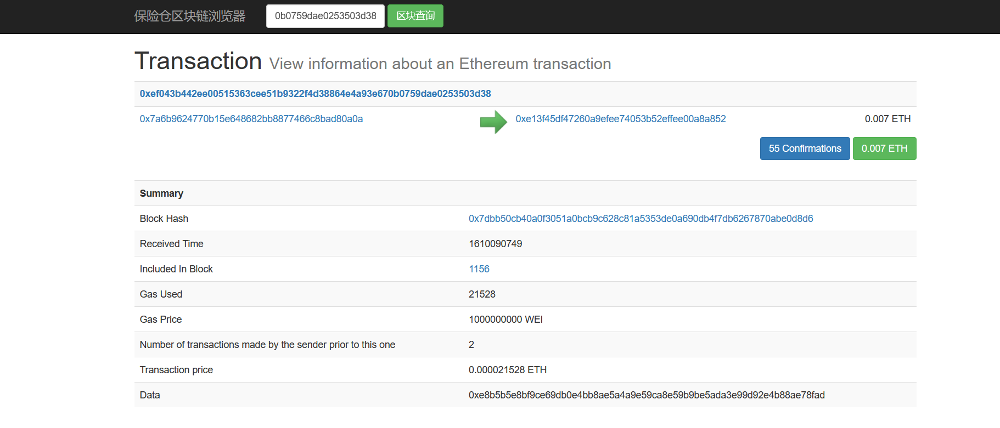

Ethereum安装及使用
~~~~~~~~~~~~~~~~~~

本文中，将选择ubuntu16.04(AMD64)操作系统作为例，进行Hive的安装。

一步一步构建Ethereum
--------------------

下载软件包
==========

.. code-block:: console

	sudo apt-get install software-properties-common
	sudo add-apt-repository -y ppa:ethereum/ethereum
	sudo apt-get update
	sudo apt-get install ethereum

.. end

使用GETH创建私有链
==================

在一个服务器上测试：

.. code-block:: console

	mkdir enode1
	mkdir enode2

.. end

分别创建两个文件夹，作为两个私有链节点的datadir,两个节点要能链接，必须是由同一个创始文件创建的链。

.. code-block:: console

 geth --datadir "enode1" init genesis.json
 
 vi genesis.json
	{
	  "config": {
	    "chainId": 1,
	    "homesteadBlock": 0,
	    "eip150Block": 0,
	    "eip150Hash": "0x0000000000000000000000000000000000000000000000000000000000000000",
	    "eip155Block": 0,
	    "eip158Block": 0,
	    "byzantiumBlock": 0,
	    "constantinopleBlock": 0,
	    "petersburgBlock": 0,
	    "istanbulBlock": 0,
	    "ethash": {}
	  },
	  "nonce": "0x0",
	  "timestamp": "0x00",
	  "extraData": "0x0000000000000000000000000000000000000000000000000000000000000000",
	  "gasLimit": "0x47b760",
	  "difficulty": "0x00002",
	  "mixHash": "0x0000000000000000000000000000000000000000000000000000000000000000",
	  "coinbase": "0x0000000000000000000000000000000000000044",
	  "alloc": { },
	  "number": "0x0",
	  "gasUsed": "0x0",
	  "parentHash": "0x0000000000000000000000000000000000000000000000000000000000000000"
	}

.. end

enode1是上文创建的文件之一， genesis.json是创世的配置文件

.. code-clock:: console

	根据配置用途可分为三大类：

	  #1    链配置
	    config项是定义链配置，会影响共识协议，虽然链配置对创世影响不大，但新区块的出块规则均依赖链配置。
	  #2  创世区块头信息配置
		nonce：随机数，对应创世区块 Nonce 字段。
		timestamp：UTC时间戳，对应创世区块 Time字段。
		extraData：额外数据，对应创世区块 Extra 字段。
		gasLimit：必填，燃料上限，对应创世区块 GasLimit 字段。
		difficulty：必填，难度系数，对应创世区块 Difficulty 字段。搭建私有链时，需要根据情况选择合适的难度值，以便调整出块。
		minHash：一个哈希值，对应创世区块的MixDigest字段。和 nonce 值一起证明在区块上已经进行了足够的计算。
		coinbase：一个地址，对应创世区块的Coinbase字段。
	   #3  初始账户资产配置
	    alloc 项是创世中初始账户资产配置。在生成创世区块时，将此数据集中的账户资产写入区块中，相当于预挖矿。这对开发测试和私有链非常好用，不需要挖矿就可以直接为任意多个账户分配资产。

.. end

创建完成之后使用命令,

.. code-block:: console

 geth --identity "OneAndOnly" --rpc --rpccorsdomain "*" --datadir "enode1" --port 30303 --rpcapi "personal,db,net,eth,web3" --networkid 4554 --rpcport 8080 --allow-insecure-unlock console

	root@ubuntu:/home/cecgw/blankchain# geth --identity "OneAndOnly" --rpc --rpccorsdomain "*" --datadir "enode1" --port 30303 --rpcapi "personal,db,net,eth,web3" --networkid 4554 --rpcport 8080 console
	INFO [01-05|10:31:47.272] Maximum peer count                       ETH=50 LES=0 total=50
	WARN [01-05|10:31:47.272] The flag --rpc is deprecated and will be removed in the future, please use --http 
	WARN [01-05|10:31:47.272] The flag --rpcport is deprecated and will be removed in the future, please use --http.port 
	WARN [01-05|10:31:47.272] The flag --rpccorsdomain is deprecated and will be removed in the future, please use --http.corsdomain 
	WARN [01-05|10:31:47.272] The flag --rpcapi is deprecated and will be removed in the future, please use --http.api 
	INFO [01-05|10:31:47.272] Smartcard socket not found, disabling    err="stat /run/pcscd/pcscd.comm: no such file or directory"
	INFO [01-05|10:31:47.273] Set global gas cap                       cap=25000000
	INFO [01-05|10:31:47.274] Allocated trie memory caches             clean=256.00MiB dirty=256.00MiB
	INFO [01-05|10:31:47.274] Allocated cache and file handles         database=/home/cecgw/blankchain/enode1/geth/chaindata cache=512.00MiB handles=65536
	INFO [01-05|10:31:47.287] Opened ancient database                  database=/home/cecgw/blankchain/enode1/geth/chaindata/ancient
	INFO [01-05|10:31:47.287] Writing default main-net genesis block 
	INFO [01-05|10:31:47.890] Persisted trie from memory database      nodes=12356 size=1.78MiB time=223.004917ms gcnodes=0 gcsize=0.00B gctime=0s livenodes=1 livesize=0.00B
	INFO [01-05|10:31:47.891] Initialised chain configuration          config="{ChainID: 1 Homestead: 1150000 DAO: 1920000 DAOSupport: true EIP150: 2463000 EIP155: 2675000 EIP158: 2675000 Byzantium: 4370000 Constantinople: 7280000 Petersburg: 7280000 Istanbul: 9069000, Muir Glacier: 9200000, YOLO v2: <nil>, Engine: ethash}"
	INFO [01-05|10:31:47.891] Disk storage enabled for ethash caches   dir=/home/cecgw/blankchain/enode1/geth/ethash count=3
	INFO [01-05|10:31:47.891] Disk storage enabled for ethash DAGs     dir=/root/.ethash count=2
	INFO [01-05|10:31:47.891] Initialising Ethereum protocol           versions="[65 64 63]" network=4554 dbversion=<nil>
	WARN [01-05|10:31:47.891] Upgrade blockchain database version      from=<nil> to=8
	INFO [01-05|10:31:47.892] Loaded most recent local header          number=0 hash="d4e567…cb8fa3" td=17179869184 age=51y9mo2d
	INFO [01-05|10:31:47.892] Loaded most recent local full block      number=0 hash="d4e567…cb8fa3" td=17179869184 age=51y9mo2d
	INFO [01-05|10:31:47.892] Loaded most recent local fast block      number=0 hash="d4e567…cb8fa3" td=17179869184 age=51y9mo2d
	INFO [01-05|10:31:47.892] Regenerated local transaction journal    transactions=0 accounts=0
	INFO [01-05|10:31:48.044] Allocated fast sync bloom                size=512.00MiB
	INFO [01-05|10:31:48.059] Starting peer-to-peer node               instance=Geth/OneAndOnly/v1.9.25-stable-e7872729/linux-amd64/go1.15.6
	INFO [01-05|10:31:48.092] New local node record                    seq=1 id=b389801f67374884 ip=127.0.0.1 udp=30303 tcp=30303
	INFO [01-05|10:31:48.098] Started P2P networking                   self=enode://28be3c2a77162883d224d5c4c142fd750115dd56338c87a6146fafc733e1aa81f002406eb323809768db063010a05d0c49d96a2e921b7e12f26698f8233b48b0@127.0.0.1:30303
	INFO [01-05|10:31:48.108] IPC endpoint opened                      url=/home/cecgw/blankchain/enode1/geth.ipc
	ERROR[01-05|10:31:48.109] Unavailable modules in HTTP API list     unavailable=[db] available="[admin debug web3 eth txpool personal ethash miner net]"
	INFO [01-05|10:31:48.109] HTTP server started                      endpoint=127.0.0.1:8080 cors=* vhosts=localhost
	WARN [01-05|10:31:48.237] Served eth_coinbase                      reqid=3 t="47.123µs" err="etherbase must be explicitly specified"
	Welcome to the Geth JavaScript console!

	instance: Geth/OneAndOnly/v1.9.25-stable-e7872729/linux-amd64/go1.15.6
	at block: 0 (Thu Jan 01 1970 08:00:00 GMT+0800 (HKT))
	 datadir: /home/cecgw/blankchain/enode1
	 modules: admin:1.0 debug:1.0 eth:1.0 ethash:1.0 miner:1.0 net:1.0 personal:1.0 rpc:1.0 txpool:1.0 web3:1.0

	To exit, press ctrl-d
.. end

启动另外一个节点
===============

.. code-block:: console

 geth --datadir "enode2" init genesis.json
 geth --identity "OneAndOnly" --rpc --rpccorsdomain "*" --datadir "enode2" --port 30304 --rpcapi "personal,db,net,eth,web3" --networkid 4554 --rpcport 8081 --allow-insecure-unlock  console

	root@ubuntu:/home/cecgw/blankchain# geth --identity "OneAndOnly" --rpc --rpccorsdomain "*" --datadir "enode2" --port 30304 --rpcapi "personal,db,net,eth,web3" --networkid 4554 --rpcport 8081 console
	INFO [01-05|10:37:20.812] Maximum peer count                       ETH=50 LES=0 total=50
	WARN [01-05|10:37:20.812] The flag --rpc is deprecated and will be removed in the future, please use --http 
	WARN [01-05|10:37:20.812] The flag --rpcport is deprecated and will be removed in the future, please use --http.port 
	WARN [01-05|10:37:20.812] The flag --rpccorsdomain is deprecated and will be removed in the future, please use --http.corsdomain 
	WARN [01-05|10:37:20.812] The flag --rpcapi is deprecated and will be removed in the future, please use --http.api 
	INFO [01-05|10:37:20.812] Smartcard socket not found, disabling    err="stat /run/pcscd/pcscd.comm: no such file or directory"
	INFO [01-05|10:37:20.816] Set global gas cap                       cap=25000000
	INFO [01-05|10:37:20.816] Allocated trie memory caches             clean=256.00MiB dirty=256.00MiB
	INFO [01-05|10:37:20.816] Allocated cache and file handles         database=/home/cecgw/blankchain/enode2/geth/chaindata cache=512.00MiB handles=65536
	INFO [01-05|10:37:20.922] Opened ancient database                  database=/home/cecgw/blankchain/enode2/geth/chaindata/ancient
	INFO [01-05|10:37:20.922] Writing default main-net genesis block 
	INFO [01-05|10:37:22.497] Persisted trie from memory database      nodes=12356 size=1.78MiB time=297.192037ms gcnodes=0 gcsize=0.00B gctime=0s livenodes=1 livesize=0.00B
	INFO [01-05|10:37:22.497] Initialised chain configuration          config="{ChainID: 1 Homestead: 1150000 DAO: 1920000 DAOSupport: true EIP150: 2463000 EIP155: 2675000 EIP158: 2675000 Byzantium: 4370000 Constantinople: 7280000 Petersburg: 7280000 Istanbul: 9069000, Muir Glacier: 9200000, YOLO v2: <nil>, Engine: ethash}"
	INFO [01-05|10:37:22.497] Disk storage enabled for ethash caches   dir=/home/cecgw/blankchain/enode2/geth/ethash count=3
	INFO [01-05|10:37:22.497] Disk storage enabled for ethash DAGs     dir=/root/.ethash count=2
	INFO [01-05|10:37:22.497] Initialising Ethereum protocol           versions="[65 64 63]" network=4554 dbversion=<nil>
	WARN [01-05|10:37:22.497] Upgrade blockchain database version      from=<nil> to=8
	INFO [01-05|10:37:22.500] Loaded most recent local header          number=0 hash="d4e567…cb8fa3" td=17179869184 age=51y9mo2d
	INFO [01-05|10:37:22.500] Loaded most recent local full block      number=0 hash="d4e567…cb8fa3" td=17179869184 age=51y9mo2d
	INFO [01-05|10:37:22.500] Loaded most recent local fast block      number=0 hash="d4e567…cb8fa3" td=17179869184 age=51y9mo2d
	INFO [01-05|10:37:22.501] Regenerated local transaction journal    transactions=0 accounts=0
	INFO [01-05|10:37:22.800] Allocated fast sync bloom                size=512.00MiB
	INFO [01-05|10:37:22.813] Starting peer-to-peer node               instance=Geth/OneAndOnly/v1.9.25-stable-e7872729/linux-amd64/go1.15.6
	INFO [01-05|10:37:22.838] New local node record                    seq=1 id=272a5bf7f985be3f ip=127.0.0.1 udp=30304 tcp=30304
	INFO [01-05|10:37:22.842] Started P2P networking                   self=enode://2223b2fa6fe6c2b89fefe1ae4603e60c57ad8abe51832ca7eb3f0d8c0a00e926d78f88cbfc779e7ad915f7a47692d0c125dae96086c55a1c6b72ae238261b5ff@127.0.0.1:30304
	INFO [01-05|10:37:22.874] IPC endpoint opened                      url=/home/cecgw/blankchain/enode2/geth.ipc
	ERROR[01-05|10:37:22.874] Unavailable modules in HTTP API list     unavailable=[db] available="[admin debug web3 eth txpool personal ethash miner net]"
	INFO [01-05|10:37:22.876] HTTP server started                      endpoint=127.0.0.1:8081 cors=* vhosts=localhost
	WARN [01-05|10:37:22.998] Served eth_coinbase                      reqid=3 t="82.424µs" err="etherbase must be explicitly specified"
	Welcome to the Geth JavaScript console!

	instance: Geth/OneAndOnly/v1.9.25-stable-e7872729/linux-amd64/go1.15.6
	at block: 0 (Thu Jan 01 1970 08:00:00 GMT+0800 (HKT))
	 datadir: /home/cecgw/blankchain/enode2
	 modules: admin:1.0 debug:1.0 eth:1.0 ethash:1.0 miner:1.0 net:1.0 personal:1.0 rpc:1.0 txpool:1.0 web3:1.0

	To exit, press ctrl-d

.. end

在第一个节点添加第二个链节点：

.. code-block:: console

 #添加前：admin.peers 
 > admin.peers
 [] 
 # 添加动作：
 > admin.addPeer('enode://2223b2fa6fe6c2b89fefe1ae4603e60c57ad8abe51832ca7eb3f0d8c0a00e926d78f88cbfc779e7ad915f7a47692d0c125dae96086c55a1c6b72ae238261b5ff@127.0.0.1:30304')
 true
 # 添加后查看 node1:
 > admin.peers
	[{
	    caps: ["eth/63", "eth/64", "eth/65"],
	    enode: "enode://2223b2fa6fe6c2b89fefe1ae4603e60c57ad8abe51832ca7eb3f0d8c0a00e926d78f88cbfc779e7ad915f7a47692d0c125dae96086c55a1c6b72ae238261b5ff@127.0.0.1:30304",
	    id: "272a5bf7f985be3f30a851db0533195d42eec1b980d2ab65cf8bb7907ecb8580",
	    name: "Geth/OneAndOnly/v1.9.25-stable-e7872729/linux-amd64/go1.15.6",
	    network: {
	      inbound: false,
	      localAddress: "127.0.0.1:57264",
	      remoteAddress: "127.0.0.1:30304",
	      static: true,
	      trusted: false
	    },
	    protocols: {
	      eth: {
		difficulty: 2,
		head: "0x7f4b6913eea16b085c01b5e0517caf8d39491057770dd043308e8f29843acc61",
		version: 65
	      }
	    }
	}] 

 # 添加后查看node2:
	> admin.peers
	[{
	    caps: ["eth/63", "eth/64", "eth/65"],
	    enode: "enode://28be3c2a77162883d224d5c4c142fd750115dd56338c87a6146fafc733e1aa81f002406eb323809768db063010a05d0c49d96a2e921b7e12f26698f8233b48b0@127.0.0.1:57264",
	    id: "b389801f673748844cddfcce863dd7524e0ba6adb4c51bc870988cd59b7fc4d2",
	    name: "Geth/OneAndOnly/v1.9.25-stable-e7872729/linux-amd64/go1.15.6",
	    network: {
	      inbound: true,
	      localAddress: "127.0.0.1:30304",
	      remoteAddress: "127.0.0.1:57264",
	      static: false,
	      trusted: false
	    },
	    protocols: {
	      eth: {
		difficulty: 2,
		head: "0x7f4b6913eea16b085c01b5e0517caf8d39491057770dd043308e8f29843acc61",
		version: 65
	      }
	    }
	}] 
 # 两个节点发现了相互的节点信息.运行在同一个区块链上.
 部署节点的必要条件，使用同一个创世文件.

.. end

部署智能合约
============

#. 安装solc, solc是用来编译智能合约文件的编译器。#部署智能合约首先需要一个由solidity编写的合约文件以及用于开发以太坊的框架Truffle

.. code-block:: console

 npm install -g npm  #升级npm到最新版本.
 npm install -g solc
 # 验证：
 root@ubuntu:/home/cecgw# solcjs --version
 0.8.0+commit.c7dfd78e.Emscripten.clang 
 # 如果出现错误，进行node 软链接. ln -s /usr/bin/nodejs /usr/bin/node
 # 升级nodejs 
 # npm install -g n # 首先安装n模块
 # n stable # 升级node.js到最新稳定版
 # 输出版本号则表示安装成功
 

.. end

#. 安装Truffle

.. code-block:: console

 npm install -g truffle

 # 检查Truffle 版本.

        root@ubuntu:/home/cecgw# truffle version
	Truffle v5.1.60 (core: 5.1.60)
	Solidity v0.5.16 (solc-js)
	Node v14.15.4
	Web3.js v1.2.9

.. end

#. 创建solidity工程

.. code-block:: console

 # mkdir solidity #在该目录下运行
	 # truffle init

	Starting init...

	> Copying project files to /home/cecgw/blankchain/solidity

	Init successful, sweet!

 # 该命令会自动创建一个工程和相关文件。并且给我们创建了一个自带的合约文件Migrations.sol

	 root@ubuntu:/home/cecgw/blankchain/solidity# tree
	.
	├── contracts
	│   └── Migrations.sol
	├── migrations
	│   └── 1_initial_migration.js
	├── test
	└── truffle-config.js

	3 directories, 3 files

 在Migrations.sol平行目录下创建自己的合约代码.
 touch yuanjiecount.sol
 vi yuanjiecount.sol
        pragma solidity ^0.5.16;

	contract yuanjiecount {

	    function multiply(uint a) public  returns(uint d) {
		return a*7;

	    }

	}  
 
 # 如果一个方法需要对外可见，也就是可以通过 合约 ABI 来访问，那么需要添加 public ，如果不对外访问，则需要添加 private.
 
.. end 

#. 利用Truffle编译合约打开工程里面的truffle-config.js ,编辑：

.. code-block:: console

	module.exports = {
	  // See <http://truffleframework.com/docs/advanced/configuration>
	  // to customize your Truffle configuration!
	  networks: {
	    development: {
	      host: "localhost",
	      port: 8081,
	      network_id: "*", // Match any network id
	      gas: 100
	    }
	  }
	};

.. end

#. host和port是你本地一个以太坊节点的IP地址和端口,gas是部署需要花费的coin，接着打开工程文件的migrations文件夹下的1_initial_migration.js将你要部署的文件改成yuanjiecount.sol

.. code-block:: console

	var Count = artifacts.require("./yuanjiecount.sol");
	module.exports = function (deployer) {
	  deployer.deploy(yuanjiecount);
	};

.. end

#. truffle部署合约 运行：

.. code-block:: console

	root@ubuntu:/home/cecgw/blankchain/solidity# truffle compile

	Compiling your contracts...
	
	> Compiling ./contracts/Migrations.sol
	> Compiling ./contracts/yuanjiecount.sol
	> Compilation warnings encountered:

	    /home/cecgw/blankchain/solidity/contracts/yuanjiecount.sol:3:5: Warning: Function state mutability can be restricted to pure
	    function multiply(uint a) public returns(uint d) { 
	    ^ (Relevant source part starts here and spans across multiple lines).

	> Artifacts written to /home/cecgw/blankchain/solidity/build/contracts
	> Compiled successfully using:
	   - solc: 0.5.16+commit.9c3226ce.Emscripten.clang

.. end

#. 创建合约账户.

.. code-block:: console

	 > personal.newAccount("1qaz2wsx")
	INFO [01-05|15:14:12.845] Your new key was generated               address=0xe13f45Df47260A9efee74053B52EffEE00A8a852
	WARN [01-05|15:14:12.846] Please backup your key file!             path=/home/cecgw/blankchain/enode2/keystore/UTC--2021-01-05T07-14-11.098273951Z--e13f45df47260a9efee74053b52effee00a8a852
	WARN [01-05|15:14:12.846] Please remember your password! 
	"0xe13f45df47260a9efee74053b52effee00a8a852"

 # 查看合约账户

 > eth.accounts
 ["0xe13f45df47260a9efee74053b52effee00a8a852"] 

 # 解锁账户

	> eth.accounts
	["0xe13f45df47260a9efee74053b52effee00a8a852"]
	> user1=eth.accounts[0]
	"0xe13f45df47260a9efee74053b52effee00a8a852"
	> personal.unlockAccount(user1)
	Unlock account 0xe13f45df47260a9efee74053b52effee00a8a852
	Passphrase: 
	true 
 出于安全考虑，默认禁止了HTTP通道解锁账户，相关issue：https://github.com/ethereum/go-ethereum/pull/17037
 --allow-insecure-unlock

.. end 

#. 部署合约.

.. code-block:: console

	root@ubuntu:/home/cecgw/blankchain/solidity/migrations# truffle migrate

	Compiling your contracts...
	===========================
	> Everything is up to date, there is nothing to compile.

	Starting migrations...
	======================
	> Network name:    'development'
	> Network id:      4554
	> Block gas limit: 4700000 (0x47b760)

	1_initial_migration.js
	======================

	   Deploying 'yuanjiecount'
	   ------------------------

	Error:  *** Deployment Failed ***

	"yuanjiecount" -- Returned error: insufficient funds for gas * price + value.

	    at /usr/local/lib/node_modules/truffle/build/webpack:/packages/deployer/src/deployment.js:365:1
	    at processTicksAndRejections (internal/process/task_queues.js:93:5)
	    at Migration._deploy (/usr/local/lib/node_modules/truffle/build/webpack:/packages/migrate/Migration.js:68:1)
	    at Migration._load (/usr/local/lib/node_modules/truffle/build/webpack:/packages/migrate/Migration.js:55:1)
	    at Migration.run (/usr/local/lib/node_modules/truffle/build/webpack:/packages/migrate/Migration.js:171:1)
	    at Object.runMigrations (/usr/local/lib/node_modules/truffle/build/webpack:/packages/migrate/index.js:150:1)
	    at Object.runFrom (/usr/local/lib/node_modules/truffle/build/webpack:/packages/migrate/index.js:110:1)
	    at Object.run (/usr/local/lib/node_modules/truffle/build/webpack:/packages/migrate/index.js:87:1)
	    at runMigrations (/usr/local/lib/node_modules/truffle/build/webpack:/packages/core/lib/commands/migrate.js:269:1)
	    at /usr/local/lib/node_modules/truffle/build/webpack:/packages/core/lib/commands/migrate.js:231:1
	Truffle v5.1.60 (core: 5.1.60)
	Node v14.15.v4

 ########################################
 部署合约需要挖矿,在node2窗口执行:
	  miner.start()INFO [01-07|15:01:47.277] Successfully sealed new block            number=156 sealhash="c91b3f…c18c91" hash="1b8eb2…a4493d" elapsed=2.190s
	INFO [01-07|15:01:47.277]  block reached canonical chain          number=149 hash="e550e1…9c62a4"
	INFO [01-07|15:01:47.279] Commit new mining work                   number=157 sealhash="a2d355…351d2b" uncles=0 txs=0 gas=0      fees=0         elapsed=1.597ms
	INFO [01-07|15:01:47.279]  mined potential block                  number=156 hash="1b8eb2…a4493d"
	INFO [01-07|15:01:47.825] Successfully sealed new block            number=157 sealhash="a2d355…351d2b" hash="da16bb…0e48e8" elapsed=547.379ms
	INFO [01-07|15:01:47.825]  block reached canonical chain          number=150 hash="52e24c…36cc4c"
	INFO [01-07|15:01:47.825]  mined potential block                  number=157 hash="da16bb…0e48e8"
	INFO [01-07|15:01:47.826] Commit new mining work                   number=158 sealhash="9d446f…faad20" uncles=0 txs=0 gas=0      fees=0         elapsed="594.516µs"
	INFO [01-07|15:01:47.855] Successfully sealed new block            number=158 sealhash="9d446f…faad20" hash="c7a489…ce6f8a" elapsed=29.398ms
	INFO [01-07|15:01:47.855]  block reached canonical chain          number=151 hash="bee711…5d0cbe"
	INFO [01-07|15:01:47.855]  mined potential block                  number=158 hash="c7a489…ce6f8a"
	INFO [01-07|15:01:47.855] Mining too far in the future             wait=2s
	INFO [01-07|15:01:49.857] Commit new mining work                   number=159 sealhash="1d2364…0765eb" uncles=0 txs=0 gas=0      fees=0         elapsed=2.001s
	INFO [01-07|15:01:50.988] Successfully sealed new block            number=159 sealhash="1d2364…0765eb" hash="d9ad67…1923ed" elapsed=1.131s
	INFO [01-07|15:01:50.988]  block reached canonical chain          number=152 hash="7496c5…e7f52f"
	INFO [01-07|15:01:50.988]  mined potential block                  number=159 hash="d9ad67…1923ed"
	INFO [01-07|15:01:50.988] Commit new mining work                   number=160 sealhash="6403f5…157b11" uncles=0 txs=0 gas=0      fees=0         elapsed="170.354µs"
	INFO [01-07|15:01:51.646] Successfully sealed new block            number=160 sealhash="6403f5…157b11" hash="019505…7c20a9" elapsed=657.638ms
	INFO [01-07|15:01:51.646]  block reached canonical chain          number=153 hash="a6ff88…2f81b0"
	INFO [01-07|15:01:51.647] Commit new mining work                   number=161 sealhash="0dbb98…aa204d" uncles=0 txs=0 gas=0      fees=0         elapsed="725.394µs"
	INFO [01-07|15:01:51.647]  mined potential block                  number=160 hash="019505…7c20a9"
	INFO [01-07|15:01:51.799] Successfully sealed new block            number=161 sealhash="0dbb98…aa204d" hash="5c210a…523190" elapsed=152.538ms
	INFO [01-07|15:01:51.799]  block reached canonical chain          number=154 hash="573e09…af0403"
	INFO [01-07|15:01:51.799]  mined potential block                  number=161 hash="5c210a…523190"
	INFO [01-07|15:01:51.799] Commit new mining work                   number=162 sealhash="0f3de7…ca40d7" uncles=0 txs=0 gas=0      fees=0         elapsed="164.667µs"

 #  等待一段时间后，部署智能合约成功.
 root@ubuntu:/home/cecgw/blankchain/solidity/migrations# truffle migrate

	Compiling your contracts...
	//===========================
	> Everything is up to date, there is nothing to compile.

	Starting migrations...
	======================
	> Network name:    'development'
	> Network id:      4554
	> Block gas limit: 4839616 (0x49d8c0)

	1_initial_migration.js
	//======================

	   Deploying 'yuanjiecount'
	   ------------------------
	   > transaction hash:    0x31a9b7fdd2250d0e64d153cd9dec357aa6651ccb1ebde08407a960386a7f8890
	   ⠏ Blocks: 0            Seconds: 460
	   ⠋ Blocks: 0            Seconds: 460
	   ⠹ Blocks: 0            Seconds: 460
	   > Blocks: 0            Seconds: 592
	   > contract address:    0xc0607d4B7b42f4f40F48B5Cb4CBbA274A2Abbdd5
	   > block number:        31
	   > block timestamp:     1610002605
	   > account:             0xe13f45Df47260A9efee74053B52EffEE00A8a852
	   > balance:             62
	   > gas used:            91019 (0x1638b)
	   > gas price:           20 gwei
	   > value sent:          0 ETH
	   > total cost:          0.00182038 ETH

	   > Saving artifacts
	   -------------------------------------
	   > Total cost:          0.00182038 ETH

	Summary
	=======
	> Total deployments:   1
	> Final cost:          0.00182038 ETH 

.. end 

#. 调用合约.

.. code-block:: console

 # 首先需要获取合约实例，上面部署合约完成后，会获得一个合约地址(0xc0607d4B7b42f4f40F48B5Cb4CBbA274A2Abbdd5),合约的发布账户:(0xe13f45Df47260A9efee74053B52EffEE00A8a852),部署合约所耗费的以太坊数值。其中在solidity/build/contracts 目录下, 我们可以看到会生成yuanjiecount.json的文件,其中有abi内容。
 abi abi全称Application Binary Interface,它定义了如何与智能合约进行交互，我们可以把它理解成一个智能合约类的接口描述文件，当我们部署完智能合约之后，智能合约被编译成机器码，我们通过这个描述文件来知道这个智能合约有哪些接口，需要传递什么参数，返回什么值。
 比如本次部署的abi 内容如下:
 "abi": [
    {
      "constant": true,
      "inputs": [
        {
          "internalType": "uint256",
          "name": "a",
          "type": "uint256"
        }
      ],
      "name": "multiply",
      "outputs": [
        {
          "internalType": "uint256",
          "name": "d",
          "type": "uint256"
        }
      ],
      "payable": false,
      "stateMutability": "pure",
      "type": "function"
    }
  ],
 我们copy出这个json里面abi的value,即"abi:"的值，"""需要注意的是"""我们使用的时候abi不能有空格和换行符,我使用bejson(https://www.bejson.com/)来压缩abi。压缩完后，只有一行.

 现在我们获取智能合约并进行调用计算:
 任何一个节点执行:
	> var addr = '0xc0607d4B7b42f4f40F48B5Cb4CBbA274A2Abbdd5'
	undefined
	> var abi =[{"constant":true,"inputs":[{"internalType":"uint256","name":"a","type":"uint256"}],"name":"multiply","outputs":[{"internalType":"uint256","name":"d","type":"uint256"}],"payable":false,"stateMutability":"pure","type":"function"}]
	undefined
	> var ballotInstance= eth.contract(abi).at(addr)

	undefined
	> ballotInstance.multiply(6)
	42 
  合约调用成功.

.. end

至此，我们在创建的区块链平台上创建了简单的一个合约，并进行了调用.

常用命令
=======

#. 查看区块

.. code-block:: console

	>  eth.blockNumber
	1015

.. end

#. 查看节点信息.

.. code-block:: console

	> admin.nodeInfo
	{
	  enode: "enode://28be3c2a77162883d224d5c4c142fd750115dd56338c87a6146fafc733e1aa81f002406eb323809768db063010a05d0c49d96a2e921b7e12f26698f8233b48b0@127.0.0.1:30303",
	  enr: "enr:-Je4QG_JQDxoRnv5MXyOheexBz_gErTxIoG8XmgLhwPux08WFB51tXk2M9H3NuaoQ4Idc3t1EqKNfzZ6fYfDO8VQ87kCg2V0aMfGhOGh5-yAgmlkgnY0gmlwhH8AAAGJc2VjcDI1NmsxoQIovjwqdxYog9Ik1cTBQv11ARXdVjOMh6YUb6_HM-GqgYN0Y3CCdl-DdWRwgnZf",
	  id: "b389801f673748844cddfcce863dd7524e0ba6adb4c51bc870988cd59b7fc4d2",
	  ip: "127.0.0.1",
	  listenAddr: "[::]:30303",
	  name: "Geth/OneAndOnly/v1.9.25-stable-e7872729/linux-amd64/go1.15.6",
	  ports: {
	    discovery: 30303,
	    listener: 30303
	  },
	  protocols: {
	    eth: {
	      config: {
		byzantiumBlock: 0,
		chainId: 1,
		constantinopleBlock: 0,
		eip150Block: 0,
		eip150Hash: "0x0000000000000000000000000000000000000000000000000000000000000000",
		eip155Block: 0,
		eip158Block: 0,
		ethash: {},
		homesteadBlock: 0,
		istanbulBlock: 0,
		petersburgBlock: 0
	      },
	      difficulty: 169336383,
	      genesis: "0x7f4b6913eea16b085c01b5e0517caf8d39491057770dd043308e8f29843acc61",
	      head: "0x90eba297734cdac004b4cf0dd30c818a268d6776d083f8c5536ff8ff16c42084",
	      network: 4554
	    }
	  }
	}

.. end

#. 查看区块信息

.. code-block:: console

	> eth.getBlock(0)
	{
	  difficulty: 2,
	  extraData: "0x0000000000000000000000000000000000000000000000000000000000000000",
	  gasLimit: 4700000,
	  gasUsed: 0,
	  hash: "0x7f4b6913eea16b085c01b5e0517caf8d39491057770dd043308e8f29843acc61",
	  logsBloom: "0x00000000000000000000000000000000000000000000000000000000000000000000000000000000000000000000000000000000000000000000000000000000000000000000000000000000000000000000000000000000000000000000000000000000000000000000000000000000000000000000000000000000000000000000000000000000000000000000000000000000000000000000000000000000000000000000000000000000000000000000000000000000000000000000000000000000000000000000000000000000000000000000000000000000000000000000000000000000000000000000000000000000000000000000000000000000",
	  miner: "0x0000000000000000000000000000000000000044",
	  mixHash: "0x0000000000000000000000000000000000000000000000000000000000000000",
	  nonce: "0x0000000000000000",
	  number: 0,
	  parentHash: "0x0000000000000000000000000000000000000000000000000000000000000000",
	  receiptsRoot: "0x56e81f171bcc55a6ff8345e692c0f86e5b48e01b996cadc001622fb5e363b421",
	  sha3Uncles: "0x1dcc4de8dec75d7aab85b567b6ccd41ad312451b948a7413f0a142fd40d49347",
	  size: 540,
	  stateRoot: "0x56e81f171bcc55a6ff8345e692c0f86e5b48e01b996cadc001622fb5e363b421",
	  timestamp: 1574932286,
	  totalDifficulty: 2,
	  transactions: [],
	  transactionsRoot: "0x56e81f171bcc55a6ff8345e692c0f86e5b48e01b996cadc001622fb5e363b421",
	  uncles: []
	}

.. end

#. 接入区块

.. code-block:: console

        root@ubuntu:/home/cecgw/blankchain/enode2# geth attach geth.ipc 
	Welcome to the Geth JavaScript console!

	instance: Geth/OneAndOnly/v1.9.25-stable-e7872729/linux-amd64/go1.15.6
	coinbase: 0xe13f45df47260a9efee74053b52effee00a8a852
	at block: 1015 (Thu Jan 07 2021 15:20:28 GMT+0800 (HKT))
	 datadir: /home/cecgw/blankchain/enode2
	 modules: admin:1.0 debug:1.0 eth:1.0 ethash:1.0 miner:1.0 net:1.0 personal:1.0 rpc:1.0 txpool:1.0 web3:1.0

	To exit, press ctrl-d

      console命令用于打开控制台用于交互，与attach有所不同，console一般是在区块链运行时打开，而attach是在节点运行的前提下连接到节点进行交互，两者可以并存。

.. end

通过区块链浏览器查看区块
------------------------

#. 下载区块链浏览器代码:

.. code-block:: console

	root@ubuntu:/home/cecgw/blankchain# git clone https://github.com/etherparty/explorer
	Cloning into 'explorer'...
	remote: Enumerating objects: 269, done.
	remote: Total 269 (delta 0), reused 0 (delta 0), pack-reused 269
	Receiving objects: 100% (269/269), 59.61 KiB | 66.00 KiB/s, done.
	Resolving deltas: 100% (139/139), done.
	Checking connectivity... done.

.. end

#. 修改配置文件：

.. code-block:: console

        root@ubuntu:/home/cecgw/blankchain/explorer# cd app/
	root@ubuntu:/home/cecgw/blankchain/explorer/app# ls
	app.js  components  index.html  scripts  styles  views
	root@ubuntu:/home/cecgw/blankchain/explorer/app# vi app.js 
        #修改       var eth_node_url = 'http://192.168.121.128:8081'; // TODO: remote URL
        # root@ubuntu:/home/cecgw/blankchain/explorer# vi package.json
        将"start": "http-server ./app -a localhost -p 8000 -c-1", 修改为"start": "http-server ./app -a 192.168.121.128 -p 8000 -c-1", 

.. end

# 下载bower工具

.. code-block:: console

	root@ubuntu:/home/cecgw/blankchain/explorer#  npm install -g bower -y
	npm WARN deprecated bower@1.8.8: We don't recommend using Bower for new projects. Please consider Yarn and Webpack or Parcel. You can read how to migrate legacy project here: https://bower.io/blog/2017/how-to-migrate-away-from-bower/
	/usr/local/bin/bower -> /usr/local/lib/node_modules/bower/bin/bower
	+ bower@1.8.8
	added 1 package from 1 contributor in 9.5v4

	root@ubuntu:/home/cecgw/blankchain/explorer# bower init
	bower ESUDO         Cannot be run with sudo

	Additional error details:
	Since bower is a user command, there is no need to execute it with superuser permissions.
	If you're having permission errors when using bower without sudo, please spend a few minutes learning more about how your system should work and make any necessary repairs.

	http://www.joyent.com/blog/installing-node-and-npm
	https://gist.github.com/isaacs/579814

	You can however run a command with sudo using "--allow-root" option
	root@ubuntu:/home/cecgw/blankchain/explorer# bower install --allow-root
	bower angular#~1.4.0        not-cached https://github.com/angular/bower-angular.git#~1.4.0
	bower angular#~1.4.0           resolve https://github.com/angular/bower-angular.git#~1.4.0
	bower angular-route#~1.4.0  not-cached https://github.com/angular/bower-angular-route.git#~1.4.0
	bower angular-route#~1.4.0     resolve https://github.com/angular/bower-angular-route.git#~1.4.0
	bower angular-loader#~1.4.0 not-cached https://github.com/angular/bower-angular-loader.git#~1.4.0
	bower angular-loader#~1.4.0    resolve https://github.com/angular/bower-angular-loader.git#~1.4.0
	bower angular-mocks#~1.4.0  not-cached https://github.com/angular/bower-angular-mocks.git#~1.4.0
	bower angular-mocks#~1.4.0     resolve https://github.com/angular/bower-angular-mocks.git#~1.4.0
	bower html5-boilerplate#~5.2.0       not-cached https://github.com/h5bp/html5-boilerplate.git#~5.2.0
	bower html5-boilerplate#~5.2.0          resolve https://github.com/h5bp/html5-boilerplate.git#~5.2.0
	bower angular-bootstrap#~0.13.3      not-cached https://github.com/angular-ui/bootstrap-bower.git#~0.13.3
	bower angular-bootstrap#~0.13.3         resolve https://github.com/angular-ui/bootstrap-bower.git#~0.13.3
	bower web3#~0.14.0                   not-cached https://github.com/ethereum/ethereum.js.git#~0.14.0
	bower web3#~0.14.0                      resolve https://github.com/ethereum/ethereum.js.git#~0.14.0
	bower html5-boilerplate#~5.2.0         download https://github.com/h5bp/html5-boilerplate/archive/5.2.0.tar.gz
	bower angular-route#~1.4.0             download https://github.com/angular/bower-angular-route/archive/v1.4.14.tar.gz
	bower angular-bootstrap#~0.13.3        download https://github.com/angular-ui/bootstrap-bower/archive/0.13.4.tar.gz
	bower angular#~1.4.0                   download https://github.com/angular/bower-angular/archive/v1.4.14.tar.gz
	bower angular-mocks#~1.4.0             download https://github.com/angular/bower-angular-mocks/archive/v1.4.14.tar.gz
	bower angular-loader#~1.4.0            download https://github.com/angular/bower-angular-loader/archive/v1.4.14.tar.gz
	bower html5-boilerplate#~5.2.0          extract archive.tar.gz
	bower html5-boilerplate#~5.2.0         resolved https://github.com/h5bp/html5-boilerplate.git#5.2.0
	bower angular-route#~1.4.0              extract archive.tar.gz
	bower angular-route#~1.4.0             resolved https://github.com/angular/bower-angular-route.git#1.4.14
	bower web3#~0.14.0                     download https://github.com/ethereum/ethereum.js/archive/0.14.0.tar.gz
	bower angular-mocks#~1.4.0              extract archive.tar.gz
	bower angular-bootstrap#~0.13.3         extract archive.tar.gz
	bower angular-mocks#~1.4.0             resolved https://github.com/angular/bower-angular-mocks.git#1.4.14
	bower angular-bootstrap#~0.13.3        resolved https://github.com/angular-ui/bootstrap-bower.git#0.13.4
	bower angular#>=1.3.0                not-cached https://github.com/angular/bower-angular.git#>=1.3.0
	bower angular#>=1.3.0                   resolve https://github.com/angular/bower-angular.git#>=1.3.0
	bower angular#>=1.3.0                  download https://github.com/angular/bower-angular/archive/v1.8.2.tar.gz
	bower angular-loader#~1.4.0             extract archive.tar.gz
	bower angular-loader#~1.4.0            resolved https://github.com/angular/bower-angular-loader.git#1.4.14
	bower angular#~1.4.0                    extract archive.tar.gz
	bower angular#~1.4.0                   resolved https://github.com/angular/bower-angular.git#1.4.14
	bower web3#~0.14.0                      extract archive.tar.gz
	bower web3#~0.14.0                 invalid-meta for:/tmp/root/bower/d55930f03965659da7442e54ee12f1d8-8610-XcWG7r/bower.json
	bower web3#~0.14.0                 invalid-meta The "main" field cannot contain minified files
	bower web3#~0.14.0                 invalid-meta The "main" field has to contain only 1 file per filetype; found multiple .js files: ["./dist/web3.js","./dist/web3.min.js"]
	bower web3#~0.14.0                     resolved https://github.com/ethereum/ethereum.js.git#0.14.0
	bower crypto-js#~3.1.4               not-cached https://github.com/brix/crypto-js.git#~3.1.4
	bower crypto-js#~3.1.4                  resolve https://github.com/brix/crypto-js.git#~3.1.4
	bower angular#>=1.3.0                   extract archive.tar.gz
	bower angular#>=1.3.0                  resolved https://github.com/angular/bower-angular.git#1.8.2
	bower bignumber.js#>=2.0.0           not-cached https://github.com/MikeMcl/bignumber.js.git#>=2.0.0
	bower bignumber.js#>=2.0.0              resolve https://github.com/MikeMcl/bignumber.js.git#>=2.0.0
	bower crypto-js#~3.1.4                 download https://github.com/brix/crypto-js/archive/3.1.9.tar.gz
	bower bignumber.js#>=2.0.0             download https://github.com/MikeMcl/bignumber.js/archive/v9.0.1.tar.gz
	bower crypto-js#~3.1.4                  extract archive.tar.gz
	bower crypto-js#~3.1.4                 resolved https://github.com/brix/crypto-js.git#3.1.9
	bower bignumber.js#>=2.0.0             progress received 0.9MB
	bower bignumber.js#>=2.0.0             progress received 1.0MB
	bower bignumber.js#>=2.0.0             progress received 1.1MB
	bower bignumber.js#>=2.0.0             progress received 1.2MB
	bower bignumber.js#>=2.0.0             progress received 1.3MB
	bower bignumber.js#>=2.0.0             progress received 1.3MB
	bower bignumber.js#>=2.0.0             progress received 1.4MB
	bower bignumber.js#>=2.0.0             progress received 1.5MB
	bower bignumber.js#>=2.0.0             progress received 1.5MB
	bower bignumber.js#>=2.0.0             progress received 1.6MB
	bower bignumber.js#>=2.0.0             progress received 1.7MB
	bower bignumber.js#>=2.0.0             progress received 1.8MB
	bower bignumber.js#>=2.0.0              extract archive.tar.gz
	bower bignumber.js#>=2.0.0             resolved https://github.com/MikeMcl/bignumber.js.git#9.0.1
	bower html5-boilerplate#~5.2.0          install html5-boilerplate#5.2.0
	bower angular-route#~1.4.0              install angular-route#1.4.14
	bower angular-mocks#~1.4.0              install angular-mocks#1.4.14
	bower angular-bootstrap#~0.13.3         install angular-bootstrap#0.13.4
	bower angular-loader#~1.4.0             install angular-loader#1.4.14
	bower angular#1.4.14                    install angular#1.4.14
	bower web3#~0.14.0                      install web3#0.14.0
	bower crypto-js#~3.1.4                  install crypto-js#3.1.9
	bower bignumber.js#>=2.0.0              install bignumber.js#9.0.1

	html5-boilerplate#5.2.0 app/bower_components/html5-boilerplate

	angular-route#1.4.14 app/bower_components/angular-route
	└── angular#1.4.14

	angular-mocks#1.4.14 app/bower_components/angular-mocks
	└── angular#1.4.14

	angular-bootstrap#0.13.4 app/bower_components/angular-bootstrap
	└── angular#1.4.14

	angular-loader#1.4.14 app/bower_components/angular-loader
	└── angular#1.4.14

	angular#1.4.14 app/bower_components/angular

	web3#0.14.0 app/bower_components/web3
	├── bignumber.js#9.0.1
	└── crypto-js#3.1.9

	crypto-js#3.1.9 app/bower_components/crypto-js

	bignumber.js#9.0.1 app/bower_components/bignumber.js

	root@ubuntu:/home/cecgw/blankchain/explorer# bower install angular --save-dev --allow-root
	bower angular#*                 cached https://github.com/angular/bower-angular.git#1.8.2
	bower angular#*               validate 1.8.2 against https://github.com/angular/bower-angular.git#*
	bower angular#~1.4.0            cached https://github.com/angular/bower-angular.git#1.4.14
	bower angular#~1.4.0          validate 1.4.14 against https://github.com/angular/bower-angular.git#~1.4.0
	bower angular#>=1.3.0           cached https://github.com/angular/bower-angular.git#1.8.2
	bower angular#>=1.3.0         validate 1.8.2 against https://github.com/angular/bower-angular.git#>=1.3.0

	Unable to find a suitable version for angular, please choose one by typing one of the numbers below:
	    1) angular#1.4.14 which resolved to 1.4.14 and is required by angular-loader#1.4.14, angular-mocks#1.4.14, angular-route#1.4.14
	    2) angular#~1.4.0 which resolved to 1.4.14 and is required by angular-seed
	    3) angular#>=1.3.0 which resolved to 1.8.2 and is required by angular-bootstrap#0.13.4
	    4) angular#^1.8.2 which resolved to 1.8.2

	Prefix the choice with ! to persist it to bower.json

	? Answer 1

.. end

#. 启动浏览器

 1 启动以太坊节点
 
.. code-block:: console

	root@ubuntu:/home/cecgw/blankchain# geth --identity "OneAndOnly" --rpc --rpccorsdomain "*" --datadir "enode2" --port 30304 --rpcapi "personal,db,net,eth,web3" --networkid 4554 --rpc --rpcaddr "0.0.0.0" --rpcport 8081 --allow-insecure-unlock --rpccorsdomain '*'  console

 # 注意加入新参数: --rpcaddr "0.0.0.0" --rpccorsdomain '*'
.. end

# 启动区块链浏览器后台:
 
.. code-block:: console

	root@ubuntu:/home/cecgw/blankchain/explorer# npm start

	> EthereumExplorer@0.1.0 prestart /home/cecgw/blankchain/explorer
	> npm install

	npm WARN deprecated bower@1.8.8: We don't recommend using Bower for new projects. Please consider Yarn and Webpack or Parcel. You can read how to migrate legacy project here: https://bower.io/blog/2017/how-to-migrate-away-from-bower/
	npm WARN deprecated ecstatic@0.4.13: https://github.com/jfhbrook/node-ecstatic/issues/259
	npm WARN deprecated chokidar@1.7.0: Chokidar 2 will break on node v14+. Upgrade to chokidar 3 with 15x less dependencies.
	npm WARN deprecated connect@2.30.2: connect 2.x series is deprecated
	npm WARN deprecated minimatch@2.0.10: Please update to minimatch 3.0.2 or higher to avoid a RegExp DoS issue
	npm WARN deprecated request@2.57.0: request has been deprecated, see https://github.com/request/request/issues/3142
	npm WARN deprecated mkdirp@0.0.7: Legacy versions of mkdirp are no longer supported. Please update to mkdirp 1.x. (Note that the API surface has changed to use Promises in 1.x.)
	npm WARN deprecated fsevents@1.2.13: fsevents 1 will break on node v14+ and could be using insecure binaries. Upgrade to fsevents 2.
	npm WARN deprecated natives@1.1.6: This module relies on Node.js's internals and will break at some point. Do not use it, and update to graceful-fs@4.x.
	npm WARN deprecated minimatch@0.3.0: Please update to minimatch 3.0.2 or higher to avoid a RegExp DoS issue
	npm WARN deprecated node-uuid@1.4.8: Use uuid module instead
	npm WARN deprecated hawk@2.3.1: This module moved to @hapi/hawk. Please make sure to switch over as this distribution is no longer supported and may contain bugs and critical security issues.
	npm WARN deprecated har-validator@1.8.0: this library is no longer supported
	npm WARN deprecated hoek@2.16.3: This version has been deprecated in accordance with the hapi support policy (hapi.im/support). Please upgrade to the latest version to get the best features, bug fixes, and security patches. If you are unable to upgrade at this time, paid support is available for older versions (hapi.im/commercial).
	npm WARN deprecated cryptiles@2.0.5: This version has been deprecated in accordance with the hapi support policy (hapi.im/support). Please upgrade to the latest version to get the best features, bug fixes, and security patches. If you are unable to upgrade at this time, paid support is available for older versions (hapi.im/commercial).
	npm WARN deprecated sntp@1.0.9: This module moved to @hapi/sntp. Please make sure to switch over as this distribution is no longer supported and may contain bugs and critical security issues.
	npm WARN deprecated boom@2.10.1: This version has been deprecated in accordance with the hapi support policy (hapi.im/support). Please upgrade to the latest version to get the best features, bug fixes, and security patches. If you are unable to upgrade at this time, paid support is available for older versions (hapi.im/commercial).
	npm WARN deprecated urix@0.1.0: Please see https://github.com/lydell/urix#deprecated
	npm WARN deprecated resolve-url@0.2.1: https://github.com/lydell/resolve-url#deprecated

	> bufferutil@1.2.1 install /home/cecgw/blankchain/explorer/node_modules/bufferutil
	> node-gyp rebuild

	gyp WARN EACCES current user ("cecgw") does not have permission to access the dev dir "/root/.cache/node-gyp/14.15.4"
	gyp WARN EACCES attempting to reinstall using temporary dev dir "/home/cecgw/blankchain/explorer/node_modules/bufferutil/.node-gyp"
	gyp WARN install got an error, rolling back install
	gyp WARN install got an error, rolling back install
	gyp ERR! configure error 
	gyp ERR! stack Error: EACCES: permission denied, mkdir '/home/cecgw/blankchain/explorer/node_modules/bufferutil/.node-gyp'
	gyp ERR! System Linux 4.4.0-198-generic
	gyp ERR! command "/usr/local/bin/node" "/usr/local/lib/node_modules/npm/node_modules/node-gyp/bin/node-gyp.js" "rebuild"
	gyp ERR! cwd /home/cecgw/blankchain/explorer/node_modules/bufferutil
	gyp ERR! node -v v14.15.4
	gyp ERR! node-gyp -v v5.1.0
	gyp ERR! not ok 

	> utf-8-validate@1.2.2 install /home/cecgw/blankchain/explorer/node_modules/utf-8-validate
	> node-gyp rebuild

	gyp WARN EACCES current user ("cecgw") does not have permission to access the dev dir "/root/.cache/node-gyp/14.15.4"
	gyp WARN EACCES attempting to reinstall using temporary dev dir "/home/cecgw/blankchain/explorer/node_modules/utf-8-validate/.node-gyp"
	gyp WARN install got an error, rolling back install
	gyp WARN install got an error, rolling back install
	gyp ERR! configure error 
	gyp ERR! stack Error: EACCES: permission denied, mkdir '/home/cecgw/blankchain/explorer/node_modules/utf-8-validate/.node-gyp'
	gyp ERR! System Linux 4.4.0-198-generic
	gyp ERR! command "/usr/local/bin/node" "/usr/local/lib/node_modules/npm/node_modules/node-gyp/bin/node-gyp.js" "rebuild"
	gyp ERR! cwd /home/cecgw/blankchain/explorer/node_modules/utf-8-validate
	gyp ERR! node -v v14.15.4
	gyp ERR! node-gyp -v v5.1.0
	gyp ERR! not ok 

	> ws@0.4.32 install /home/cecgw/blankchain/explorer/node_modules/ws
	> (node-gyp rebuild 2> builderror.log) || (exit 0)

	sh: 1: cannot create builderror.log: Permission denied
	npm WARN lifecycle EthereumExplorer@0.1.0~postinstall: cannot run in wd EthereumExplorer@0.1.0 bower install (wd=/home/cecgw/blankchain/explorer)
	npm notice created a lockfile as package-lock.json. You should commit this file.
	npm WARN notsup Unsupported engine for karma@0.12.37: wanted: {"node":">=0.8 <=0.12 || >=1 <=2"} (current: {"node":"14.15.4","npm":"6.14.10"})
	npm WARN notsup Not compatible with your version of node/npm: karma@0.12.37
	npm WARN optional SKIPPING OPTIONAL DEPENDENCY: fsevents@^1.0.0 (node_modules/chokidar/node_modules/fsevents):
	npm WARN notsup SKIPPING OPTIONAL DEPENDENCY: Unsupported platform for fsevents@1.2.13: wanted {"os":"darwin","arch":"any"} (current: {"os":"linux","arch":"x64"})
	npm WARN optional SKIPPING OPTIONAL DEPENDENCY: bufferutil@1.2.1 (node_modules/bufferutil):
	npm WARN optional SKIPPING OPTIONAL DEPENDENCY: bufferutil@1.2.1 install: `node-gyp rebuild`
	npm WARN optional SKIPPING OPTIONAL DEPENDENCY: Exit status 1
	npm WARN optional SKIPPING OPTIONAL DEPENDENCY: utf-8-validate@1.2.2 (node_modules/utf-8-validate):
	npm WARN optional SKIPPING OPTIONAL DEPENDENCY: utf-8-validate@1.2.2 install: `node-gyp rebuild`
	npm WARN optional SKIPPING OPTIONAL DEPENDENCY: Exit status 1

	added 485 packages from 503 contributors and audited 491 packages in 40.02s

	35 packages are looking for funding
	  run `npm fund` for details

	found 67 vulnerabilities (21 low, 11 moderate, 35 high)
	  run `npm audit fix` to fix them, or `npm audit` for details

	> EthereumExplorer@0.1.0 start /home/cecgw/blankchain/explorer
	> http-server ./app -a 192.168.121.128 -p 8000 -c-1

	Starting up http-server, serving ./app on port: 8000
	Hit CTRL-C to stop the server

.. end

点击浏览器查看，因为需要连接google.cn下载bootstrap.min.css  bootstrap.min.js 导致浏览器打不开,我们可以提前下载好该文件，放到本地加载。

.. code-block:: console

	 修改: root@ubuntu:/home/cecgw/blankchain/explorer/app# vi index.html
  13   <link rel="stylesheet" href="https://maxcdn.bootstrapcdn.com/bootstrap/3.3.5/css/bootstrap.min.css"> 为本地
  42   
  45   
  46   

.. end

尝试发送新区快
==============

我们通过账户1发送信息到账户2.

账户1：

.. code-block:: console

	root@ubuntu:/home/cecgw/blankchain/enode1# geth attach geth.ipc 
	Welcome to the Geth JavaScript console!

	instance: Geth/OneAndOnly/v1.9.25-stable-e7872729/linux-amd64/go1.15.6
	coinbase: 0x7a6b9624770b15e648682bb8877466c8bad80a0a
	at block: 0 (Thu Nov 28 2019 17:11:26 GMT+0800 (HKT))
	 datadir: /home/cecgw/blankchain/enode1
	 modules: admin:1.0 debug:1.0 eth:1.0 ethash:1.0 miner:1.0 net:1.0 personal:1.0 rpc:1.0 txpool:1.0 web3:1.0

	To exit, press ctrl-d
	> eth.accounts
	["0x7a6b9624770b15e648682bb8877466c8bad80a0a"]
	> 

	> eth.getBalance(eth.accounts[0])
	266000000000000000000
 # 转账:
	 
	> eth.accounts
	["0x7a6b9624770b15e648682bb8877466c8bad80a0a"]
	> personal.unlockAccount("0x7a6b9624770b15e648682bb8877466c8bad80a0a")

	Unlock account 0x7a6b9624770b15e648682bb8877466c8bad80a0a
	Passphrase: 
	true
	> eth.sendTransaction({from: "0x7a6b9624770b15e648682bb8877466c8bad80a0a",to: "0xe13f45df47260a9efee74053b52effee00a8a852", value: "7000000000000000",data: "0xe8b5b5e8bf9ce69db0e4bb8ae5a4a9e59ca8e59b9be5ada3e99d92e4b88ae78fad"})
       "0xef043b442ee00515363cee51b9322f4d38864e4a93e670b0759dae0253503d38" # 获取区块链地址
       # data 要求 hex形式，在python下可直接获取,
       >>> content="赵远杰今天在四季青上班"
       >>> content
       '\xe8\xb5\xb5\xe8\xbf\x9c\xe6\x9d\xb0\xe4\xbb\x8a\xe5\xa4\xa9\xe5\x9c\xa8\xe5\x9b\x9b\xe5\xad\xa3\xe9\x9d\x92\xe4\xb8\x8a\xe7\x8f\xad' 替换\x,题头增加0x,为 0xef043b442ee00515363cee51b9322f4d38864e4a93e670b0759dae0253503d38。 
.. end

查看区块交易信息:启动节点挖矿后，可以看到区块信息.

账户2:

.. code-block:: console

	root@ubuntu:/home/cecgw/blankchain/enode2# geth attach geth.ipc 
	Welcome to the Geth JavaScript console!

	instance: Geth/OneAndOnly/v1.9.25-stable-e7872729/linux-amd64/go1.15.6
	coinbase: 0xe13f45df47260a9efee74053b52effee00a8a852
	at block: 1015 (Thu Jan 07 2021 15:20:28 GMT+0800 (HKT))
	 datadir: /home/cecgw/blankchain/enode2
	 modules: admin:1.0 debug:1.0 eth:1.0 ethash:1.0 miner:1.0 net:1.0 personal:1.0 rpc:1.0 txpool:1.0 web3:1.0

	To exit, press ctrl-d
	> eth.account
	undefined
	> eth.accounts
	["0xe13f45df47260a9efee74053b52effee00a8a852"]	
	> eth.getBalance(eth.accounts[0])
	2.03e+21

.. end

现在我们通过账户1，发送信息到账户2.

GETH命令参数详解
----------------

版本查看
========

.. code-block:: console

	root@ubuntu:/home/cecgw/blankchain# geth version
	Geth
	Version: 1.9.25-stable
	Git Commit: e7872729012a4871397307b12cc3f4772ffcbec6
	Architecture: amd64
	Protocol Versions: [65 64 63]
	Go Version: go1.15.6
	Operating System: linux
	GOPATH=
	GOROOT=go

.. end

命令解释
========

.. code-block:: console

	account    管理账户
	attach     启动交互式JavaScript环境（连接到节点）
	bug        上报bug Issues
	console    启动交互式JavaScript环境
	copydb     从文件夹创建本地链
	dump       Dump（分析）一个特定的块存储
	dumpconfig 显示配置值
	export     导出区块链到文件
	import     导入一个区块链文件
	init       启动并初始化一个新的创世纪块
	js         执行指定的JavaScript文件(多个)
	license    显示许可信息
	makecache  生成ethash验证缓存(用于测试)
	makedag    生成ethash 挖矿DAG(用于测试)
	monitor    监控和可视化节点指标
	removedb   删除区块链和状态数据库
	version    打印版本号
	wallet     管理Ethereum预售钱包
	help,h     显示一个命令或帮助一个命令列表

.. end

ETHEREUM选项
============

.. code-block:: console

	--config value          TOML 配置文件
	--datadir “xxx”         数据库和keystore密钥的数据目录
	--keystore              keystore存放目录(默认在datadir内)
	--nousb                 禁用监控和管理USB硬件钱包
	--networkid value       网络标识符(整型, 1=Frontier, 2=Morden (弃用), 3=Ropsten, 4=Rinkeby) (默认: 1)
	--testnet               Ropsten网络:预先配置的POW(proof-of-work)测试网络
	--rinkeby               Rinkeby网络: 预先配置的POA(proof-of-authority)测试网络
	--syncmode "fast"       同步模式 ("fast", "full", or "light")
	--ethstats value        上报ethstats service  URL (nodename:secret@host:port)
	--identity value        自定义节点名
	--lightserv value       允许LES请求时间最大百分比(0 – 90)(默认值:0) 
	--lightpeers value      最大LES client peers数量(默认值:20)
	--lightkdf              在KDF强度消费时降低key-derivation RAM&CPU使用

.. end

开发者（模式）选项
==================

.. code-block:: console

	--dev               使用POA共识网络，默认预分配一个开发者账户并且会自动开启挖矿。
	--dev.period value  开发者模式下挖矿周期 (0 = 仅在交易时) (默认: 0)

.. end

ETHASH 选项
===========

.. code-block:: console

	--ethash.cachedir                        ethash验证缓存目录(默认 = datadir目录内)
	--ethash.cachesinmem value               在内存保存的最近的ethash缓存个数  (每个缓存16MB ) (默认: 2)
	--ethash.cachesondisk value              在磁盘保存的最近的ethash缓存个数 (每个缓存16MB) (默认: 3)
	--ethash.dagdir ""                       存ethash DAGs目录 (默认 = 用户hom目录)
	--ethash.dagsinmem value                 在内存保存的最近的ethash DAGs 个数 (每个1GB以上) (默认: 1)
	--ethash.dagsondisk value                在磁盘保存的最近的ethash DAGs 个数 (每个1GB以上) (默认: 2)

.. end

交易池选项:
===========

.. code-block:: console

	--txpool.nolocals            为本地提交交易禁用价格豁免
	--txpool.journal value       本地交易的磁盘日志：用于节点重启 (默认: "transactions.rlp")
	--txpool.rejournal value     重新生成本地交易日志的时间间隔 (默认: 1小时)
	--txpool.pricelimit value    加入交易池的最小的gas价格限制(默认: 1)
	--txpool.pricebump value     价格波动百分比（相对之前已有交易） (默认: 10)
	--txpool.accountslots value  每个帐户保证可执行的最少交易槽数量  (默认: 16)
	--txpool.globalslots value   所有帐户可执行的最大交易槽数量 (默认: 4096)
	--txpool.accountqueue value  每个帐户允许的最多非可执行交易槽数量 (默认: 64)
	--txpool.globalqueue value   所有帐户非可执行交易最大槽数量  (默认: 1024)
	--txpool.lifetime value      非可执行交易最大入队时间(默认: 3小时)

.. end

性能调优的选项
==============

.. code-block:: console

	--cache value                分配给内部缓存的内存MB数量，缓存值(最低16 mb /数据库强制要求)(默认:128)
	--trie-cache-gens value      保持在内存中产生的trie node数量(默认:120)

.. end	

帐户选项
========

.. code-block:: console

	--unlock value              需解锁账户用逗号分隔
	--password value            用于非交互式密码输入的密码文件

.. end

API和控制台选项:
===============

.. code-block:: console

	--rpc                       启用HTTP-RPC服务器
	--rpcaddr value             HTTP-RPC服务器接口地址(默认值:“localhost”)
	--rpcport value             HTTP-RPC服务器监听端口(默认值:8545)
	--rpcapi value              基于HTTP-RPC接口提供的API
	--ws                        启用WS-RPC服务器
	--wsaddr value              WS-RPC服务器监听接口地址(默认值:“localhost”)
	--wsport value              WS-RPC服务器监听端口(默认值:8546)
	--wsapi  value              基于WS-RPC的接口提供的API
	--wsorigins value           websockets请求允许的源
	--ipcdisable                禁用IPC-RPC服务器
	--ipcpath                   包含在datadir里的IPC socket/pipe文件名(转义过的显式路径)
	--rpccorsdomain value       允许跨域请求的域名列表(逗号分隔)(浏览器强制)
	--jspath loadScript         JavaScript加载脚本的根路径(默认值:“.”)
	--exec value                执行JavaScript语句(只能结合console/attach使用)
	--preload value             预加载到控制台的JavaScript文件列表(逗号分隔)

.. end

网络选项:
========

.. code-blcok:: console

	--bootnodes value    用于P2P发现引导的enode urls(逗号分隔)(对于light servers用v4+v5代替)
	--bootnodesv4 value  用于P2P v4发现引导的enode urls(逗号分隔) (light server, 全节点)
	--bootnodesv5 value  用于P2P v5发现引导的enode urls(逗号分隔) (light server, 轻节点)
	--port value         网卡监听端口(默认值:30303)
	--maxpeers value     最大的网络节点数量(如果设置为0，网络将被禁用)(默认值:25)
	--maxpendpeers value    最大尝试连接的数量(如果设置为0，则将使用默认值)(默认值:0)
	--nat value             NAT端口映射机制 (any|none|upnp|pmp|extip:<IP>) (默认: “any”)
	--nodiscover            禁用节点发现机制(手动添加节点)
	--v5disc                启用实验性的RLPx V5(Topic发现)机制
	--nodekey value         P2P节点密钥文件
	--nodekeyhex value      十六进制的P2P节点密钥(用于测试)

.. end

矿工选项:
========

.. code-block:: console

	--mine                  打开挖矿
	--minerthreads value    挖矿使用的CPU线程数量(默认值:8)
	--etherbase value       挖矿奖励地址(默认=第一个创建的帐户)(默认值:“0”)
	--targetgaslimit value  目标gas限制：设置最低gas限制（低于这个不会被挖？） (默认值:“4712388”)
	--gasprice value        挖矿接受交易的最低gas价格
	--extradata value       矿工设置的额外块数据(默认=client version)

.. end

GAS价格选项:
===========

.. code-block:: console

	--gpoblocks value      用于检查gas价格的最近块的个数  (默认: 10)
	--gpopercentile value  建议gas价参考最近交易的gas价的百分位数，(默认: 50)

.. end

虚拟机的选项:
============

.. code-block:: console

	--vmdebug        记录VM及合约调试信息

.. end

日志和调试选项:
==============

.. code-block:: console

	--metrics            启用metrics收集和报告
	--fakepow            禁用proof-of-work验证
	--verbosity value    日志详细度:0=silent, 1=error, 2=warn, 3=info, 4=debug, 5=detail (default: 3)
	--vmodule value      每个模块详细度:以 <pattern>=<level>的逗号分隔列表 (比如 eth/\*=6,p2p=5)
	--backtrace value    请求特定日志记录堆栈跟踪 (比如 “block.go:271”)
	--debug                     突出显示调用位置日志(文件名及行号)
	--pprof                     启用pprof HTTP服务器
	--pprofaddr value           pprof HTTP服务器监听接口(默认值:127.0.0.1)
	--pprofport value           pprof HTTP服务器监听端口(默认值:6060)
	--memprofilerate value      按指定频率打开memory profiling    (默认:524288)
	--blockprofilerate value    按指定频率打开block profiling    (默认值:0)
	--cpuprofile value          将CPU profile写入指定文件
	--trace value               将execution trace写入指定文件

.. end

WHISPER实验选项:
===============

.. code-block:: console

	--shh                        启用Whisper
	--shh.maxmessagesize value   可接受的最大的消息大小 (默认值: 1048576)
	--shh.pow value              可接受的最小的POW (默认值: 0.2)

.. end

FYB
