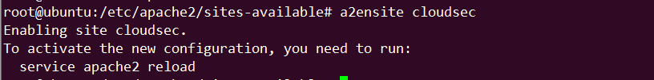
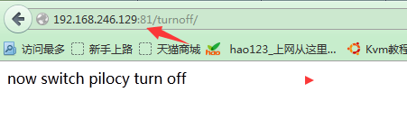

horizon+keystone+ceilometer
~~~~~~~~~~~~~~~~~~~~~~~~~~~

为何选择3个框架
----------------

主要原因如下：

.. code-block:: console

 # 懒
 # 熟悉
 # 还不错
 >>>>>>>>>>>>>>>>>>>>>>>>>>>>>>>
 一个值得参考的框架。
 设计较为全面。
 一个带认证的框架。
 一个带分布式交互的框架。
 一个优秀团队撰写的框架。
 一个用框架较多的框架。
 一个抽象思维较好的框架。
 总之，也没什么坏处。
 >>>>>>>>>>>>>>>>>>>>>>>>>>>>>>
 
.. end

如何构建及验证
--------------

环境准备：ubuntu 18.04 server
依赖开源：openstack

.. code-block:: console

 root@ubuntu:/home/ubuntu# apt-get update # 更新源
 root@ubuntu:/etc/apt# add-apt-repository cloud-archive:rocky # 增加openstack 社区源
 root@ubuntu: apt-get update && apt-get dist-upgrade  # 更新 等待时间较长
 root@ubuntu: apt install python-openstackclient  # 按装openstack 客户端(sdk)
 root@ubuntu:/etc/apt# apt install mariadb-server python-pymysql # 安装mysql
 root@ubuntu:/etc/apt# touch /etc/mysql/mariadb.conf.d/99-openstack.cnf # 创建mysql openstack 配置文件
 root@ubuntu:/etc/apt# vi /etc/mysql/mariadb.conf.d/99-openstack.cnf 
  [mysqld]
  bind-address = 0.0.0.0

  default-storage-engine = innodb
  innodb_file_per_table = on
  max_connections = 4096
  collation-server = utf8_general_ci
  character-set-server = utf8
  # add the following info
 root@ubuntu:/etc/apt# service mysql restart# 重启Mysql

 root@ubuntu:/etc/apt# mysql_secure_installation
 >>>>>>>>>>>>>>>>>>>>>>>>>>>>>>>>>>>>>>>>>>>>>>>>>>>>>>>>>>>>>>>>>>>>>>>>>>
 NOTE: RUNNING ALL PARTS OF THIS SCRIPT IS RECOMMENDED FOR ALL MariaDB
      SERVERS IN PRODUCTION USE!  PLEASE READ EACH STEP CAREFULLY!

 In order to log into MariaDB to secure it, we'll need the current
 password for the root user.  If you've just installed MariaDB, and
 you haven't set the root password yet, the password will be blank,
 so you should just press enter here.

 Enter current password for root (enter for none): 
	OK, successfully used password, moving on...

	Setting the root password ensures that nobody can log into the MariaDB
	root user without the proper authorisation.

	Set root password? [Y/n] y
	New password: 
	Re-enter new password: 
	Password updated successfully!
	Reloading privilege tables..
	 ... Success!

	By default, a MariaDB installation has an anonymous user, allowing anyone
	to log into MariaDB without having to have a user account created for
	them.  This is intended only for testing, and to make the installation
	go a bit smoother.  You should remove them before moving into a
	production environment.

	Remove anonymous users? [Y/n] y
	 ... Success!

	Normally, root should only be allowed to connect from 'localhost'.  This
	ensures that someone cannot guess at the root password from the network.

	Disallow root login remotely? [Y/n] n
	 ... skipping.

	By default, MariaDB comes with a database named 'test' that anyone can
	access.  This is also intended only for testing, and should be removed
	before moving into a production environment.

	Remove test database and access to it? [Y/n] y
	 - Dropping test database...
	 ... Success!
	 - Removing privileges on test database...
	 ... Success!

	Reloading the privilege tables will ensure that all changes made so far
	will take effect immediately.

	Reload privilege tables now? [Y/n] y
	 ... Success!

	 Cleaning up...

	 All done!  If you've completed all of the above steps, your MariaDB
	 installation should now be secure.

	 Thanks for using MariaDB!
    >>>>>>>>>>>>>>>>>>>>>>>>>>>>>>>>>>>>>>>>>>>>>>>>>>>>>>>>>>>>>>.

.. end

.. figure:: image/linux-shell/awk.png
   :width: 80%
   :align: center
   :alt: awk

django 如何部署在apache下
------------------------

.. code-block:: console

 python manage.py runserver 0.0.0.0:8000
 下正常运行起来了，那么接下来只需要配置apache2 即可
 1、安装所需要的软件包:

     apt-get install apache2
     apt-get install python-django
     apt-get install libapache2-mod-wsgi
 2、修改apache2配置文件，端口情况，这里的端口需要根据自己的需要指定 
      vi  /etc/apache2/ports.conf
      添加监听端口

.. end

.. code-block:: console

 3、添加配置项目，让apache可寻找 django入口
      touch /etc/apache2/sites-avilable/cloudsec.conf
      vi /etc/apche2/sites/avilable/cloudsec.conf
       <VirtualHost \*:81>
        ServerName 192.168.246.129 
       WSGIScriptAlias / /opt/cloud3.0/cloudsec/cloudsec/wsgi.py
       <Directory /opt/cloud3.0/cloudsec>
       <Files wsgi.py> 
            Require all granted
       </Files>
       </Directory>
       </VirtualHost>

.. end

.. code-block:: console

 4、修改 /opt/cloud3.0/cloudsec/cloudsec/wsgi.py文件 
     新添加 
     import sys
     sys.path.append('/opt/cloud3.0')
     sys.path.append('/opt/cloud3.0/cloudsec')
     path = '/opt/cloud3.0'

      if path not in sys.path:
          sys.path.insert(0, '/opt/cloud3.0')

.. end

.. figure:: image/fy-img/step-4.png
   :width: 80%
   :align: center
   :alt: step-4

.. code-block:: console

 5、令apache2配置生效 
     cd /etc/apache2/sites-available
    执行 
    sudo a2ensite cloudsec 

.. end

执行完后 会在  /etc/apache2/sites-enabled下生成软连接文件 cloudsec.conf

.. figure:: image/fy-img/step-5-1.png
   :width: 80%
   :align: center
   :alt: step-5-1

.. code-block:: console

 6、reload apache2
     执行 ：
     service apache2 reload
     每次修改 配置文件都需要 reload
 7、重启 apache2  service apache2 restart

 8、访问 web

.. end

2
--

.. code-block:: console

.. end

3
-------------

.. code-block:: console

.. end

