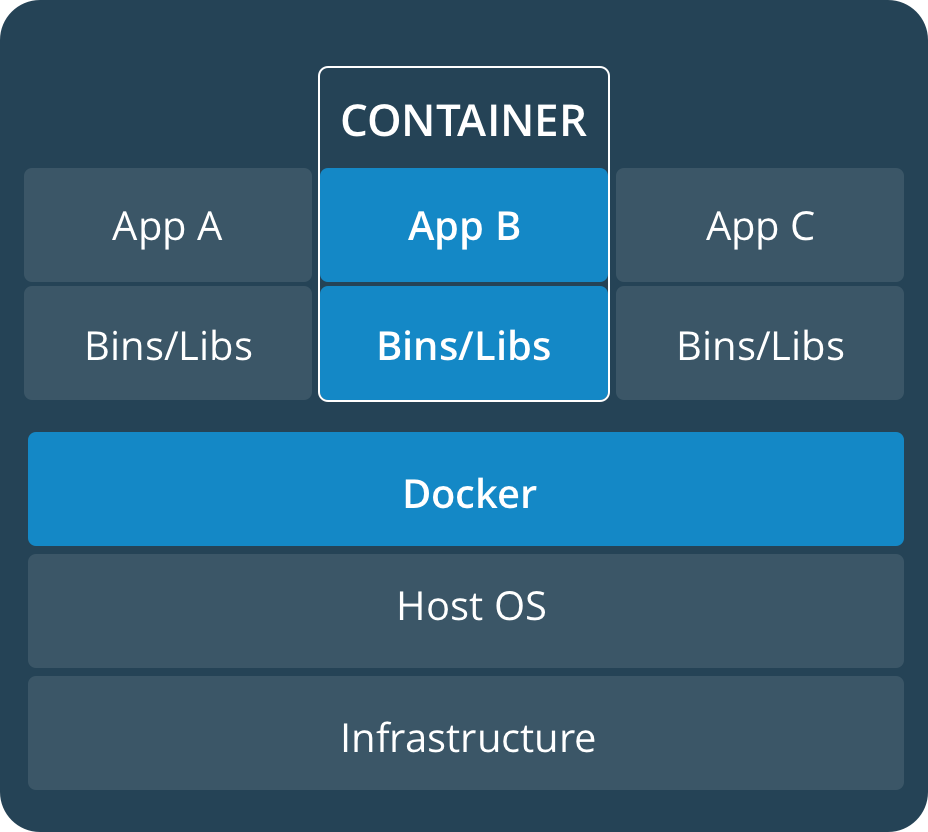

Get-Start Docker
~~~~~~~~~~~~~~~~
在接下来的分享中，重点分享六个方面的内容：
1. 介绍Docker
2. 构建并运行第一个Docker容器
3. 将APP转换为一个扩展服务
4. 将服务扩展至多个服务集群
5. 添加一个永久保存的访问计时器
6. 将集群部署至生产环境

示例中的应用程序非常的简单，因此读者不必纠结于程序本身的代码. 事实上，这与Docker的理念是相同的。Docker更关注如何构建，发布以及运行应用程序，具体应用程序的复杂度，Docker是毫不关心的。

概念介绍
---------------
1. image:镜像是一个轻量级的、独立的、可执行的包，它包含运行一个软件所需的所有东西，包括代码、运行时、库、环境变量和配置文件。
2. Container 容器是一个映像的运行时实例，当实际执行时，映像会在内存中出现。默认情况下，它与主机环境完全隔离，只有在配置时才访问主机文件和端口。
Docker 与 VM 的比较
--------------------
.. figure:: image/docker/vm.png
   :width: 80%
   :align: center
   :alt: vm

新的开发环境
------------
在过去，如果您开始编写一个Python应用程序，那么您的第一项业务就是在您的机器上安装一个Python运行时。但是，这就产生了这样一种情况，你的机器上的环境必须是这样才能让你的应用程序按照预期运行;运行应用程序的服务器也是如此。

使用Docker，您可以只获取一个可移植的Python运行时作为映像，不需要安装。然后，您的构建可以在应用程序代码旁边包含基本的Python映像，确保您的应用程序、它的依赖项和运行时都可以一起旅行。

这些可移植的图像是由一个叫做Dockerfile的东西定义的.

使用Dockerfile定义容器
----------------------

Dockerfile 定义了容器的内容。下面我们将使用一个简单的例子，学习下容器的创建过程。

首先，创建一个空白的目录，并创建名称为Dockerfile的文件，然后将如下内容复制到该文件中。

.. code-block:: console
	
        # Use an official Python runtime as a parent image
	FROM python:2.7-slim

	# Set the working directory to /app
	WORKDIR /app

	# Copy the current directory contents into the container at /app
	ADD . /app

	# Install any needed packages specified in requirements.txt
	RUN pip install --trusted-host pypi.python.org -r requirements.txt

	# Make port 80 available to the world outside this container
	EXPOSE 80

	# Define environment variable
	ENV NAME World

	# Run app.py when the container launches
	CMD ["python", "app.py"]

.. end

创建应用所需要的文件，requirements.txt 以及 app.py. 与Dockerfile放在相同的目录下。
这与我们的应用就创建完毕了。其中：

requirements.txt 

.. code-block:: console

 Flask
 Redis

.. end

app.py 

.. code-block:: python

	from flask import Flask
	from redis import Redis, RedisError
	import os
	import socket

	# Connect to Redis
	redis = Redis(host="redis", db=0, socket_connect_timeout=2, socket_timeout=2)

	app = Flask(__name__)

	@app.route("/")
	def hello():
	    try:
		visits = redis.incr("counter")
	    except RedisError:
		visits = "<i>cannot connect to Redis, counter disabled</i>"

	    html = "<h3>Hello {name}!</h3>" \
		   "<b>Hostname:</b> {hostname} " \
		   "<b>Visits:</b> {visits}"
	    return html.format(name=os.getenv("NAME", "world"), hostname=socket.gethostname(), visits=visits)

	if __name__ == "__main__":
	    app.run(host='0.0.0.0', port=80)

.. end

构建APP
-------
现在查看我们创建的文件:

.. code-block:: console

	root@cecgw:/home/cecgw/docker/docker-app# ls
	app.py  Dockerfile  requirements.txt

.. end
现在可以运行docker命令，构建一个Docker镜像. 我们用-t命令标记该镜像。

.. code-block:: console

	docker build -t friendlyhello .
	Sending build context to Docker daemon   5.12kB
	Step 1/7 : FROM python:2.7-slim
	2.7-slim: Pulling from library/python
	c4bb02b17bb4: Pull complete 
	c5c896dce5ee: Pull complete 
	cf210b898cc6: Downloading [===>                                               ]    983kB/14.93MB
	5117cef49bdb: Download complete 

	cf210b898cc6: Pull complete 
	5117cef49bdb: Pull complete 
	Digest: sha256:22112f2295fe9ea84b72e5344af73a2580a47b1014a1f4c58eccf6095b7ea18f
	Status: Downloaded newer image for python:2.7-slim
	 ---> 4fd30fc83117
	Step 2/7 : WORKDIR /app
	Removing intermediate container 44556fde19fe
	 ---> 8fa21018e0be
	Step 3/7 : ADD . /app
	 ---> f110d6b4a4ea
	Step 4/7 : RUN pip install --trusted-host pypi.python.org -r requirements.txt
	 ---> Running in 1d0e54fa8dfc
	Collecting Flask (from -r requirements.txt (line 1))
	  Downloading Flask-0.12.2-py2.py3-none-any.whl (83kB)
	Collecting Redis (from -r requirements.txt (line 2))
	  Downloading redis-2.10.6-py2.py3-none-any.whl (64kB)
	Collecting itsdangerous>=0.21 (from Flask->-r requirements.txt (line 1))
	  Downloading itsdangerous-0.24.tar.gz (46kB)
	Collecting Jinja2>=2.4 (from Flask->-r requirements.txt (line 1))
	  Downloading Jinja2-2.10-py2.py3-none-any.whl (126kB)
	Collecting Werkzeug>=0.7 (from Flask->-r requirements.txt (line 1))
	  Downloading Werkzeug-0.14.1-py2.py3-none-any.whl (322kB)
	Collecting click>=2.0 (from Flask->-r requirements.txt (line 1))
	  Downloading click-6.7-py2.py3-none-any.whl (71kB)
	Collecting MarkupSafe>=0.23 (from Jinja2>=2.4->Flask->-r requirements.txt (line 1))
	  Downloading MarkupSafe-1.0.tar.gz
	Building wheels for collected packages: itsdangerous, MarkupSafe
	  Running setup.py bdist_wheel for itsdangerous: started
	  Running setup.py bdist_wheel for itsdangerous: finished with status 'done'
	  Stored in directory: /root/.cache/pip/wheels/fc/a8/66/24d655233c757e178d45dea2de22a04c6d92766abfb741129a
	  Running setup.py bdist_wheel for MarkupSafe: started
	  Running setup.py bdist_wheel for MarkupSafe: finished with status 'done'
	  Stored in directory: /root/.cache/pip/wheels/88/a7/30/e39a54a87bcbe25308fa3ca64e8ddc75d9b3e5afa21ee32d57
	Successfully built itsdangerous MarkupSafe
	Installing collected packages: itsdangerous, MarkupSafe, Jinja2, Werkzeug, click, Flask, Redis
	Successfully installed Flask-0.12.2 Jinja2-2.10 MarkupSafe-1.0 Redis-2.10.6 Werkzeug-0.14.1 click-6.7 itsdangerous-0.24
	Removing intermediate container 1d0e54fa8dfc
	 ---> 964c9a2ff5ac
	Step 5/7 : EXPOSE 80
	 ---> Running in f136af4ed15f
	Removing intermediate container f136af4ed15f
	 ---> 9fe081fc05a0
	Step 6/7 : ENV NAME World
	 ---> Running in ae4dee9777e3
	Removing intermediate container ae4dee9777e3
	 ---> 9de5dff3a988
	Step 7/7 : CMD ["python", "app.py"]
	 ---> Running in 61a41aa26178
	Removing intermediate container 61a41aa26178
	 ---> e8aafca68713
	Successfully built e8aafca68713
	Successfully tagged friendlyhello:latest
.. end

运行容器
--------
执行DOCKER运行命令，前台执行命令：
.. code-block:: console

  docker run -p 4000:80 friendlyhello

.. end

后台执行命令：

.. code-block:: console

 docker run -d -p 4000:80 friendlyhello

.. end

查看容器运行状态：

.. code-block:: console

 # docker container ls
 CONTAINER ID        IMAGE               COMMAND             CREATED             STATUS              PORTS                  NAMES
 621fa271fc72        friendlyhello       "python app.py"     44 seconds ago      Up 43 seconds       0.0.0.0:4000->80/tcp   jovial_morse

.. end

结束容器运行命令：

.. code-block:: console

 # docker container stop 621fa271fc72
   621fa271fc72

.. end

容器运行成功后，可以访问浏览器，http://ip:4000,可以查看浏览器响应。也可以在本地使用
curl命令进行查看。

.. code-block:: console

	# curl http://localhost:4000
	<h3>Hello World!</h3><b>Hostname:</b> 598cc14f4c28 <b>Visits:</b> <i>cannot connect to Redis, counter disabled</i>
.. end
分享镜像
--------

测试成功后，我们可以将我们制作的镜像上传至云端。前提是需要到官网上进行注册。
`注册地址 <https://cloud.docker.com>`_.

本地登录
       注册后，在本地终端进行登录：

.. code-block:: console
	root@cecgw:/home/cecgw/github/readme/source# docker login
	Login with your Docker ID to push and pull images from Docker Hub. If you don't have a Docker ID, head over to https://hub.docker.com to create one.
	Username: oneandonly
	Password: 
	Login Succeeded
.. end

Docker 服务
-----------
前面已经介绍了容器的内容，现在介绍下Services. 

如果已经安装了Docker|docker-engine的，可以使用如下指令，完成旧版本的卸载：

.. code-block:: console

   $ sudo apt-get remove docker docker-engine docker.io

.. end
在目录 ``/var/log/docker/`` 目录下，卸载后仍然保留原有的镜像，容器，以及网络的配置，现在Docker CE包已经改名为 ``docker-ce``.

安装Docker 
----------
安装方式包括两种，一种为APT安装，一种是通过DEB包安装。

APT安装

deb包安装

用户可以到 `Docker源选取合适的包下载安装 <https://download.docker.com/linux/ubuntu/dists/trusty/>`_.
下载后，使用如下命令进行安装：
.. code-block:: console
   root@cecgw:/home/cecgw# dpkg -i docker-ce_17.12.0~ce-0~ubuntu_amd64.deb
.. end
首次执行后，发现出现报错信息如下:

.. code-block:: console

  root@cecgw:/home/cecgw#  dpkg -i docker-ce_17.12.0~ce-0~ubuntu_amd64.deb 
  (Reading database ... 134914 files and directories currently installed.)
  Preparing to unpack docker-ce_17.12.0~ce-0~ubuntu_amd64.deb ...
  Unpacking docker-ce (17.12.0~ce-0~ubuntu) over (17.12.0~ce-0~ubuntu) ...
  dpkg: dependency problems prevent configuration of docker-ce:
  docker-ce depends on libsystemd-journal0 (>= 201); however:
  Package libsystemd-journal0 is not installed.

  dpkg: error processing package docker-ce (--install):
  dependency problems - leaving unconfigured
  Processing triggers for ureadahead (0.100.0-16) ...
  Processing triggers for man-db (2.6.7.1-1ubuntu1) ...
  Errors were encountered while processing:
  docker-ce
.. end
发现系统中缺少依赖，关于依赖的问题，确实是在软件部署及升级过程中，非常头痛的问题，Docker也是在着重解决该问题。

.. Note::

  这里给大家普及下，如何找到相关的依赖，`站点 https://pkgs.org/ <https://pkgs.org/>`_ 中提供了linux中大部分的软件包，
  大家可以在此网站上，选取适合自己的操作系统版本，并搜索下载相关的软件包。
.. end

下载完成后，先安装相关的依赖，然后完成Docker相关的软件安装即可。我们查看系统用户组，`/etc/group`发现多出系统用户组docker，但查看`/etc/passwd`，并没有发现多出docker用户。

下载完成后，我们可以使用如下命令验证Docker安装是否成功：

.. code-block:: console

        docker run hello-world
	Unable to find image 'hello-world:latest' locally
	latest: Pulling from library/hello-world
	ca4f61b1923c: Pull complete 
	Digest: sha256:66ef312bbac49c39a89aa9bcc3cb4f3c9e7de3788c944158df3ee0176d32b751
	Status: Downloaded newer image for hello-world:latest

	Hello from Docker!
	This message shows that your installation appears to be working correctly.

	To generate this message, Docker took the following steps:
	 1. The Docker client contacted the Docker daemon.
	 2. The Docker daemon pulled the "hello-world" image from the Docker Hub.
	    (amd64)
	 3. The Docker daemon created a new container from that image which runs the
	    executable that produces the output you are currently reading.
	 4. The Docker daemon streamed that output to the Docker client, which sent it
	    to your terminal.

	To try something more ambitious, you can run an Ubuntu container with:
	 $ docker run -it ubuntu bash

	Share images, automate workflows, and more with a free Docker ID:
	 https://cloud.docker.com/

	For more examples and ideas, visit:
	 https://docs.docker.com/engine/userguide/
.. end

该命令，将下载一个测试镜像，并且启动容器；该测试容器将打印Hello from Docker. 并且退出，似乎我们已经运行了一个容器，但对于其原理及用途扔不是很清晰。带着疑问继续研究。
具体到Docker自身，我们需要观察，Docker运行的一些基本元素，比如，是否只有root用户权限可操作？是否绑定系统端口？是否跟随系统自启动？等一系列的问题，这个将在随后的章节给出答案。

卸载DOCKER CE
-------------
1. 卸载相关软件包:

.. code-block:: console

  # sudo apt-get purge docker-ce

.. end

2. 删除相关的镜像，容器，卷：

.. code-block:: console

  # sudo rm -rf /var/lib/docker

.. end

		 

end-21

   
