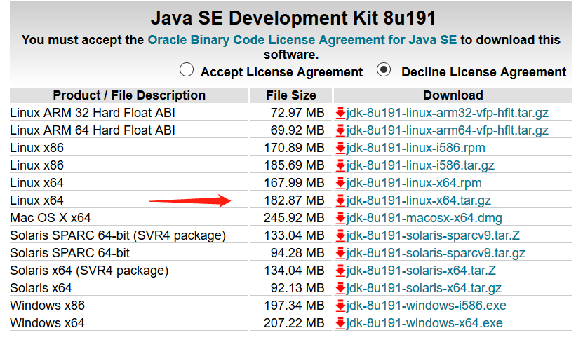
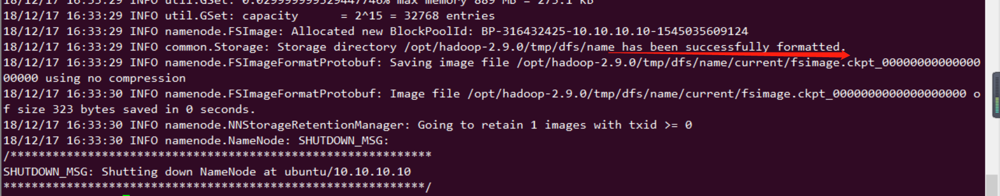

HADOOP安装
~~~~~~~~~~

单机版本安装
------------
操作系统：ubuntu-16.04
jdk版本：jdk-8u191-linux-x64.tar.gz
hadoop版本：2.7.7
关于hadoop与jdk之间的关系，可以参考（https://wiki.apache.org/hadoop/HadoopJavaVersions）

创建hadoop用户
=============

使用root登陆系统，创建用户组：hadoop，然后在此用户组下创建hadoop用户。可在安装系统的时候创建，也可以在安装好之后用如下命令创建：

.. code-block:: console

 添加用户：# sudo useradd -m hadoop -s /bin/bash
 设置密码：# passwd hadoop 
 设置root权限：# sudo adduser hadoop sudo。

.. end

java安装
========
1. 下载jdk软件包。jdk下载地址为：(https://www.oracle.com/technetwork/java/javase/downloads/jdk8-downloads-2133151.html)
选择所需要的软件包，本次安装环境为ubuntu1604，选择软件包版本为：jdk-8u191-linux-x64.tar.gz

2. 将下载的压缩包，传输至安装环境。解压。

.. code-block:: console

 # tar -xzvf jdk-8u191-linux-x64.tar.gz 解压
 # mv jdk1.8.0_191/ /usr/lib/jdk 将解压文件移动至/usr/lib/jdk，作为jdk安装目录。
 
.. end

3. 配置环境变量。

.. code-block:: console

 # vi /etc/profile 配置全局环境变量
 写入：
 # set java environment 
 export JAVA_HOME=/usr/lib/jdk
 export CLASSPATH=.:$JAVA_HOME/lib:$JAVA_HOME/jre/lib
 export PATH=.:$JAVA_HOME/bin:$PATH

.. end

4. 测试验证。

.. code-block:: console

 # java -version 测试
 java version "1.8.0_191"
 Java(TM) SE Runtime Environment (build 1.8.0_191-b12)
 Java HotSpot(TM) 64-Bit Server VM (build 25.191-b12, mixed mode)

 NOTE: 切换到hadoop 用户，测试java是否正常，直接执行java -version 提示需要安装java，需要执行 source /etc/profile 即可。
 在不执行 /etc/profile 情况下，hadoop不能读取环境变量，该情况下，修改/home/hadoop/.bashrc文件，追加上述环境变量，source /home/hadoop/.bashrc 即可在hadoop用户下永久生效。
 如果只允许某个用户使用java，则只需要在该用户的主目录下，修改.bashrc，在文件末尾追加上述环境变量即可。
 
.. end

至此，java安装完毕。

hadoop 单机伪分布式安装
=======================

1. 软件包下载.

软件包下载：软件下载地址为 (http://mirrors.shu.edu.cn/apache/hadoop/common/hadoop-2.7.7/hadoop-2.7.7.tar.gz)

2. 解压缩文件.

解压到安装目录(root 用户),安装软件。

.. code-block:: console

 # tar -xzvf hadoop-2.7.7.tar.gz -C /opt
 # cd /opt 
 # chown -R hadoop:hadoop hadoop-2.7.7
 Hadoop 解压后即可使用。输入如下命令来检查 Hadoop 是否可用，成功则会显示 Hadoop 版本信息：
 # cd /opt/hadoop-2.7.7
 # ./bin/hadoop version

.. end

3. 配置hadoop环境变量

.. code-block:: console

 vi /home/hadoop/.bashrc
 追加 export PATH=$PATH:/opt/hadoop-2.7.7/sbin:/opt/hadoop-2.7.7/bin
 使配置生效：
 # source /home/hadoop/.bashrc

.. end

4. 配置hadoop 配置文件

Hadoop 可以在单节点上以伪分布式的方式运行，Hadoop 进程以分离的 Java 进程来运行，节点既作为 NameNode 也作为 DataNode，同时，读取的是 HDFS 中的文件。

Hadoop 的配置文件位于 /opt/hadoop-2.7.7/etc/hadoop/ 中，伪分布式需要修改2个配置文件 core-site.xml 和 hdfs-site.xml。Hadoop的配置文件是 xml 格式，每个配置以声明 property 的 name 和 value 的方式来实现。

.. code-block:: console

	修改 core-site.xml
	修改配置文件 core-site.xml (通过 vi 编辑会比较方便: vi ./etc/hadoop/core-site.xml)，将当中的
	<configuration>
	</configuration>
	XML
	修改为下面配置：
	<configuration>
	<property>
	<name>hadoop.tmp.dir</name>
	<value>file:/opt/hadoop-2.7.7/tmp</value>
	<description>Abase for other temporary directories.</description>
	</property>
	<property>
	<name>fs.defaultFS</name>
	<value>hdfs://localhost:9000</value>
	</property>
	</configuration>
	XML
	同样的，修改配置文件 hdfs-site.xml：
	<configuration>
	<property>
	<name>dfs.replication</name>
	<value>1</value>
	</property>
	<property>
	<name>dfs.namenode.name.dir</name>
	<value>file:/opt/hadoop-2.7.7/tmp/dfs/name</value>
	</property>
	<property>
	<name>dfs.datanode.data.dir</name>
	<value>file:/opt/hadoop-2.7.7/tmp/dfs/data</value>
	</property>
	</configuration>
	修改
	./etc/hadoop/hadoop-env.sh 中设置 JAVA_HOME 变量，即在该文件中找到：
	export JAVA_HOME=${JAVA_HOME}
	将这一行改为JAVA安装位置：
	export JAVA_HOME=/usr/lib/jdk

.. end

5. 测试验证。

配置完成后，执行 NameNode 的格式化:

.. code-block:: console

 # ./bin/hdfs namenode -format

.. end

启动NameNode和DataNode守护进程。启动时，提示输入密码，输入hadoop密码即可。

.. code-block:: console

 # ./sbin/start-dfs.sh
 # jsp
 # 可以看到 namenode datanode secondnamenode 均正常启动。

.. end

成功启动后，可以访问 Web 界面 http://ip:50070 查看 NameNode 和 Datanode 信息，还可以在线查看 HDFS 中的文件。

6. 配置免密码登录。

上述启动过程中，需要输入密码，可配置免密码登录，即可避免输入密码。

.. code-block:: console

 以hadoop用户登录，
 cd ~/.ssh/ # 若没有该目录，请先执行一次ssh localhost 
 ssh-keygen -t rsa # 会有提示，都按回车就可以
 cat ./id_rsa.pub >> ./authorized_keys # 加入授权
 这样下次启动时，则不需要再次输入密码启动hadoop.

7. 运行Hadoop伪分布式实例

.. code-block:: console

	要使用 HDFS，首先需要在 HDFS 中创建用户目录：
	./bin/hdfs dfs -mkdir -p  /user/hadoop
	Shell 命令
	接着将 ./etc/hadoop 中的 xml 文件作为输入文件复制到分布式文件系统中，即将 /usr/local/hadoop/etc/hadoop 复制到分布式文件系统中的 /user/hadoop/input 中。我们使用的是 hadoop 用户，并且已创建相应的用户目录 /user/hadoop ，因此在命令中就可以使用相对路径如 input，其对应的绝对路径就是 /user/hadoop/input:
	./bin/hdfs dfs -mkdir input
	./bin/hdfs dfs -put ./etc/hadoop/*.xml input
	Shell 命令
	复制完成后，可以通过如下命令查看文件列表：
	./bin/hdfs dfs -ls input
	Shell 命令
	伪分布式运行 MapReduce 作业的方式跟单机模式相同，区别在于伪分布式读取的是HDFS中的文件（可以将单机步骤中创建的本地 input 文件夹，输出结果 output 文件夹都删掉来验证这一点）。
	./bin/hadoop jar ./share/hadoop/mapreduce/hadoop-mapreduce-examples-*.jar grep input output 'dfs[a-z.]+'
	Shell 命令
	查看运行结果的命令（查看的是位于 HDFS 中的输出结果）：
	./bin/hdfs dfs -cat output/*

.. end

8. 启动YARN

.. code-block:: console

	启动YARN
	（伪分布式不启动 YARN 也可以，一般不会影响程序执行）
	有的读者可能会疑惑，怎么启动 Hadoop 后，见不到书上所说的 JobTracker 和 TaskTracker，这是因为新版的 Hadoop 使用了新的 MapReduce 框架（MapReduce V2，也称为 YARN，Yet Another Resource Negotiator）。
	YARN 是从 MapReduce 中分离出来的，负责资源管理与任务调度。YARN 运行于 MapReduce 之上，提供了高可用性、高扩展性，YARN 的更多介绍在此不展开，有兴趣的可查阅相关资料。
	上述通过 ./sbin/start-dfs.sh 启动 Hadoop，仅仅是启动了 MapReduce 环境，我们可以启动 YARN ，让 YARN 来负责资源管理与任务调度。
	首先修改配置文件 mapred-site.xml，这边需要先进行重命名：
	mv ./etc/hadoop/mapred-site.xml.template ./etc/hadoop/mapred-site.xml
	Shell 命令
	然后再进行编辑，同样使用 gedit 编辑会比较方便些 gedit ./etc/hadoop/mapred-site.xml ：
	<configuration>
	<property>
	<name>mapreduce.framework.name</name>
	<value>yarn</value>
	</property>
	</configuration>
	XML
	接着修改配置文件 yarn-site.xml：
	<configuration>
	<property>
	<name>yarn.nodemanager.aux-services</name>
	<value>mapreduce_shuffle</value>
	</property>
	</configuration>
	XML
	然后就可以启动 YARN 了（需要先执行过 ./sbin/start-dfs.sh）：
	./sbin/start-yarn.sh      # 启动YARN
	./sbin/mr-jobhistory-daemon.sh start historyserver  # 开启历史服务器，才能在Web中查看任务运行情况
	Shell 命令
	开启后通过 jps 查看，可以看到多了 NodeManager 和 ResourceManager 两个后台进程

.. end

启动 YARN 之后，运行实例的方法还是一样的，仅仅是资源管理方式、任务调度不同。观察日志信息可以发现，不启用 YARN 时，是 "mapred.LocalJobRunner"在跑任务，启用 YARN 之后，是"mapred.YARNRunner"在跑任务。启动 YARN 有个好处是可以通过 Web 界面查看任务的运行情况：http://ip:8088/cluster

分布式版本安装
--------------
环境准备
========
操作系统版本：ubuntu-16.04 （操作系统安装过程中默认安装sshserver）
jdk版本：jdk-8u191-linux-x64.tar.gz
hadoop版本：2.7.7
关于hadoop与jdk之间的关系，可以参考（https://wiki.apache.org/hadoop/HadoopJavaVersions）
物理主机3台，其中1台充当集群master角色,2台充当slaver角色。

服务器基本配置
^^^^^^^^^^^^^^
1、在各节点上配置网络。

.. code-block:: console

    
	# vi  /etc/network/interface 
	auto eth0
      iface eth0 inet static
      address 17.17.17.2
      gateway 17.17.17.1
      netmask 255.255.255.0
      dns-nameservers 114.114.114.114
    # ifup eth0 # 使配置生效;
	# ping 17.17.17.2 # 并检测网络配置；
  
.. end

同理，配置其他节点，满足如下IP配置。

.. code-block:: console
  
	master    17.17.17.2
	slaver-1  17.17.17.4  
	slaver-2  17.17.17.5
	
.. end

2、为方便使用，配置节点名称与IP对应关系,三台配置如下：

.. code-block:: console

   root@bignode1:/home/ubuntu# vi /etc/hosts
   
   127.0.0.1       localhost
   17.17.17.2      master
   17.17.17.4      slaver-1
   17.17.17.5      slaver-2

   
   root@bignode1:/home/ubuntu# ping master
   PING master (17.17.17.2) 56(84) bytes of data.
   64 bytes from master (17.17.17.2): icmp_seq=1 ttl=64 time=0.025 ms 
   # 说明映射成功。
   修改各个节点的主机名。
   vi /etc/hostname
   修改为与上述配置一致，后重启。
   
.. end

3. 安装NTP时钟，并配置时钟同步。确保服务器之间的时钟同步。关于NTP同步的知识可以参考此链接。（http://linux.vbird.org/linux_server/0440ntp.php）
   
.. code-block:: console

   apt-get install ntp ntpdate
   
.. end

配置ntp时钟，使slaver-1,slaver-2与 master 同步。master配置不变，修改slaver-1,slaver-2的配置如下：

.. code-block:: console

   vi /etc/ntp.conf # 删除原有配置，设置新配置如下：
   
	server 210.72.145.44 
	server master
	server 127.127.1.0
	fudge 127.127.1.0 stratum 10
   
.. end

重启修改配置服务器的ntp服务。

.. code-block:: console

  root@slaver-1:/home/ubuntu# /etc/init.d/ntp restart
 [ ok ] Restarting ntp (via systemctl): ntp.service.
   
.. end

slaver节点同步时钟。

.. code-block:: console

	root@slaver-1:/home/ubuntu# /etc/init.d/ntp stop
	[ ok ] Stopping ntp (via systemctl): ntp.service.
	root@bignode3:/home/ubuntu# ntpdate master
	24 Jan 16:37:51 ntpdate[25729]: adjust time server 17.17.17.2 offset -0.012206 sec
	root@bignode3:/home/ubuntu# /etc/init.d/ntp start
	[ ok ] Starting ntp (via systemctl): ntp.service.
	
.. code-block:: console

创建hadoop用户
==============

在各个节点上，使用root登陆系统，创建用户组：hadoop，然后在此用户组下创建hadoop用户。可在安装系统的时候创建，也可以在安装好之后用如下命令创建：

.. code-block:: console

 添加用户：# sudo useradd -m hadoop -s /bin/bash
 设置密码：# passwd hadoop 
 设置root权限：# sudo adduser hadoop sudo。

.. end

配置master-slaver hadoop用户免密码登录
======================================

1. 在各个节点上，配置本机hadoop用户免密码登录。
 
.. code-block:: console
 
  hadoop@master:~$ ssh-keygen -t rsa #过程中直接Enter即可。注意使用hadoop用户执行。
  cd /home/hadoop/ 
  hadoop@master:~$ cat .ssh/id_rsa.pub >> .ssh/authorized_keys
  cat .ssh/id_rsa.pub >> .ssh/authorized_keys
  hadoop@master:~$ ssh localhost #不需要输入密码即免密码登录设置成功。

  .. end
  
2. 配置master-> slaver之间的免密码登录。

.. code-block:: console
    # 将master 公钥拷贝到各个slaver节点。
	hadoop@master:~$ scp -r .ssh/id_rsa.pub hadoop@slaver-1:/home/hadoop/
	The authenticity of host 'slaver-1 (17.17.17.4)' can't be established.
	ECDSA key fingerprint is SHA256:3G/O1TJBx+h+Si0SB32dHAXgk1Yi8no8xZIJ4SJVUzc.
	Are you sure you want to continue connecting (yes/no)? yes
	Warning: Permanently added 'slaver-1,17.17.17.4' (ECDSA) to the list of known hosts.
	hadoop@slaver-1's password: 
	id_rsa.pub                                                                                               100%  395     0.4KB/s   00:00    
	hadoop@master:~$ scp -r .ssh/id_rsa.pub hadoop@slaver-2:/home/hadoop/
	The authenticity of host 'slaver-2 (17.17.17.5)' can't be established.
	ECDSA key fingerprint is SHA256:3G/O1TJBx+h+Si0SB32dHAXgk1Yi8no8xZIJ4SJVUzc.
	Are you sure you want to continue connecting (yes/no)? yes
	Warning: Permanently added 'slaver-2,17.17.17.5' (ECDSA) to the list of known hosts.
	hadoop@slaver-2's password: 
	id_rsa.pub                                                                                               100%  395     0.4KB/s   00:00   
    # 在各个节点上追加其公钥到授权文件中。
	hadoop@slaver-1:~$ cat ./id_rsa.pub >> .ssh/authorized_keys
	hadoop@slaver-2:~$ cat ./id_rsa.pub >> .ssh/authorized_keys
	# 验证免密码登录。
	hadoop@master:~$ ssh slaver-1  # master-slaver1 不需要免登录。
	Welcome to Ubuntu 16.04 LTS (GNU/Linux 4.4.0-21-generic x86_64)

	 * Documentation:  https://help.ubuntu.com/

	138 packages can be updated.
	11 updates are security updates.

	New release '18.04.1 LTS' available.
	Run 'do-release-upgrade' to upgrade to it.

	Last login: Thu Jan 24 17:06:42 2019 from ::1
	To run a command as administrator (user "root"), use "sudo <command>".
	See "man sudo_root" for details.

	hadoop@slaver-1:~$ exit
	logout
	Connection to slaver-1 closed.
	hadoop@master:~$ ssh slaver-2  # master-slaver2 不需要免登录。
	Welcome to Ubuntu 16.04 LTS (GNU/Linux 4.4.0-21-generic x86_64)

	 * Documentation:  https://help.ubuntu.com/

	138 packages can be updated.
	11 updates are security updates.

	New release '18.04.1 LTS' available.
	Run 'do-release-upgrade' to upgrade to it.

	Last login: Thu Jan 24 17:10:55 2019 from ::1
	To run a command as administrator (user "root"), use "sudo <command>".
	See "man sudo_root" for details.

	hadoop@slaver-2:~$ exit
	logout
	Connection to slaver-2 closed.
  
.. end
  
  
 
java安装
========

各个节点均需安如下步骤操作。
1. 下载jdk软件包。jdk下载地址为：(https://www.oracle.com/technetwork/java/javase/downloads/jdk8-downloads-2133151.html)
选择所需要的软件包，本次安装环境为ubuntu1604，选择软件包版本为：jdk-8u191-linux-x64.tar.gz

2. 将下载的压缩包，传输至安装环境。解压。

.. code-block:: console

 # tar -xzvf jdk-8u191-linux-x64.tar.gz 解压
 # mv jdk1.8.0_191/ /usr/lib/jdk 将解压文件移动至/usr/lib/jdk，作为jdk安装目录。
 
.. end

3. 配置环境变量。

.. code-block:: console

 # vi /etc/profile 配置全局环境变量
 写入：
 # set java environment 
 export JAVA_HOME=/usr/lib/jdk
 export CLASSPATH=.:$JAVA_HOME/lib:$JAVA_HOME/jre/lib
 export PATH=.:$JAVA_HOME/bin:$PATH

.. end

4. 测试验证。

.. code-block:: console

 # java -version 测试
 java version "1.8.0_191"
 Java(TM) SE Runtime Environment (build 1.8.0_191-b12)
 Java HotSpot(TM) 64-Bit Server VM (build 25.191-b12, mixed mode)

 NOTE: 切换到hadoop 用户，测试java是否正常，直接执行java -version 提示需要安装java，需要执行 source /etc/profile 即可。
 在不执行 /etc/profile 情况下，hadoop不能读取环境变量，该情况下，修改/home/hadoop/.bashrc文件，追加上述环境变量，source /home/hadoop/.bashrc 即可在hadoop用户下永久生效。
 如果只允许某个用户使用java，则只需要在该用户的主目录下，修改.bashrc，在文件末尾追加上述环境变量即可。
 
.. end

至此，java安装完毕。

hadoop 完全分布式安装
=======================

软件包下载
^^^^^^^^^^

软件包下载：软件下载地址为 (http://mirrors.shu.edu.cn/apache/hadoop/common/hadoop-2.7.7/hadoop-2.7.7.tar.gz)

master节点安装hadoop
^^^^^^^^^^^^^^^^^^^^

1. 解压缩文件.安装并解压到安装目录(root 用户),安装软件。

.. code-block:: console

 # tar -xzvf hadoop-2.7.7.tar.gz -C /opt # 解压到安装目录
 # cd /opt 
 # chown -R hadoop:hadoop hadoop-2.7.7 # 调整文件权限
 Hadoop 解压后即可使用。输入如下命令来检查 Hadoop 是否可用，成功则会显示 Hadoop 版本信息：
 # cd /opt/hadoop-2.7.7 
 # ./bin/hadoop version

.. end

2. 配置master hadoop相关配置文件。

2.1 配置slave信息。

.. code-block:: console

  # root@master:/opt/hadoop-2.7.7/etc/hadoop# vi slaves # 将slaves 节点信息写入slaves文件
 
	root@master:/opt/hadoop-2.7.7/etc/hadoop# echo "" > slaves
	root@master:/opt/hadoop-2.7.7/etc/hadoop# vi slaves 
	root@master:/opt/hadoop-2.7.7/etc/hadoop# echo "slaver-1"  >> slaves 
	root@master:/opt/hadoop-2.7.7/etc/hadoop# echo "slaver-2"  >> slaves 

.. end  

2.2 配置core-site.xml文件。

.. code-block:: console

	root@master:/opt/hadoop-2.7.7/etc/hadoop# vi core-site.xml 
	<configuration>
		  <property>
			  <name>hadoop.tmp.dir</name>
			  <value>file:/opt/hadoop-2.7.7/tmp</value>
			  <description>Abase for other temporary directories.</description>
		  </property>
		  <property>
			  <name>fs.defaultFS</name>
			  <value>hdfs://master:9000</value>
		  </property>
	  </configuration>

.. end

2.3 配置hdfs-site.xml文件。

.. code-block:: console

	root@master:/opt/hadoop-2.7.7/etc/hadoop# vi hdfs-site.xml 

	<configuration>
    <property>
        <name>dfs.replication</name>
        <value>3</value>
    </property>
	<property>
		<name>dfs.namenode.name.dir</name>
		<value>file:/opt/hadoop-2.7.7/tmp/dfs/name</value>
	</property>
	<property>
		<name>dfs.datanode.data.dir</name>
		<value>file:/opt/hadoop-2.7.7/tmp/dfs/data</value>
	</property>
	</configuration>

.. end

2.4 配置mapred-site.xml文件。

.. code-block:: console

  root@master:/opt/hadoop-2.7.7/etc/hadoop# cp mapred-site.xml.template mapred-site.xml
  root@master:/opt/hadoop-2.7.7/etc/hadoop# vi mapred-site.xml

	<configuration>
	  <property>
		  <name>mapreduce.framework.name</name>
		  <value>yarn</value>
	  </property>
	</configuration>

.. end

2.5 配置yarn-site.xml文件。

.. code-block:: console

	root@master:/opt/hadoop-2.7.7/etc/hadoop# vi yarn-site.xml 

	<configuration>
	  <!-- Site specific YARN configuration properties -->
		<property>
			<name>yarn.nodemanager.aux-services</name>
			<value>mapreduce_shuffle</value>
		</property>
		<property>
			<name>yarn.resourcemanager.hostname</name>
			<value>master</value>
		</property>
	</configuration>

.. end

2.6 配置hadoop-env.sh、mapred-env.sh。在这两个文件中添加JAVA_HOME路径：

.. code-block:: console

	root@master:/opt/hadoop-2.7.7/etc/hadoop# vi hadoop-env.sh 
	root@master:/opt/hadoop-2.7.7/etc/hadoop# vi mapred-env.sh 
	#export JAVA_HOME=${JAVA_HOME}
	export JAVA_HOME=/usr/lib/jdk

.. end 

2.7 配置hadoop 环境变量。

.. code-block:: console

 vi /home/hadoop/.bashrc
 追加 export PATH=$PATH:/opt/hadoop-2.7.7/sbin:/opt/hadoop-2.7.7/bin
 使配置生效：
 # source /home/hadoop/.bashrc

.. end

slaver节点安装hadoop
^^^^^^^^^^^^^^^^^^^^

1. 将master hadoop安装目录拷贝到slaver-1,slaver-2 与master同步安装目录下即可。

.. note::

 注意scp传输后，hadoop 安装目录的权限。
 
.. end

启动hadoop集群
^^^^^^^^^^^^^^

1. 在hadoop master节点，使用hadoop用户执行格式化命令。

.. code-block:: console

 # hdfs namenode -format
	19/01/25 14:34:55 INFO common.Storage: Storage directory /opt/hadoop-2.7.7/tmp/dfs/name has been successfully formatted.
	19/01/25 14:34:55 INFO namenode.FSImageFormatProtobuf: Saving image file /opt/hadoop-2.7.7/tmp/dfs/name/current/fsimage.ckpt_0000000000000000000 using no compression
	19/01/25 14:34:55 INFO namenode.FSImageFormatProtobuf: Image file /opt/hadoop-2.7.7/tmp/dfs/name/current/fsimage.ckpt_0000000000000000000 of size 322 bytes saved in 0 seconds.
	19/01/25 14:34:55 INFO namenode.NNStorageRetentionManager: Going to retain 1 images with txid >= 0
	19/01/25 14:34:55 INFO util.ExitUtil: Exiting with status 0
	19/01/25 14:34:55 INFO namenode.NameNode: SHUTDOWN_MSG: 
	/************************************************************
	SHUTDOWN_MSG: Shutting down NameNode at master/17.17.17.2
	************************************************************/

.. end 
	
2. 启动集群。

.. code-block:: console

 hadoop@master:/opt/hadoop-2.7.7$ ./sbin/start-all.sh 

.. end

3. 查看集群状态。

# master 节点 hadoop 用户。

.. code-block:: console

 hadoop@master:/opt/hadoop-2.7.7$ jps
 9681 Jps
 9188 ResourceManager
 8799 NameNode
 9023 SecondaryNameNode

.. end

# slaver 节点 hadoop 用户。

.. code-block:: console

 hadoop@slaver-1:/opt/hadoop-2.7.7/etc/hadoop$ jps
 4036 DataNode
 4329 Jps
 4174 NodeManager

.. end

可以访问 http:masterip:50070 查看集群状态。

4. 验证。

.. code-block:: console

 HDFS，首先需要在 HDFS 中创建用户目录：
	./bin/hdfs dfs -mkdir -p  /user/hadoop
	接着将 ./etc/hadoop 中的 xml 文件作为输入文件复制到分布式文件系统中，即将 /usr/local/hadoop/etc/hadoop 复制到分布式文件系统中的 /user/hadoop/input 中。我们使用的是 hadoop 用户，并且已创建相应的用户目录 /user/hadoop ，因此在命令中就可以使用相对路径如 input，其对应的绝对路径就是 /user/hadoop/input:
	./bin/hdfs dfs -mkdir input
	./bin/hdfs dfs -put ./etc/hadoop/*.xml input
	Shell 命令
	复制完成后，可以通过如下命令查看文件列表：
	./bin/hdfs dfs -ls input

Shell 命令

	./bin/hadoop jar ./share/hadoop/mapreduce/hadoop-mapreduce-examples-*.jar grep input output 'dfs[a-z.]+'
	Shell 命令
	查看运行结果的命令（查看的是位于 HDFS 中的输出结果）：
	./bin/hdfs dfs -cat output/*

.. end

.. code-block:: console

 hadoop@master:/opt/hadoop-2.7.7$ hdfs dfs -cat output/*
 1	dfsadmin
 1	dfs.replication
 1	dfs.namenode.name.dir
 1	dfs.datanode.data.dir	
	
.. end

可以在slaver节点上使用grep命令搜索的上传的特殊字符串。均可查看到响应的文件。
至此，分布式环境搭建完毕。	

扩展hadoop集群
^^^^^^^^^^^^^^

操作系统安装-->修改主机名-->配置host.dns-->创建hadoop组-->安装NTP并配置-->安装java并配置-->配置slaver-3->slaver-3，master->slaver-3免密登录-->安装hadoop-->配置slaver环境变量-->master节点修改配置-->安装时钟同步软件-->master节点重启服务并验证。

1、安装操作系统。

2、修改host主机名，也可在安装操作系统时进行设定。建议安装集群前统一规划规范主机名命名规范。

.. code-block:: console

 root@ubuntu:/home/ubuntu# vi /etc/hostname  #修改为 slaver-3,重启生效。
	
.. end

3、修改host域名解析。

.. code-block:: console

	# 在slaver-3上添加域名解析.
	root@ubuntu:/home/ubuntu# vi /etc/hosts # 仅添加master及本机域名解析即可。  

		17.17.17.2      master
		17.17.17.6      slaver-3
	# 在master上添加域名解析。
	root@master:/home/ubuntu# vi /etc/hosts # 添加slaver-3域名解析。  
	# 
.. end

4、创建hadoop 用户和组。

使用root登陆系统，创建用户组：hadoop，然后在此用户组下创建hadoop用户。可在安装系统的时候创建，也可以在安装好之后用如下命令创建：

.. code-block:: console

 添加用户：# sudo useradd -m hadoop -s /bin/bash
 设置密码：# passwd hadoop 
 设置root权限：# sudo adduser hadoop sudo。

.. end

5、java安装

5.1. 下载jdk软件包。jdk下载地址为：(https://www.oracle.com/technetwork/java/javase/downloads/jdk8-downloads-2133151.html)
选择所需要的软件包，本次安装环境为ubuntu1604，选择软件包版本为：jdk-8u191-linux-x64.tar.gz

5.2. 将下载的压缩包，传输至安装环境。解压。

.. code-block:: console

 # tar -xzvf jdk-8u191-linux-x64.tar.gz 解压
 # mv jdk1.8.0_191/ /usr/lib/jdk 将解压文件移动至/usr/lib/jdk，作为jdk安装目录。
 
.. end

5.3. 配置环境变量。

.. code-block:: console

 # vi /etc/profile 配置全局环境变量
 写入：
 # set java environment 
 export JAVA_HOME=/usr/lib/jdk
 export CLASSPATH=.:$JAVA_HOME/lib:$JAVA_HOME/jre/lib
 export PATH=.:$JAVA_HOME/bin:$PATH

.. end

5.4. 测试验证。

.. code-block:: console

 # java -version 测试
 java version "1.8.0_191"
 Java(TM) SE Runtime Environment (build 1.8.0_191-b12)
 Java HotSpot(TM) 64-Bit Server VM (build 25.191-b12, mixed mode)

 NOTE: 切换到hadoop 用户，测试java是否正常，直接执行java -version 提示需要安装java，需要执行 source /etc/profile 即可。
 在不执行 /etc/profile 情况下，hadoop不能读取环境变量，该情况下，修改/home/hadoop/.bashrc文件，追加上述环境变量，source /home/hadoop/.bashrc 即可在hadoop用户下永久生效。
 如果只允许某个用户使用java，则只需要在该用户的主目录下，修改.bashrc，在文件末尾追加上述环境变量即可。
 
.. end

至此，java安装完毕。

6、配置slaver-3->slaver-3，master->slaver-3免密码登录。

6.1 配置本机免密码登录。

.. code-block:: console

  # 配置本机免密码登录。
  hadoop@slaver-3:~$ ssh-keygen -t rsa #过程中直接Enter即可。注意使用hadoop用户执行。
  cd /home/hadoop/ 
  hadoop@master:~$ cat .ssh/id_rsa.pub >> .ssh/authorized_keys
  
  hadoop@master:~$ ssh localhost #首次登录需要输入密码，第二次登录不需要输入密码即免密码登录设置成功。

.. end

6.2 配置master->slaver-3免密码登录。

.. code-block:: console
  
  # 将主机master 上hadoop 用户 id_rsa.pub传输至slaver-3。
  hadoop@master:~$ scp id_rsa.pub  ubuntu@17.17.17.6:/home/ubuntu
  ubuntu@17.17.17.6's password: 
  id_rsa.pub            100%  395     0.4KB/s   00:00 
  #将 id_rsa.pub 写入 slaver-3 hadoop用户授权key.
  hadoop@slaver-3:~$ cat id_rsa.pub >> .ssh/authorized_keys 
  # 验证。
  # hadoop@master:~$ ssh hadoop@slaver-3 # 注意是使用hadoop验证。首次需要输入，第二次后免密登录生效。
  
.. end

7、复制hadoop至新节点.

将master hadoop 目录拷贝到slaver-3,注意，不要将 logs文件及数据文件拷贝到slaver-3，同时注意文件权限.

.. code-block:: console

	root@slaver-3:/opt# chown -R hadoop:hadoop hadoop-2.7.7/

.. end

8、slaver-3节点配置hadoop环境变量。

.. code-block:: console

	export JAVA_HOME=/usr/lib/jdk
	export CLASSPATH=.:$JAVA_HOME/lib:$JAVA_HOME/jre/lib
	export PATH=.:$JAVA_HOME/bin:$PATH

	# set hadoop environment
	export PATH=$PATH:/opt/hadoop-2.7.7/sbin:/opt/hadoop-2.7.7/bin

.. end

9、在master节点修改slaver配置文件。

.. code-block:: console

	hadoop@master:/opt/hadoop-2.7.7/etc/hadoop$ vi slaves 
	slaver-1
	slaver-2
	slaver-3

.. end

10、安装并配置时钟。

.. code-block:: console

	root@slaver-3:/home/ubuntu# apt-get install  ntp ntpdate 
	
	root@slaver-3:/home/ubuntu# /etc/init.d/ntp stop
	[ ok ] Stopping ntp (via systemctl): ntp.service.
	root@slaver-3:/home/ubuntu# ntpdate master
	28 Jan 13:30:15 ntpdate[2923]: adjust time server 17.17.17.2 offset 0.021848 sec
	root@slaver-3:/home/ubuntu# /etc/init.d/start
	bash: /etc/init.d/start: No such file or directory
	root@slaver-3:/home/ubuntu# /etc/init.d/ntp start
	[ ok ] Starting ntp (via systemctl): ntp.service.
	
.. end

11、master节点重启服务。

.. code-block:: console

	hadoop@master:/opt/hadoop-2.7.7$ ./sbin/start-all.sh 
	# 查看slaver-3节点服务状态。
	hadoop@master:/opt/hadoop-2.7.7$ jps
	13444 NameNode
	13670 SecondaryNameNode
	3501 Jps
	13837 ResourceManager
	
.. end

hadoop HA完全分布式安装
=======================

部署情况如下，master，master-0节点做HA。

.. code-block:: console

	17.17.17.2      master    # namenode master节点
	17.17.17.7      master-0  # namenode master节点
	17.17.17.4      slaver-1  # DataNode slaver节点
	17.17.17.5      slaver-2  # Datanode slaver节点
	17.17.17.6      slaver-3  # DataNode slaver节点 

.. end

前置条件：

1、所有的机器上增加hadoop用户；

2、安装java；

3、配置master->slaver-*，master-0-->slaver-*节点及各自节点hadoop用户的密码登录；

4、同步ntp时钟；

5、修改ip域名解析；

