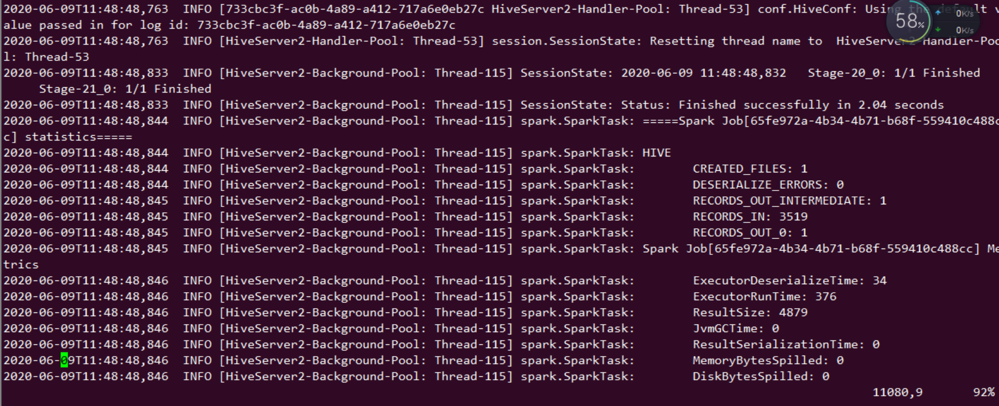
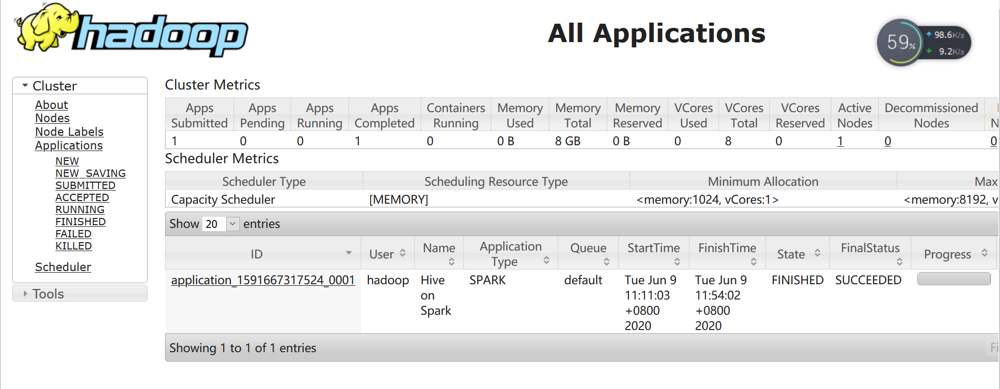

Hive安装及使用
~~~~~~~~~~~~~~

本文中，将选择ubuntu16.04(AMD64)操作系统作为例，进行Hive的安装。

Hive软件版本可以从https://hive.apache.org/downloads.html选择相关版本进行下载，因我们搭建的hadoop为2.7版本，选择2.3.4Hive版本进行安装。
在下载页有相关软件兼容性的描述。

前置条件：安装java、安装hadoop。

选择在hadoop集群的namenode上安装hive，选择在slaver-4安装mysql作为hive元数据存储数据库。

Hive数据库节点安装
------------------

该节点主要安装mysql数据库，将hive元数据存储在该数据库中。

1、在slaver-4上安装mysql或者mariadb，并在数据库中创建hive用户，同时赋予所有的权限：

.. code-block:: console

	MariaDB [(none)]> CREATE USER 'hive'@'%' IDENTIFIED BY '1qaz2wsx'; # %为可以通过任何主机使用HIVE用户远程登录。
	MariaDB [(none)]> GRANT ALL PRIVILEGES ON *.* TO hive IDENTIFIED BY '1qaz2wsx'  WITH GRANT OPTION;
	MariaDB [(none)]> flush privileges;

.. end

注意，确保mysql自身允许远程访问，主要修改其配置文件中的bind-address。

.. code-block:: console

	root@slaver-4:/etc/mysql/mariadb.conf.d# vi 50-server.cnf
    bind-address = 0.0.0.0  
	# 修改配置后重启mysql /etc/init.d/mysql restart
	
.. end

通过新增加的用户登录MySQL，创建一个数据库，这里命名为hive，数据库名是可以随意定义的。

.. code-block:: console

	root@slaver-4:/opt# mysql -u hive -p
	Enter password: 
	Welcome to the MariaDB monitor.  Commands end with ; or \g.
	Your MariaDB connection id is 43
	Server version: 10.0.38-MariaDB-0ubuntu0.16.04.1 Ubuntu 16.04

	Copyright (c) 2000, 2018, Oracle, MariaDB Corporation Ab and others.

	Type 'help;' or '\h' for help. Type '\c' to clear the current input statement.

	MariaDB [(none)]> create database hive;
	Query OK, 1 row affected (0.00 sec)

.. end

Hive服务端安装
--------------

在hadoop节点namenode上安装hive服务端；

1、解压安装包到指定目录；

.. code-block:: console

	root@master:/opt# tar -xzvf apache-hive-2.3.4-bin.tar.gz  -C /opt/
	
.. end
	
2、将MySQL的JDBC驱动包拷贝到hive的安装目录的lib中，驱动包下载地址为https://dev.mysql.com/downloads/file/?id=480090。

.. code-block:: console

    root@slaver-4:/home/ubuntu/mysql-connector-java-5.1.47# cp mysql-connector-java-5.1.47.jar  /opt/hive/lib/
	root@master:/opt# mv apache-hive-2.3.4-bin/ hive
	root@master:/opt# vi /home/hadoop-1/.bashrc 

	# set hive environment 
	export HIVE_HOME=/opt/hive
	export PATH=$PATH:$HIVE_HOME/bin
	
	root@master:/opt# source /home/hadoop-1/.bashrc 

.. end

3、修改配置文件：

.. code-block:: console

	root@master:/opt/hive/conf# cp hive-default.xml.template hive-site.xml ##注意是hive-site.xml

	root@master:/opt/hive/conf# cp hive-default.xml.template hive-site.xml
	root@master:/opt/hive/conf# cp hive-log4j2.properties.template  hive-log4j2.properties
	root@master:/opt/hive/conf# cp hive-exec-log4j2.properties.template  hive-exec-log4j2.properties
	root@master:/opt/hive/conf# vi hive-site.xml

 <property>
        <name>javax.jdo.option.ConnectionURL</name>
        <value>jdbc:mysql://slaver-4:3306/metastore?createDatabaseIfNotExist=true</value>
        <description>JDBC connect string for a JDBC metastore</description>
    </property>

    <property>
        <name>javax.jdo.option.ConnectionDriverName</name>
        <value>com.mysql.jdbc.Driver</value>
        <description>Driver class name for a JDBC metastore</description>
    </property>

    <property>
        <name>javax.jdo.option.ConnectionUserName</name>
        <value>root</value>
        <description>username to use against metastore database</description>
    </property>

    <property>
        <name>javax.jdo.option.ConnectionPassword</name>
        <value>1qaz2wsx</value>
        <description>password to use against metastore database</description>
    </property>
    <!-- 是否在当前客户端中显示查询出来的数据的字段名称 -->
    <property>
        <name>hive.cli.print.header</name>
        <value>true</value>
        <description>Whether to print the names of the columns in query output.</description>
    </property>

    <!-- 是否在当前客户端中显示当前所在数据库名称 -->
    <property>
        <name>hive.cli.print.current.db</name>
        <value>true</value>
        <description>Whether to include the current database in the Hive prompt.</description>
    </property>

 查看hive-site.xml配置，会看到配置值含有"system:java.io.tmpdir"的配置项
 新建文件夹在hive目录下新建一个tmp目录
 将含有"system:java.io.tmpdir"的配置项的值修改为如上地址
 把${system:java.io.tmpdir}改成：/opt/hive/tmp

	root@master:/opt/hive/conf#  grep -vE  '^#|^$' hive-env.sh
	HADOOP_HOME=/opt/hadoop-2.7.7
	export JAVA_HOME=/usr/lib/jdk
	export HADOOP_HOME=/opt/hadoop-2.7.7	

.. end

4、修改文件权限；将/opt/hive权限修改为hadoop用户，在hadoop用户下启动hive。

5、启动hive服务；

.. code-block:: console

 hadoop@ubuntu:/opt/hive/conf$ schematool -dbType mysql -initSchema # 初始化数据库
 Metastore connection URL:	 jdbc:mysql://localhost:3306/metastore?createDatabaseIfNotExist=true
 Metastore Connection Driver :	 com.mysql.jdbc.Driver
 Metastore connection User:	 hive
 Starting metastore schema initialization to 2.3.0
 Initialization script hive-schema-2.3.0.mysql.sql
 Initialization script completed
 schemaTool completed

 hive --service metastore 1>/dev/null 2>&1 &
 hive --service hiveserver2 1>/dev/null 2>&1 & #启用后默认端口为10002.可通过ip:10002查看hive相关信息。

.. end

错误记录：

hive数据库初始化报错：

.. code-block:: console

	SLF4J: Class path contains multiple SLF4J bindings.
	SLF4J: Found binding in [jar:file:/usr/local/hive/lib/log4j-slf4j-impl-2.6.2.jar!/org/slf4j/impl/StaticLoggerBinder.class]
	SLF4J: Found binding in [jar:file:/usr/local/hadoop/share/hadoop/common/lib/slf4j-log4j12-1.7.10.jar!/org/slf4j/impl/StaticLoggerBinder.class]
	SLF4J: See http://www.slf4j.org/codes.html#multiple_bindings for an explanation.

.. end
	
解决方法：移除其中一个jar包.

检查：

.. code-block:: console

	hive> 
		> 
		> 
		> 
		> 
		> dfs -ls /;
	Found 2 items
	drwx-wx-wx   - hadoop-1 supergroup          0 2019-03-12 09:25 /tmp
	drwxr-xr-x   - hadoop-1 supergroup          0 2019-03-13 14:32 /user
	hive> dfs -ls /user;
	Found 4 items
	drwxr-xr-x   - hadoop-1 supergroup          0 2019-03-06 10:11 /user/hadoop
	drwxr-xr-x   - hadoop-1 supergroup          0 2019-03-06 10:12 /user/hadoop-1
	drwxr-xr-x   - hadoop-1 supergroup          0 2019-03-08 11:36 /user/hbase
	drwxr-xr-x   - hadoop-1 supergroup          0 2019-03-13 14:32 /user/hive
	hive>
	hive> 
    > 
    >     create table dataflow(
    > 
    >     phoneNumber string,
    > 
    >     upflow int,
    > 
    >     downflow int
    > 
    >     );
	OK
	Time taken: 1.31 seconds
	hive> 
		> show tables;
	OK
	dataflow

.. end

通过webui可以访问hive相关信息。

Hive on Spark
-------------

Hive on Spark.前置条件 hive spark hadoop 正常运行.

HIVE version 2.3.4
Spark version 2.4.0
Spark 启动: ./start-all.sh  && ./start-slave.sh spark://ubuntu:7077

HIVE 默认计算引擎为mr,如果修改为spark则按照如下方式配置即可：

1 修改hive-site.xml配置如下：

.. code-block:: console

	<property>
	   <name>spark.home</name>
	   <value>/opt/spark</value>
	  </property>
	  <property>
	  <name>spark.yarn.jars</name>
	  <value>hdfs://192.168.121.128:9000/spark-jars/* </value>
	</property>

	<property>
	    <name>hive.execution.engine</name>
	    <value>spark</value>
	    <description>
	      Expects one of [mr, tez, spark].
	      Chooses execution engine. Options are: mr (Map reduce, default), tez, spark. While MR
	      remains the default engine for historical reasons, it is itself a historical engine
	      and is deprecated in Hive 2 line. It may be removed without further warning.
	    </description>
	  </property>

.. end

2 将spark相关jar包按照配置中spark.yarn.jars信息，传输到hdfs指定目录下.

.. code-block:: console

 # hdfs dfs -mkdir /spark-jars
 # hdfs dfs -put /opt/spark/jars/* .jar /spark-jars
 # 

.. end

3 将spark 相关的jar包软链接到hive lib下.

.. code-block:: console

   	hadoop@ubuntu:/opt/hive/lib$ history|grep ln
        1309  ln -s /opt/spark/jars/scala-library-2.12.7.jar .
        1310  ln -s /opt/spark/jars/spark-core_2.12-2.4.0.jar .
        1311  ln -s /opt/spark/jars/spark-network-common_2.12-2.4.0.jar .

.. end

4 调整yarn-site.xml文件配置.

.. code-block:: console

	<property>
	    <name>yarn.nodemanager.vmem-check-enabled</name>
		<value>false</value>
	    <description>Whether virtual memory limits will be enforced for containers</description>
	    </property>
	   <property>
	       <name>yarn.nodemanager.vmem-pmem-ratio</name>
	    <value>4</value>
	    <description>Ratio between virtual memory to physical memory when setting memory limits for containers</description>
	</property>

.. end

5 重启hive,做count运算验证。

.. code-block:: console

	hadoop@ubuntu:/opt/hive/bin$ ./beeline 
	Beeline version 2.3.4 by Apache Hive
	beeline> !connect jdbc:hive2://192.168.121.128:10000
	Transaction isolation: TRANSACTION_REPEATABLE_READ
	0: jdbc:hive2://192.168.121.128:10000> select count (*) from zhaoyuanjie;
	+------+
	| _c0  |
	+------+
	| 0    |
	+------+
	1 row selected (0.23 seconds)
	0: jdbc:hive2://192.168.121.128:10000> select count (*) from tongchenginfo;
	+-------+
	|  _c0  |
	+-------+
	| 3519  |
	+-------+
	1 row selected (28.308 seconds)

.. end

通过 http://ip:8088 查看日志信息.

 

参考文献：https://www.itread01.com/content/1532926928.html

