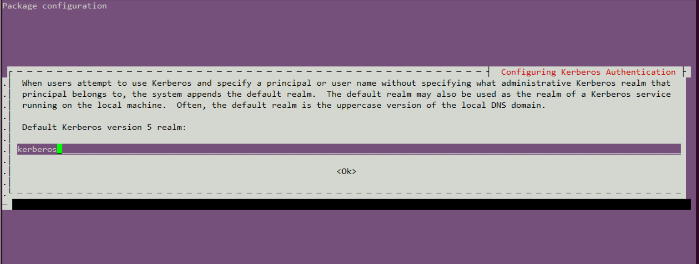
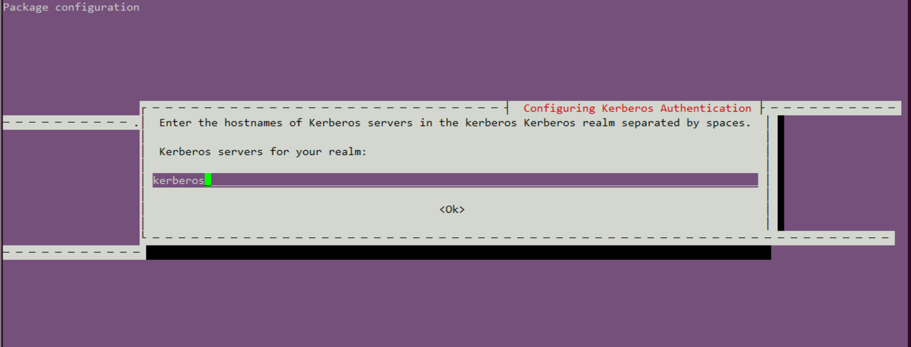
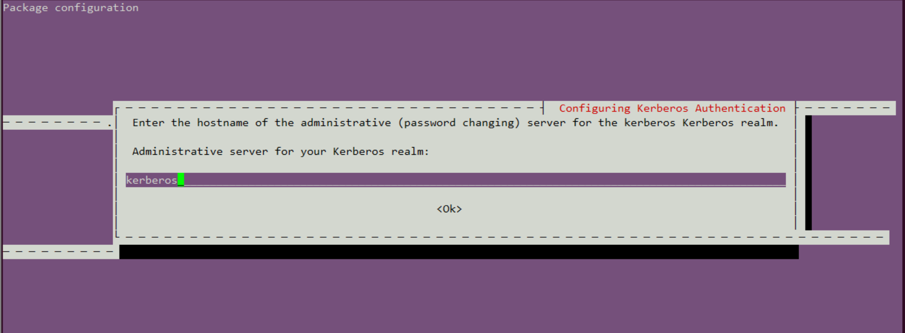
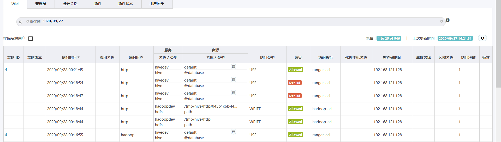

UBUNTU16.04 KERBEROS 安装及使用
~~~~~~~~~~~~~~~~~~~~~~~~~~~~~~~

本文中，将选择ubuntu16.04(AMD64)操作系统作为例，进行KERBEROS的安装。

安装和配置KERBEROS服务器
------------------------

SERVER端服务安装：

.. code-block:: console
 
 root@slaver-1:/home/cecgw# apt-get install krb5-admin-server krb5-kdc krb5-user krb5-config

.. end

1、设置default realm.

2、设置realm server.

3、设置hostname.

4、配置krb5配置文件.

.. code-block:: console

 root@kerberos:/home/ubuntu# vi /etc/krb5.conf 
 [libdefaults]
        default_realm = CECGW.CN

 # The following krb5.conf variables are only for MIT Kerberos.
        krb4_config = /etc/krb.conf
        krb4_realms = /etc/krb.realms
        kdc_timesync = 1
        ccache_type = 4
        forwardable = true
        proxiable = true
        ticket_lifetime = 6d
        renew_lifetime = 6d
        # ticket_lifetime和renew_lifetime：指定了kdc授权ticket的过期时长，和允许更新现有ticket的时长。

 #DNS#
 [realms]
        CECGW.CN = {
                kdc = kerberos
                admin_server = kerberos
        }

.. end

5、配置/etc/krb5kdc/kdc.conf

.. code-block:: console

 root@kerberos:/etc/krb5kdc# vi kdc.conf 
 [kdcdefaults]
    kdc_ports = 750,88

 [realms]
    CECGW.CN = {
        database_name = /var/lib/krb5kdc/principal
        admin_keytab = FILE:/etc/krb5kdc/kadm5.keytab
        acl_file = /etc/krb5kdc/kadm5.acl
        key_stash_file = /etc/krb5kdc/stash
        kdc_ports = 750,88
        max_life = 10h 0m 0s
        max_renewable_life = 7d 0h 0m 0s
        master_key_type = des3-hmac-sha1
        supported_enctypes = aes256-cts:normal arcfour-hmac:normal des3-hmac-sha1:normal des-cbc-crc:normal des:normal des:v4 des:norealm des:onlyrealm des:afs3
        default_principal_flags = +preauth
    }
 # 这是kdc的专属配置，可以根据自己的需求修改下kdc数据库的存放目录。  key_stash_file 
 # #master_key_type = des3-hmac-sha1 #由于，JAVA使用aes256-cts验证方式需要安装额外的jar包，不推荐使用。

.. end

6、创建数据库和principal,使用kdb5_util创建数据库，存放principal相关的信息。

.. code-block:: console

 root@kerberos:/etc/krb5kdc# kdb5_util create -r CECGW.CN -s
	Loading random data
	Initializing database '/var/lib/krb5kdc/principal' for realm 'CECGW.CN',
	master key name 'K/M@CECGW.CN'
	You will be prompted for the database Master Password.
	It is important that you NOT FORGET this password.
	Enter KDC database master key: 
	Re-enter KDC database master key to verify: 

 #若在安装过程中出现 Loading random data,新开启终端，安装 apt-get install rng-tools,启动service rng-tools start，执行rngd -r /dev/urandom，加快系统随机数生成速度。
 执行后自动生成stash文件.
     root@kerberos:/etc/krb5kdc# ls
     kdc.conf  stash

.. end

7、使用kadmin.local来添加principal

.. code-block:: console

	root@kerberos:~# kadmin.local
	Authenticating as principal root/admin@CECGW.CN with password.
	kadmin.local:  add_principal oneandonly/kerberos@CECGW.CN
	WARNING: no policy specified for oneandonly/kerberos@CECGW.CN; defaulting to no policy
	Enter password for principal "oneandonly/kerberos@CECGW.CN": 
	Re-enter password for principal "oneandonly/kerberos@CECGW.CN": 
	Principal "oneandonly/kerberos@CECGW.CN" created.

.. end

8、导出用户文件.

.. code-block:: console

	kadmin.local:  xst -k oneandonly.keytab -norandkey oneandonly/kerberos@CECGW.CN
	Entry for principal oneandonly/kerberos@CECGW.CN with kvno 1, encryption type aes256-cts-hmac-sha1-96 added to keytab WRFILE:oneandonly.keytab.
	Entry for principal oneandonly/kerberos@CECGW.CN with kvno 1, encryption type arcfour-hmac added to keytab WRFILE:oneandonly.keytab.
	Entry for principal oneandonly/kerberos@CECGW.CN with kvno 1, encryption type des3-cbc-sha1 added to keytab WRFILE:oneandonly.keytab.
	Entry for principal oneandonly/kerberos@CECGW.CN with kvno 1, encryption type des-cbc-crc added to keytab WRFILE:oneandonly.keytab.
	Entry for principal oneandonly/kerberos@CECGW.CN with kvno 1, encryption type des-cbc-md5 added to keytab WRFILE:oneandonly.keytab.
	Entry for principal oneandonly/kerberos@CECGW.CN with kvno 1, encryption type des-cbc-md5 added to keytab WRFILE:oneandonly.keytab.
	Entry for principal oneandonly/kerberos@CECGW.CN with kvno 1, encryption type des-cbc-md5 added to keytab WRFILE:oneandonly.keytab.
	Entry for principal oneandonly/kerberos@CECGW.CN with kvno 1, encryption type des-cbc-md5 added to keytab WRFILE:oneandonly.keytab.

.. end

9、验证登录,使用密钥登录.

.. code-block:: console

	root@kerberos:~# kinit -kt oneandonly.keytab oneandonly/kerberos
	root@kerberos:~# klist
	Ticket cache: FILE:/tmp/krb5cc_0
	Default principal: oneandonly/kerberos@CECGW.CN

	Valid starting       Expires              Service principal
	2020-09-03T14:20:23  2020-09-04T00:20:23  krbtgt/CECGW.CN@CECGW.CN
		renew until 2020-09-09T14:20:22

.. end

10、退出登录.

.. code-block:: console

	root@kerberos:/etc/krb5kdc# kdestroy
	root@kerberos:/etc/krb5kdc# klist
	klist: Credentials cache file '/tmp/krb5cc_0' not found

.. end

11、使用密码登录.

.. code-block:: console

	root@kerberos:/etc/krb5kdc# kinit oneandonly/kerberos
	Password for oneandonly/kerberos@CECGW.CN: 
	root@kerberos:/etc/krb5kdc# klist
	Ticket cache: FILE:/tmp/krb5cc_0
	Default principal: oneandonly/kerberos@CECGW.CN

	Valid starting       Expires              Service principal
	2020-09-03T14:27:58  2020-09-04T00:27:58  krbtgt/CECGW.CN@CECGW.CN
		renew until 2020-09-09T14:27:55

.. end

12、查看principal.

.. code-block:: console

 root@kerberos:/etc/krb5kdc# kadmin.local 
	Authenticating as principal oneandonly/admin@CECGW.CN with password.
	kadmin.local:  list_principals 
	K/M@CECGW.CN
	kadmin/admin@CECGW.CN
	kadmin/changepw@CECGW.CN
	kadmin/kerberos@CECGW.CN
	kiprop/kerberos@CECGW.CN
	krbtgt/CECGW.CN@CECGW.CN
	oneandonly/kerberos@CECGW.CN

.. end

13、修改密码.修改密码后需重新导出密钥本,方可验证成功.

.. code-block:: console

	 kadmin.local:  change_password oneandonly/kerberos
	Enter password for principal "oneandonly/kerberos@CECGW.CN": 
	Re-enter password for principal "oneandonly/kerberos@CECGW.CN": 
	change_password: Password mismatch while reading password for "oneandonly/kerberos@CECGW.CN".
	kadmin.local:  change_password oneandonly/kerberos
	Enter password for principal "oneandonly/kerberos@CECGW.CN": 
	Re-enter password for principal "oneandonly/kerberos@CECGW.CN": 
	Password for "oneandonly/kerberos@CECGW.CN" changed.
	kadmin.local:  change_password oneandonly/kerberos
	Enter password for principal "oneandonly/kerberos@CECGW.CN": 
	Re-enter password for principal "oneandonly/kerberos@CECGW.CN": 
	Password for "oneandonly/kerberos@CECGW.CN" changed.
	kadmin.local:  quit
	root@kerberos:/etc/krb5kdc# kinit oneandonly/kerberos
	Password for oneandonly/kerberos@CECGW.CN: 
	root@kerberos:/etc/krb5kdc# klist
	Ticket cache: FILE:/tmp/krb5cc_0
	Default principal: oneandonly/kerberos@CECGW.CN

	Valid starting       Expires              Service principal
	2020-09-03T14:33:05  2020-09-04T00:33:05  krbtgt/CECGW.CN@CECGW.CN
		renew until 2020-09-09T14:33:02
	root@kerberos:/etc/krb5kdc# cd ~
	root@kerberos:~# kinit -kt oneandonly.keytab oneandonly/kerberos 
	kinit: Password incorrect while getting initial credentials
	root@kerberos:~# kadmin.local 
	Authenticating as principal oneandonly/admin@CECGW.CN with password.
	kadmin.local:  xst -k oneandonly.keytab -norandkey oneandonly/kerberos@CECGW.CN
	Entry for principal oneandonly/kerberos@CECGW.CN with kvno 3, encryption type aes256-cts-hmac-sha1-96 added to keytab WRFILE:oneandonly.keytab.
	Entry for principal oneandonly/kerberos@CECGW.CN with kvno 3, encryption type arcfour-hmac added to keytab WRFILE:oneandonly.keytab.
	Entry for principal oneandonly/kerberos@CECGW.CN with kvno 3, encryption type des3-cbc-sha1 added to keytab WRFILE:oneandonly.keytab.
	Entry for principal oneandonly/kerberos@CECGW.CN with kvno 3, encryption type des-cbc-crc added to keytab WRFILE:oneandonly.keytab.
	Entry for principal oneandonly/kerberos@CECGW.CN with kvno 3, encryption type des-cbc-md5 added to keytab WRFILE:oneandonly.keytab.
	Entry for principal oneandonly/kerberos@CECGW.CN with kvno 3, encryption type des-cbc-md5 added to keytab WRFILE:oneandonly.keytab.
	Entry for principal oneandonly/kerberos@CECGW.CN with kvno 3, encryption type des-cbc-md5 added to keytab WRFILE:oneandonly.keytab.
	Entry for principal oneandonly/kerberos@CECGW.CN with kvno 3, encryption type des-cbc-md5 added to keytab WRFILE:oneandonly.keytab.
	kadmin.local:  quit
	root@kerberos:~# kinit -kt oneandonly.keytab oneandonly/kerberos 
	root@kerberos:~# klist
	Ticket cache: FILE:/tmp/krb5cc_0
	Default principal: oneandonly/kerberos@CECGW.CN

	Valid starting       Expires              Service principal
	2020-09-03T14:34:09  2020-09-04T00:34:09  krbtgt/CECGW.CN@CECGW.CN
		renew until 2020-09-09T14:34:09

.. end

14、查看principal详情.

.. code-block:: console

	 kadmin.local:  get_principal oneandonly/kerberos
	Principal: oneandonly/kerberos@CECGW.CN
	Expiration date: [never]
	Last password change: Thu Sep 03 14:32:38 CST 2020
	Password expiration date: [none]
	Maximum ticket life: 0 days 10:00:00
	Maximum renewable life: 7 days 00:00:00
	Last modified: Thu Sep 03 14:32:38 CST 2020 (oneandonly/admin@CECGW.CN)
	Last successful authentication: Thu Sep 03 14:34:09 CST 2020
	Last failed authentication: Thu Sep 03 14:33:34 CST 2020
	Failed password attempts: 0
	Number of keys: 8
	Key: vno 3, aes256-cts-hmac-sha1-96
	Key: vno 3, arcfour-hmac
	Key: vno 3, des3-cbc-sha1
	Key: vno 3, des-cbc-crc
	Key: vno 3, des-cbc-md5:v4
	Key: vno 3, des-cbc-md5:norealm
	Key: vno 3, des-cbc-md5:onlyrealm
	Key: vno 3, des-cbc-md5:afs3
	MKey: vno 1
	Attributes: REQUIRES_PRE_AUTH
	Policy: [none]

.. end

15、删除principal属性信息.

.. code-block:: console

 modprinc -requires_preauth oneandonly/kerberos@CECGW.CN

.. end

16、合并密钥文件，并验证登录.

.. code-block:: cosole

	kadmin.local:  xst -k allinone.keytab -norandkey whois/kerberos@CECGW.CN
	Entry for principal whois/kerberos@CECGW.CN with kvno 1, encryption type aes256-cts-hmac-sha1-96 added to keytab WRFILE:allinone.keytab.
	Entry for principal whois/kerberos@CECGW.CN with kvno 1, encryption type arcfour-hmac added to keytab WRFILE:allinone.keytab.
	Entry for principal whois/kerberos@CECGW.CN with kvno 1, encryption type des3-cbc-sha1 added to keytab WRFILE:allinone.keytab.
	Entry for principal whois/kerberos@CECGW.CN with kvno 1, encryption type des-cbc-crc added to keytab WRFILE:allinone.keytab.
	Entry for principal whois/kerberos@CECGW.CN with kvno 1, encryption type des-cbc-md5 added to keytab WRFILE:allinone.keytab.
	Entry for principal whois/kerberos@CECGW.CN with kvno 1, encryption type des-cbc-md5 added to keytab WRFILE:allinone.keytab.
	Entry for principal whois/kerberos@CECGW.CN with kvno 1, encryption type des-cbc-md5 added to keytab WRFILE:allinone.keytab.
	Entry for principal whois/kerberos@CECGW.CN with kvno 1, encryption type des-cbc-md5 added to keytab WRFILE:allinone.keytab.
	kadmin.local:  xst -k allinone.keytab -norandkey oneandonly/kerberos@CECGW.CN
	Entry for principal oneandonly/kerberos@CECGW.CN with kvno 3, encryption type aes256-cts-hmac-sha1-96 added to keytab WRFILE:allinone.keytab.
	Entry for principal oneandonly/kerberos@CECGW.CN with kvno 3, encryption type arcfour-hmac added to keytab WRFILE:allinone.keytab.
	Entry for principal oneandonly/kerberos@CECGW.CN with kvno 3, encryption type des3-cbc-sha1 added to keytab WRFILE:allinone.keytab.
	Entry for principal oneandonly/kerberos@CECGW.CN with kvno 3, encryption type des-cbc-crc added to keytab WRFILE:allinone.keytab.
	Entry for principal oneandonly/kerberos@CECGW.CN with kvno 3, encryption type des-cbc-md5 added to keytab WRFILE:allinone.keytab.
	Entry for principal oneandonly/kerberos@CECGW.CN with kvno 3, encryption type des-cbc-md5 added to keytab WRFILE:allinone.keytab.
	Entry for principal oneandonly/kerberos@CECGW.CN with kvno 3, encryption type des-cbc-md5 added to keytab WRFILE:allinone.keytab.
	Entry for principal oneandonly/kerberos@CECGW.CN with kvno 3, encryption type des-cbc-md5 added to keytab WRFILE:allinone.keytab.
	kadmin.local:  quit
	root@kerberos:~# ls
	allinone.keytab  ondandonly.keytab  oneandonly.keytab
	root@kerberos:~# vi allinone.keytab 
	root@kerberos:~# kinit -kt allinone.keytab oneandonly/kerberos
	root@kerberos:~# klist
	Ticket cache: FILE:/tmp/krb5cc_0
	Default principal: oneandonly/kerberos@CECGW.CN

	Valid starting       Expires              Service principal
	2020-09-03T14:46:35  2020-09-04T00:46:35  krbtgt/CECGW.CN@CECGW.CN
		renew until 2020-09-09T14:46:35
	root@kerberos:~# kdestroy
	root@kerberos:~# kinit -kt allinone.keytab whois/kerberos
	root@kerberos:~# klist
	Ticket cache: FILE:/tmp/krb5cc_0
	Default principal: whois/kerberos@CECGW.CN

	Valid starting       Expires              Service principal
	2020-09-03T14:46:52  2020-09-04T00:46:52  krbtgt/CECGW.CN@CECGW.CN
		renew until 2020-09-09T14:46:52

.. end

17、在客户端验证登录.资源限制，我们采用在本机安装ubuntu16.04 docker模拟客户端.

.. code-block:: console
 
 # 安装docker
 root@kerberos:~# apt-get install -y apt-transport-https ca-certificates curl software-properties-common 
 # 添加Docker官方的GPG密钥：
 root@kerberos:~# curl -fsSL https://download.docker.com/linux/ubuntu/gpg | sudo apt-key add -
 OK
 #使用下面的命令来设置stable存储库：
 root@kerberos:~# sudo add-apt-repository "deb [arch=amd64] https://download.docker.com/linux/ubuntu $(lsb_release -cs) stable"
 # sudo apt-get update
  root@kerberos:~# apt-get update
	Hit:1 http://mirrors.tuna.tsinghua.edu.cn/ubuntu xenial InRelease
	Hit:2 http://mirrors.tuna.tsinghua.edu.cn/ubuntu xenial-updates InRelease
	Hit:3 http://mirrors.tuna.tsinghua.edu.cn/ubuntu xenial-backports InRelease
	Get:4 http://security.ubuntu.com/ubuntu xenial-security InRelease [109 kB]      
	Get:5 https://download.docker.com/linux/ubuntu xenial InRelease [66.2 kB]
	Get:6 https://download.docker.com/linux/ubuntu xenial/stable amd64 Packages [14.5 kB]
	Fetched 190 kB in 2s (86.1 kB/s)                                     
	Reading package lists... Done
 # 安装docker.
 apt-get install -y docker-ce
 # 拉取ubntu1604镜像.
 root@kerberos:~# docker pull ubuntu:16.04
	16.04: Pulling from library/ubuntu
	8e097b52bfb8: Pull complete 
	a613a9b4553c: Pull complete 
	acc000f01536: Pull complete 
	73eef93b7466: Pull complete 
	Digest: sha256:3dd44f7ca10f07f86add9d0dc611998a1641f501833692a2651c96defe8db940
	Status: Downloaded newer image for ubuntu:16.04
	docker.io/library/ubuntu:16.04 
        root@kerberos:~# docker images
	REPOSITORY          TAG                 IMAGE ID            CREATED             SIZE
	ubuntu              16.04               4b22027ede29        2 weeks ago         127MB
        #运行容器.
        root@kerberos:~# docker run -itd --name ubuntu-1604 ubuntu:16.04
        7701c0e553c765cf62b73143dd0abb58dab84e3eab20e70db88a8a01ad7609a4
        # 进入容器.
        root@kerberos:~# docker exec -it ubuntu-1604 /bin/bash
	root@7701c0e553c7:/# vi /etc/hosts 
	bash: vi: command not found
	root@7701c0e553c7:/# apt-get update && apt-get install vim
        root@7701c0e553c7:/# vi /etc/hosts #添加宿主机的域名
        root@7701c0e553c7:/# apt-get install -y inetutils-ping
        root@7701c0e553c7:/# ping kerberos # 可以ping 通kerberos server
	PING kerberos (177.0.1.88): 56 data bytes
	64 bytes from 177.0.1.88: icmp_seq=0 ttl=64 time=0.364 ms
	64 bytes from 177.0.1.88: icmp_seq=1 ttl=64 time=0.153 ms
        ==============客户端系统环境准备就绪=========================
        root@7701c0e553c7:/# apt-get install krb5-user
        Default Kerberos version 5 realm: CECGW.CN

	Enter the hostnames of Kerberos servers in the CECGW.CN Kerberos realm separated by spaces.

	Kerberos servers for your realm: kerberos

	Enter the hostname of the administrative (password changing) server for the CECGW.CN Kerberos realm.

	Administrative server for your Kerberos realm: kerberos     
        =============客户端验证=====================================
        root@7701c0e553c7:/# kinit oneandonly/kerberos     
	Password for oneandonly/kerberos@CECGW.CN: 
	root@7701c0e553c7:/# klist
	Ticket cache: FILE:/tmp/krb5cc_0
	Default principal: oneandonly/kerberos@CECGW.CN

	Valid starting     Expires            Service principal
	09/03/20 07:19:09  09/03/20 17:19:09  krbtgt/CECGW.CN@CECGW.CN
		renew until 09/04/20 07:19:04 
       ==============客户端验证完毕==================================

.. end

hadoop集成kerberos
------------------

本验证环境kerberos节点+hadoop伪分布式环境验证,分布式环境同比类推.
kerberos 节点: 192.168.121.128
hadoop-allinone 节点：192.168.121.128
前置条件: 各个节点安装kerberos client. apt-get install krb5-user

生成keytab
==========

可以按照服务生成keytab,也可各个服务公用一个keytab. 本次验证将所有服务公用一个keytab. 名为hadoop.keytab，ssl通信模块采用http.keytab,并合并为一个keytab文件，名称为allinone.keytab.具体过程见kerberos keytab生成步骤模块.

在hadoop etc目录下，创建keytabs 文件目录，将生成的allinon.keytab拷贝至 keytabs目录.并设置该文件权限为hadoop运行用户，权限为只读.

修改core-site.xml
=================

增加2项目配置到core-site.xml文件

.. code-block:: console

	<property>
	  <name>hadoop.security.authentication</name>
	  <value>kerberos</value>
	</property>
	<property>
	  <name>hadoop.security.authorization</name>
	  <value>true</value>
	</property>

.. end

修改hdfs-site.xml
=================

.. code-bolock:: console

	<property>
	  <name>dfs.http.address</name>
	  <value>0.0.0.0:50070</value>
	</property>
	<property>
	  <name>dfs.block.access.token.enable</name>
	  <value>true</value>
	</property>
	<property>
	  <name>dfs.namenode.keytab.file</name>
	  <value>/opt/hadoop-2.7.7/etc/keytabs/allinone.keytab</value>
	</property>
	<property>
	  <name>dfs.namenode.kerberos.principal</name>
	  <value>hadoop/_HOST@CECGW.CN</value>
	</property>
	<property>
	  <name>dfs.namenode.kerberos.https.principal</name>
	  <value>http/_HOST@CECGW.CN</value>
	</property>

	<property>
	<name>dfs.secondary.namenode.kerberos.principal</name>
	   <value>hadoop/_HOST@CECGW.CN</value>
	</property>
	<property>
	  <name>dfs.secondary.namenode.keytab.file</name>
	  <value>/opt/hadoop-2.7.7/etc/keytabs/allinone.keytab</value>
	</property>
	<property>
	<name>dfs.secondary.namenode.kerberos.internal.spnego.principal</name>
	 <value>http/_HOST@CECGW.CN</value>
	</property>

	<property>
	  <name>dfs.datanode.keytab.file</name>
	  <value>/opt/hadoop-2.7.7/etc/keytabs/allinone.keytab</value>
	</property>
	<property>
	  <name>dfs.datanode.kerberos.principal</name>
	  <value>hadoop/_HOST@CECGW.CN</value>
	</property>
	<property>
	  <name>dfs.datanode.kerberos.https.principal</name>
	  <value>http/_HOST@CECGW.CN</value>
	</property>

	<property>
	  <name>dfs.webhdfs.enabled</name>
	  <value>true</value>
	</property>
	<property>
	  <name>dfs.web.authentication.kerberos.principal</name>
	  <value>http/_HOST@CECGW.CN</value>
	</property>
	<property>
	  <name>dfs.web.authentication.kerberos.keytab</name>
	  <value>/opt/hadoop-2.7.7/etc/keytabs/allinone.keytab</value>
	</property>
	<property>
	  <name>dfs.datanode.address</name>
	  <value>0.0.0.0:61004</value>
	</property>
	<property>
	  <name>dfs.datanode.http.address</name>
	  <value>0.0.0.0:61006</value>
	</property>

	<property>
	  <name>dfs.data.transfer.protection</name>
	  <value>integrity</value>
	</property>
	<property>
	  <name>dfs.http.policy</name>
	  <value>HTTPS_ONLY</value>
	</property>

.. end

配置hadoop https
===============

1、生成CA：

.. code-block:: console

	root@ubuntu:/home/cecgw/CA/cataset# openssl req -new -x509 -keyout hdfs_ca_key -out hdfs_ca_cert -days 9999 -subj '/C=CN/ST=BJ/L=BJ/O=CECGW/OU=CECGW/CN=cecgw.com' 
	Generating a 2048 bit RSA private key
	...................+++
	............+++
	writing new private key to 'hdfs_ca_key'
	Enter PEM pass phrase:
	Verifying - Enter PEM pass phrase:
	-----
	root@ubuntu:/home/cecgw/CA/cataset# ll
	total 16
	drwxr-xr-x 2 root root 4096 Sep 27 10:56 ./
	drwxr-xr-x 3 root root 4096 Sep 27 10:31 ../
	-rw-r--r-- 1 root root 1285 Sep 27 10:56 hdfs_ca_cert
	-rw-r--r-- 1 root root 1834 Sep 27 10:56 hdfs_ca_key

.. end

2、生成keystore

.. code-block:: console

	root@ubuntu:/home/cecgw/CA/cataset# keytool -keystore keystore -alias localhost -validity 9999 -genkey -keyalg RSA -keysize 2048 -dname "CN=CN, OU=DT, O=DT, L=CY, ST=BJ, C=CN"
	Enter keystore password:  
	Re-enter new password: 
	Enter key password for <CECGW>
		(RETURN if same as keystore password):  
	Re-enter new password: 

	Warning:
	The JKS keystore uses a proprietary format. It is recommended to migrate to PKCS12 which is an industry standard format using "keytool -importkeystore -srckeystore keystore -destkeystore keystore -deststoretype pkcs12".
	root@ubuntu:/home/cecgw/CA/cataset# ll
	total 20
	drwxr-xr-x 2 root root 4096 Sep 27 11:01 ./
	drwxr-xr-x 3 root root 4096 Sep 27 10:31 ../
	-rw-r--r-- 1 root root 1285 Sep 27 10:56 hdfs_ca_cert
	-rw-r--r-- 1 root root 1834 Sep 27 10:56 hdfs_ca_key
	-rw-r--r-- 1 root root 2189 Sep 27 11:01 keystore

.. end

3、添加CA到truststore

.. code-block:: console

	root@ubuntu:/home/cecgw/CA/cataset# keytool -keystore truststore -alias CARoot -import -file hdfs_ca_cert
	Enter keystore password:  
	Re-enter new password: 
	Owner: CN=cecgw.com, OU=CECGW, O=CECGW, L=BJ, ST=BJ, C=CN
	Issuer: CN=cecgw.com, OU=CECGW, O=CECGW, L=BJ, ST=BJ, C=CN
	Serial number: f335f9a398795485
	Valid from: Sun Sep 27 10:56:49 HKT 2020 until: Wed Feb 12 10:56:49 HKT 2048
	Certificate fingerprints:
		 MD5:  2D:1D:24:08:C0:9F:65:28:7D:FA:EF:7C:C4:D6:45:3D
		 SHA1: 0D:97:D0:FD:D9:80:68:7D:13:A7:C2:1A:2B:50:45:95:64:4C:E4:20
		 SHA256: 29:63:22:13:37:A3:00:E2:E4:15:7C:3C:C8:53:E7:6E:62:9F:E2:77:40:D3:DB:42:59:F5:54:59:D2:0E:8E:2F
	Signature algorithm name: SHA256withRSA
	Subject Public Key Algorithm: 2048-bit RSA key
	Version: 3

	Extensions: 

	#1: ObjectId: 2.5.29.35 Criticality=false
	AuthorityKeyIdentifier [
	KeyIdentifier [
	0000: CC 18 95 DF AA 30 CF A2   E0 61 07 54 83 AD 43 D4  .....0...a.T..C.
	0010: 2B 1D 0C D6                                        +...
	]
	]

	#2: ObjectId: 2.5.29.19 Criticality=false
	BasicConstraints:[
	  CA:true
	  PathLen:2147483647
	]

	#3: ObjectId: 2.5.29.14 Criticality=false
	SubjectKeyIdentifier [
	KeyIdentifier [
	0000: CC 18 95 DF AA 30 CF A2   E0 61 07 54 83 AD 43 D4  .....0...a.T..C.
	0010: 2B 1D 0C D6                                        +...
	]
	]

	Trust this certificate? [no]:  yes
	Certificate was added to keystore

	root@ubuntu:/home/cecgw/CA/cataset# ll
	total 24
	drwxr-xr-x 2 root root 4096 Sep 27 11:04 ./
	drwxr-xr-x 3 root root 4096 Sep 27 10:31 ../
	-rw-r--r-- 1 root root 1285 Sep 27 10:56 hdfs_ca_cert
	-rw-r--r-- 1 root root 1834 Sep 27 10:56 hdfs_ca_key
	-rw-r--r-- 1 root root 2189 Sep 27 11:01 keystore
	-rw-r--r-- 1 root root  971 Sep 27 11:04 truststore

.. end

4、从 keystore 中导出 cert

.. code-block:: console

	root@ubuntu:/home/cecgw/CA/cataset# keytool -certreq -alias localhost -keystore keystore -file cert
	Enter keystore password:  

	Warning:
	The JKS keystore uses a proprietary format. It is recommended to migrate to PKCS12 which is an industry standard format using "keytool -importkeystore -srckeystore keystore -destkeystore keystore -deststoretype pkcs12".
	root@ubuntu:/home/cecgw/CA/cataset# ll
	total 28
	drwxr-xr-x 2 root root 4096 Sep 27 11:10 ./
	drwxr-xr-x 3 root root 4096 Sep 27 10:31 ../
	-rw-r--r-- 1 root root 1059 Sep 27 11:10 cert
	-rw-r--r-- 1 root root 1285 Sep 27 10:56 hdfs_ca_cert
	-rw-r--r-- 1 root root 1834 Sep 27 10:56 hdfs_ca_key
	-rw-r--r-- 1 root root 2189 Sep 27 11:01 keystore
	-rw-r--r-- 1 root root  971 Sep 27 11:04 truststore

.. end

5、用 CA 对 cert 签名

.. code-block:: console

	root@ubuntu:/home/cecgw/CA/cataset# openssl x509 -req -CA hdfs_ca_cert -CAkey hdfs_ca_key -in cert -out cert_signed -days 9999 -CAcreateserial
	Signature ok
	subject=/C=CN/ST=BJ/L=CY/O=DT/OU=DT/CN=CECGW
	Getting CA Private Key
	Enter pass phrase for hdfs_ca_key:
	root@ubuntu:/home/cecgw/CA/cataset# ls
	cert  cert_signed  hdfs_ca_cert  hdfs_ca_cert.srl  hdfs_ca_key  keystore  truststore
	root@ubuntu:/home/cecgw/CA/cataset# ll
	total 36
	drwxr-xr-x 2 root root 4096 Sep 27 11:13 ./
	drwxr-xr-x 3 root root 4096 Sep 27 10:31 ../
	-rw-r--r-- 1 root root 1059 Sep 27 11:10 cert
	-rw-r--r-- 1 root root 1155 Sep 27 11:13 cert_signed
	-rw-r--r-- 1 root root 1285 Sep 27 10:56 hdfs_ca_cert
	-rw-r--r-- 1 root root   17 Sep 27 11:13 hdfs_ca_cert.srl
	-rw-r--r-- 1 root root 1834 Sep 27 10:56 hdfs_ca_key
	-rw-r--r-- 1 root root 2189 Sep 27 11:01 keystore
	-rw-r--r-- 1 root root  971 Sep 27 11:04 truststore

.. end

6、将 CA 的 cert 和用 CA 签名之后的 cert 导入 keystore

.. code-block:: console

	root@ubuntu:/home/cecgw/CA/cataset# keytool -keystore keystore -alias CARoot -import -file hdfs_ca_cert
	Enter keystore password:  
	Owner: CN=cecgw.com, OU=CECGW, O=CECGW, L=BJ, ST=BJ, C=CN
	Issuer: CN=cecgw.com, OU=CECGW, O=CECGW, L=BJ, ST=BJ, C=CN
	Serial number: a845ecc042de0a89
	Valid from: Sun Sep 27 15:01:23 HKT 2020 until: Wed Feb 12 15:01:23 HKT 2048
	Certificate fingerprints:
		 MD5:  18:F4:DE:CB:AD:A7:77:D7:90:5C:75:53:40:7E:EA:3A
		 SHA1: 14:36:A3:61:77:AB:E8:F6:B3:BD:DA:4A:86:1C:23:CE:B5:B8:A7:0C
		 SHA256: 5D:08:57:A5:4B:A8:1D:A8:8D:B8:B3:79:D7:07:EE:BE:10:E2:C3:36:B0:DD:5A:9D:46:D6:2C:64:AD:15:88:3A
	Signature algorithm name: SHA256withRSA
	Subject Public Key Algorithm: 2048-bit RSA key
	Version: 3

	Extensions: 

	#1: ObjectId: 2.5.29.35 Criticality=false
	AuthorityKeyIdentifier [
	KeyIdentifier [
	0000: 74 CA 1A 3D 77 FE 9F C8   41 47 D2 5E D4 8C AF 88  t..=w...AG.^....
	0010: BE 02 66 4D                                        ..fM
	]
	]

	#2: ObjectId: 2.5.29.19 Criticality=false
	BasicConstraints:[
	  CA:true
	  PathLen:2147483647
	]

	#3: ObjectId: 2.5.29.14 Criticality=false
	SubjectKeyIdentifier [
	KeyIdentifier [
	0000: 74 CA 1A 3D 77 FE 9F C8   41 47 D2 5E D4 8C AF 88  t..=w...AG.^....
	0010: BE 02 66 4D                                        ..fM
	]
	]

	Trust this certificate? [no]:  yes
	Certificate was added to keystore

	Warning:
	The JKS keystore uses a proprietary format. It is recommended to migrate to PKCS12 which is an industry standard format using "keytool -importkeystore -srckeystore keystore -destkeystore keystore -deststoretype pkcs12".

	root@ubuntu:/home/cecgw/CA/cataset# keytool -keystore keystore -alias localhost -import -file cert_signed
	Enter keystore password:  
	Certificate reply was installed in keystore

	Warning:
	The JKS keystore uses a proprietary format. It is recommended to migrate to PKCS12 which is an industry standard format using "keytool -importkeystore -srckeystore keystore -destkeystore keystore -deststoretype pkcs12".

.. end

7、将最终keystore,trustores放入/opt/hadoop-2.7.7/etc/https/目录，并修改后缀.

.. code-block:: console

	root@ubuntu:/home/cecgw/CA/cataset# cp keystore /opt/hadoop-2.7.7/etc/https/keystore.jks
	root@ubuntu:/home/cecgw/CA/cataset# cp truststore /opt/hadoop-2.7.7/etc/https/truststore.jks

.. end

8、配置 ssl-server.xml

.. code-block:: console

	<property>
	  <name>ssl.server.truststore.location</name>
	  <value>/opt/hadoop-2.7.7/etc/https/keystore.jks</value>
	  <description>Truststore to be used by NN and DN. Must be specified.
	  </description>
	</property>

	<property>
	  <name>ssl.server.truststore.password</name>
	  <value>1qaz2wsx</value>
	  <description>Optional. Default value is "".
	  </description>
	</property>

	<property>
	  <name>ssl.server.truststore.type</name>
	  <value>jks</value>
	  <description>Optional. The keystore file format, default value is "jks".
	  </description>
	</property>

	<property>
	  <name>ssl.server.truststore.reload.interval</name>
	  <value>10000</value>
	  <description>Truststore reload check interval, in milliseconds.
	  Default value is 10000 (10 seconds).
	  </description>
	</property>

	<property>
	  <name>ssl.server.keystore.location</name>
	  <value>/opt/hadoop-2.7.7/etc/https/keystore.jks</value>
	  <description>Keystore to be used by NN and DN. Must be specified.
	  </description>
	</property>

	<property>
	  <name>ssl.server.keystore.password</name>
	  <value>1qaz2wsx</value>
	  <description>Must be specified.
	  </description>
	</property>

	<property>
	  <name>ssl.server.keystore.keypassword</name>
	  <value>1qaz2wsx</value>
	  <description>Must be specified.
	  </description>
	</property>

	<property>
	  <name>ssl.server.keystore.type</name>
	  <value>jks</value>
	  <description>Optional. The keystore file format, default value is "jks".
	  </description>
	</property>

	<property>
	  <name>ssl.server.exclude.cipher.list</name>
	  <value>TLS_ECDHE_RSA_WITH_RC4_128_SHA,SSL_DHE_RSA_EXPORT_WITH_DES40_CBC_SHA,
	  SSL_RSA_WITH_DES_CBC_SHA,SSL_DHE_RSA_WITH_DES_CBC_SHA,
	  SSL_RSA_EXPORT_WITH_RC4_40_MD5,SSL_RSA_EXPORT_WITH_DES40_CBC_SHA,
	  SSL_RSA_WITH_RC4_128_MD5</value>
	  <description>Optional. The weak security cipher suites that you want excluded
	  from SSL communication.</description>
	</property>

.. end

9、配置ssl-client.xml文件.

.. code-block:: console

	<property>
	  <name>ssl.client.truststore.location</name>
	  <value>/opt/hadoop-2.7.7/etc/https/truststore.jks</value>
	  <description>Truststore to be used by clients like distcp. Must be
	  specified.
	  </description>
	</property>

	<property>
	  <name>ssl.client.truststore.password</name>
	  <value>1qaz2wsx</value>
	  <description>Optional. Default value is "".
	  </description>
	</property>

	<property>
	  <name>ssl.client.truststore.type</name>
	  <value>jks</value>
	  <description>Optional. The keystore file format, default value is "jks".
	  </description>
	</property>

	<property>
	  <name>ssl.client.truststore.reload.interval</name>
	  <value>10000</value>
	  <description>Truststore reload check interval, in milliseconds.
	  Default value is 10000 (10 seconds).
	  </description>
	</property>

	<property>
	  <name>ssl.client.keystore.location</name>
	  <value>/opt/hadoop-2.7.7/etc/https/keystore.jks</value>
	  <description>Keystore to be used by clients like distcp. Must be
	  specified.
	  </description>
	</property>

	<property>
	  <name>ssl.client.keystore.password</name>
	  <value>1qaz2wsx</value>
	  <description>Optional. Default value is "".
	  </description>
	</property>

	<property>
	  <name>ssl.client.keystore.keypassword</name>
	  <value>1qaz2wsx</value>
	  <description>Optional. Default value is "".
	  </description>
	</property>

	<property>
	  <name>ssl.client.keystore.type</name>
	  <value>jks</value>
	  <description>Optional. The keystore file format, default value is "jks".
	  </description>
	</property>

.. end

10 yarn配置kerberos,修改yarn-site.xml

.. code-block:: console

	<property>
	  <name>yarn.resourcemanager.keytab</name>
	  <value>/opt/hadoop-2.7.7/etc/keytabs/allinone.keytab</value>
	</property>
	<property>
	  <name>yarn.resourcemanager.principal</name>
	  <value>hadoop/_HOST@CECGW.CN</value>
	</property>

	<property>
	  <name>yarn.nodemanager.keytab</name>
	  <value>/opt/hadoop-2.7.7/etc/keytabs/allinone.keytab</value>
	</property>
	<property>
	  <name>yarn.nodemanager.principal</name>
	  <value>hadoop/_HOST@CECGW.CN</value>
	</property>

.. end

11、重启后检查. list map.

.. code-block:: console

 visit https://ubuntu:50470
 运算脚本.

.. end

HIVE 配置kerberos
-----------------

1、还沿用上述章节hadoop keytab.

2、修改hive-site.xml

.. code-block:: console

	<property>
	    <name>hive.server2.authentication</name>
	    <value>KERBEROS</value>
	    <description>
	      Expects one of [nosasl, none, ldap, kerberos, pam, custom].
	      Client authentication types.
		NONE: no authentication check
		LDAP: LDAP/AD based authentication
		KERBEROS: Kerberos/GSSAPI authentication
		CUSTOM: Custom authentication provider
			(Use with property hive.server2.custom.authentication.class)
		PAM: Pluggable authentication module
		NOSASL:  Raw transport
	    </description>
	  </property>

	<property>
	    <name>hive.server2.authentication.kerberos.principal</name>
	    <value>hadoop/_HOST@CECGW.CN</value>
	    <description>Kerberos server principal</description>
	  </property>

	<property>
	    <name>hive.server2.authentication.kerberos.keytab</name>
	    <value>/opt/hive/conf/keytab/allinone.keytab</value>
	    <description>Kerberos keytab file for server principal</description>
	  </property>

	<property>
	    <name>hive.metastore.sasl.enabled</name>
	    <value>true</value>
	    <description>If true, the metastore Thrift interface will be secured with SASL. Clients must authenticate with Kerberos.</description>
	  </property>

	<property>
	    <name>hive.metastore.kerberos.keytab.file</name>
	    <value>/opt/hive/conf/keytab/allinone.keytab</value>
	    <description>The path to the Kerberos Keytab file containing the metastore Thrift server's service principal.</description>
	  </property>

	<property>
	    <name>hive.metastore.kerberos.principal</name>
	    <value>hadoop/_HOST@CECGW.CN</value>
	    <description>
	      The service principal for the metastore Thrift server.
	      The special string _HOST will be replaced automatically with the correct host name.
	    </description>
	  </property>

.. end

3、重启hive.

.. code-block:: console

	hadoop@ubuntu:/opt/hive/bin$ hive --service metastore 1>/dev/null 2>&1 &
	[1] 25568
	hadoop@ubuntu:/opt/hive/bin$ hive --service hiveserver2 1>/dev/null 2>&1 &
	[2] 25644

.. end

4、测试.

.. code-block:: console

	hadoop@ubuntu:/opt/hive/bin$ klist
	Ticket cache: FILE:/tmp/krb5cc_1001
	Default principal: hadoop/ubuntu@CECGW.CN

	Valid starting       Expires              Service principal
	2020-09-27T15:27:04  2020-10-03T15:27:04  krbtgt/CECGW.CN@CECGW.CN

	hadoop@ubuntu:/opt/hive/bin$ beeline
	Beeline version 2.3.4 by Apache Hive
	beeline>  !connect jdbc:hive2://ubuntu:10000/;principal=hadoop/ubuntu@CECGW.CN -n hadoop
	Connecting to jdbc:hive2://ubuntu:10000/;principal=hadoop/ubuntu@CECGW.CN
	Connected to: Apache Hive (version 2.3.4)
	Driver: Hive JDBC (version 2.3.4)
	Transaction isolation: TRANSACTION_REPEATABLE_READ
	0: jdbc:hive2://ubuntu:10000/> show tables;
	+----------------+
	|    tab_name    |
	+----------------+
	| beijing        |
	| beijinghubei   |
	| beijingtotal   |
	| cec            |
	| cecgw          |
	| china          |
	| employees      |
	| hank           |
	| hubei          |
	| hubeitotal     |
	| shanghai       |
	| shenzhen       |
	| students       |
	| tongchenginfo  |
	| whosample      |
	| xiaoquinfo     |
	| zhaosql        |
	| zhaowang       |
	| zhaoyuanjie    |
	+----------------+
	19 rows selected (1.711 seconds)v

	root@ubuntu:/opt/hive/bin# kinit -kt /home/HTTP.keytab http/ubuntu
	root@ubuntu:/opt/hive/bin# beeline
	Beeline version 2.3.4 by Apache Hive
	beeline> !connect jdbc:hive2://ubuntu:10000/;principal=hadoop/ubuntu@CECGW.CN -n http
	Connecting to jdbc:hive2://ubuntu:10000/;principal=hadoop/ubuntu@CECGW.CN
	Connected to: Apache Hive (version 2.3.4)
	Driver: Hive JDBC (version 2.3.4)
	Transaction isolation: TRANSACTION_REPEATABLE_READ
	0: jdbc:hive2://ubuntu:10000/> show tables;
	Error: Error while compiling statement: FAILED: HiveAccessControlException Permission denied: user [http] does not have [USE] privilege on [default] (state=42000,code=40000)
	0: jdbc:hive2://ubuntu:10000/> show tables;
	Error: Error while compiling statement: FAILED: HiveAccessControlException Permission denied: user [http] does not have [USE] privilege on [default] (state=42000,code=40000)

.. end

Ranger installation in Kerberized Environment
=============================================

为了在kerberos环境中使用ranger，需要在ranger所在的节点安装 kerberos客户端.参考`https://cwiki.apache.org/confluence/display/RANGER/Ranger+installation+in+Kerberized++Environment`

安装并配置kerberos客户端
-------------------------

.. code-block:: console

 apt-get install krb5-user

 vi /etc/krb5.conf

	[libdefaults]
		default_realm = CECGW.CN

	# The following krb5.conf variables are only for MIT Kerberos.
		kdc_timesync = 1
		ccache_type = 4
		forwardable = true
		proxiable = true

	# The following encryption type specification will be used by MIT Kerberos
	# if uncommented.  In general, the defaults in the MIT Kerberos code are
	# correct and overriding these specifications only serves to disable new
	# encryption types as they are added, creating interoperability problems.
	#
	# The only time when you might need to uncomment these lines and change
	# the enctypes is if you have local software that will break on ticket
	# caches containing ticket encryption types it doesn't know about (such as
	# old versions of Sun Java).

	#       default_tgs_enctypes = des3-hmac-sha1
	#       default_tkt_enctypes = des3-hmac-sha1
	#       permitted_enctypes = des3-hmac-sha1

	# The following libdefaults parameters are only for Heimdal Kerberos.
		fcc-mit-ticketflags = true

	[realms]
		CECGW.CN = {
			kdc = ubuntu
			admin_server = ubuntu
		  }

.. end

在kerberos服务端创建 rangeradmin rangerlookup http服务的密钥文件
----------------------------------------------------------------

.. code-block:: console

 分别创建
 HTTP/ranger-server@CECGW.CN
 rangeradmin/ranger-server@CECGW.CN
 rangerlookup/ranger-server@CECGW.CN
 剔除上述用户的Attributes: REQUIRES_PRE_AUTH该属性；
 kadmin.local: modprinc -requires_preauth HTTP/ranger-server@CECGW.CN
 kadmin.local: modprinc -requires_preauth rangeradmin/ranger-server@CECGW.CN
 kadmin.local: modprinc -requires_preauth  rangerlookup/ranger-server@CECGW.CN
 导出keytab,拷贝至ranger admin
 # 创建完后，可在ranger-admin 端验证是否可通过验证.

.. end

ranger server端修改配置文件
---------------------------

将密钥拷贝到/etc/security/keytab目录下.

.. code-block:: console

	#------------ Kerberos Config -----------------
	spnego_principal=HTTP/ranger-server@CECGW.CN
	spnego_keytab=/etc/security/keytab/HTTP.keytab
	token_valid=30
	cookie_domain=ranger-server
	cookie_path=/
	admin_principal=rangeradmin/ranger-server@CECGW.CN
	admin_keytab=/etc/security/keytab/rangeradmin.keytab
	lookup_principal=rangerlookup/ranger-server@CECGW.CN
	#lookup_principal=hadoop/ubuntu@CECGW.CN
	lookup_keytab=/etc/security/keytab/rangerlookup.keytab
	#lookup_keytab=/etc/security/keytab/HADOOP.keytab
	hadoop_conf=/opt/hadoop-2.7.7/etc/hadoop
	#

.. end

执行setup.sh
------------

.. code-block:: console

 ./setup.sh

.. end

重启ranger-admin
---------------

.. code-block:: console

 ranger-admin restart

.. end

界面设置hdfs参数
----------------

.. code-block:: console

 username                                  hadoop/ubuntu@CECGW.CN
 password                                  *****
 Namenode URL                              hdfs://ubuntu:9000
 Authorization Enabled                     yes
 Authentication Type                       kerberos
 dfs.datanode.kerberos.principal           hadoop/ubuntu@CECGW.CN
 dfs.namenode.kerberos.principal           hadoop/ubuntu@CECGW.CN
 dfs.secondary.namenode.kerberos.principal hadoop/ubuntu@CECGW.CN
 RPC Protection Type                       Authentication
 tag.download.auth.users                   hadoop
 policy.download.auth.users                hadoop

.. end

界面设置hive参数
----------------

.. code-block:: console

 username hadoop
 password xxxx
 jdbc.driverClassName org.apache.hive.jdbc.HiveDriver
 jdbc.url *  jdbc:hive2://192.168.121.128:10000/;principal=hadoop/ubuntu@CECGW.CN
 tag.download.auth.users hadoop
 policy.download.auth.users hadoop

.. end

