UBUNTU16.04 LDAP 安装及使用
~~~~~~~~~~~~~~~~~~~~~~~~~~~

本文中，将选择ubuntu16.04(AMD64)操作系统作为例，进行LDAP的安装。

安装和配置LDAP服务器
--------------------

.. code-block:: console

 root@ubuntu:/home/cecgw# sudo apt-get install slapd ldap-utils #过程中会要求输入admin密码.

.. end

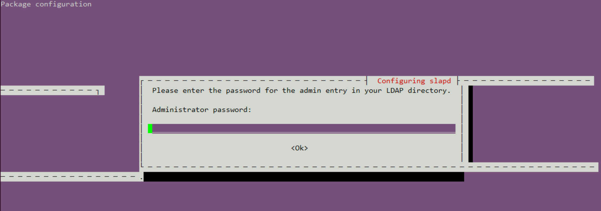

修改配置文件:

打开'/etc/ldap/ldap.conf'文件按照以下内容配置修改:

.. code-block:: console

	# LDAP Defaults
	#

	# See ldap.conf(5) for details
	# This file should be world readable but not world writable.

	BASE    dc=cecgw,dc=cn
	URI     ldap://192.168.121.131

	#SIZELIMIT      12
	#TIMELIMIT      15
	#DEREF          never

	# TLS certificates (needed for GnuTLS)
	TLS_CACERT      /etc/ssl/certs/ca-certificates.crt

.. end

对ldap 重新配置.

.. code-block:: console

 root@ubuntu:/home/cecgw# dpkg-reconfigure slapd

.. end

选择NO

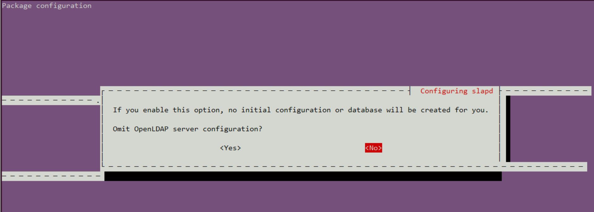

配置DNS.

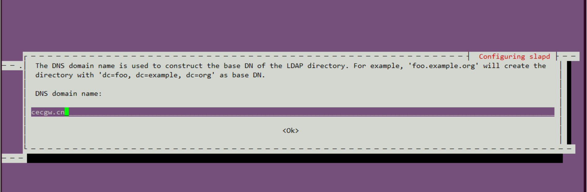

配置组织信息

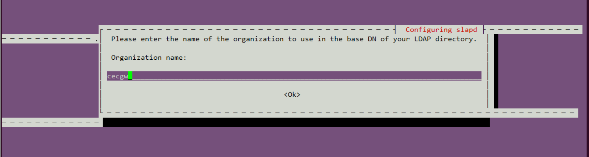

配置存储

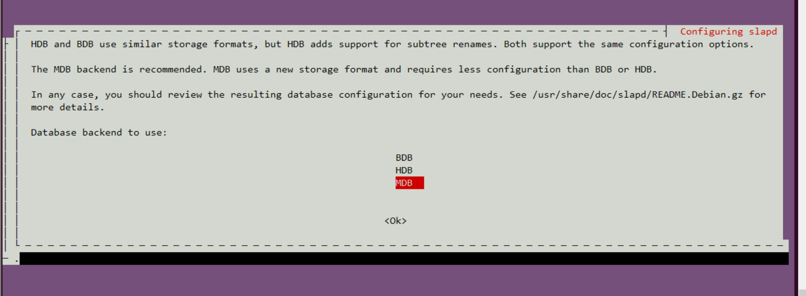

删除原有数据

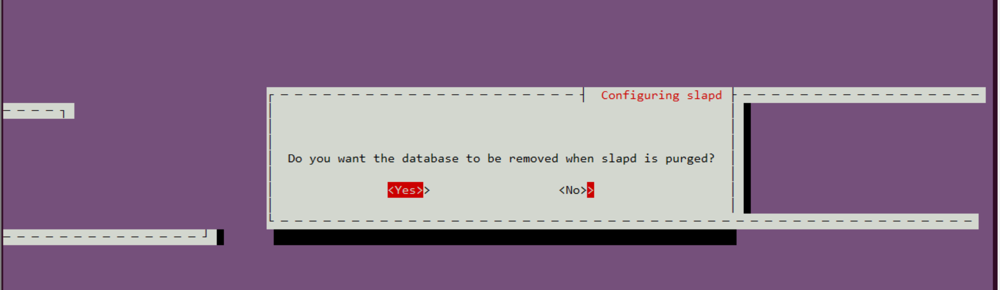

后续选项默认即可.

测试我们与ldapwhoami的LDAP连接，该连接应该返回我们连接的用户名：

.. code-block:: console

 root@ubuntu:/home/cecgw# ldapwhoami -H ldap:// -x
 anonymous
 root@ubuntu:/home/cecgw# netstat -anp|grep 389 # 服务端口389
 tcp        0      0 0.0.0.0:389             0.0.0.0:*               LISTEN      42943/slapd     
 tcp6       0      0 :::389                  :::*                    LISTEN      42943/slapd     

.. end

至此，ladp server安装完毕，我们可以通过命令行，实现用户的添加删除，为了管理方便，安装web进行管理.

安装和配置LDAP web manager
--------------------------

.. code-block:: console

	root@ubuntu:/home/cecgw# apt-get install phpldapadmin
	Reading package lists... Done
	Building dependency tree       
	Reading state information... Done
	The following packages were automatically installed and are no longer required:
	  linux-headers-4.4.0-116 linux-headers-4.4.0-116-generic linux-headers-4.4.0-119 linux-headers-4.4.0-119-generic linux-headers-4.4.0-121
	  linux-headers-4.4.0-121-generic linux-headers-4.4.0-124 linux-headers-4.4.0-124-generic linux-headers-4.4.0-130
	  linux-headers-4.4.0-130-generic linux-headers-4.4.0-161 linux-headers-4.4.0-31 linux-headers-4.4.0-31-generic
	  linux-image-4.4.0-116-generic linux-image-4.4.0-119-generic linux-image-4.4.0-121-generic linux-image-4.4.0-124-generic
	  linux-image-4.4.0-130-generic linux-image-4.4.0-31-generic linux-image-extra-4.4.0-116-generic linux-image-extra-4.4.0-119-generic
	  linux-image-extra-4.4.0-121-generic linux-image-extra-4.4.0-124-generic linux-image-extra-4.4.0-130-generic
	  linux-image-extra-4.4.0-31-generic
	Use 'sudo apt autoremove' to remove them.
	The following additional packages will be installed:
	  apache2 apache2-bin apache2-data apache2-utils libapache2-mod-php libapache2-mod-php7.0 libaprutil1-dbd-sqlite3 libaprutil1-ldap
	  liblua5.1-0 php-common php-ldap php-xml php7.0-cli php7.0-common php7.0-json php7.0-ldap php7.0-opcache php7.0-readline php7.0-xml
	  ssl-cert
	Suggested packages:
	  www-browser apache2-doc apache2-suexec-pristine | apache2-suexec-custom php-pear openssl-blacklist
	The following NEW packages will be installed:
	  apache2 apache2-bin apache2-data apache2-utils libapache2-mod-php libapache2-mod-php7.0 libaprutil1-dbd-sqlite3 libaprutil1-ldap
	  liblua5.1-0 php-common php-ldap php-xml php7.0-cli php7.0-common php7.0-json php7.0-ldap php7.0-opcache php7.0-readline php7.0-xml
	  phpldapadmin ssl-cert
	0 upgraded, 21 newly installed, 0 to remove and 253 not upgraded.
	Need to get 5,738 kB of archives.
	After this operation, 25.5 MB of additional disk space will be used.
	Do you want to continue? [Y/n] y
	Get:1 http://mirrors.tuna.tsinghua.edu.cn/ubuntu xenial/main amd64 libaprutil1-dbd-sqlite3 amd64 1.5.4-1build1 [10.6 kB]
	Get:2 http://mirrors.tuna.tsinghua.edu.cn/ubuntu xenial/main amd64 libaprutil1-ldap amd64 1.5.4-1build1 [8,720 B]
	Get:3 http://mirrors.tuna.tsinghua.edu.cn/ubuntu xenial/main amd64 liblua5.1-0 amd64 5.1.5-8ubuntu1 [102 kB]
	Get:4 http://mirrors.tuna.tsinghua.edu.cn/ubuntu xenial-updates/main amd64 apache2-bin amd64 2.4.18-2ubuntu3.14 [930 kB]
	Get:5 http://mirrors.tuna.tsinghua.edu.cn/ubuntu xenial-updates/main amd64 apache2-utils amd64 2.4.18-2ubuntu3.14 [82.1 kB]
	Get:6 http://mirrors.tuna.tsinghua.edu.cn/ubuntu xenial-updates/main amd64 apache2-data all 2.4.18-2ubuntu3.14 [162 kB]
	Get:7 http://mirrors.tuna.tsinghua.edu.cn/ubuntu xenial-updates/main amd64 apache2 amd64 2.4.18-2ubuntu3.14 [86.5 kB]
	Get:8 http://mirrors.tuna.tsinghua.edu.cn/ubuntu xenial-updates/main amd64 php-common all 1:35ubuntu6.1 [10.8 kB]
	Get:9 http://mirrors.tuna.tsinghua.edu.cn/ubuntu xenial-updates/main amd64 php7.0-common amd64 7.0.33-0ubuntu0.16.04.14 [846 kB]
	Get:10 http://mirrors.tuna.tsinghua.edu.cn/ubuntu xenial-updates/main amd64 php7.0-json amd64 7.0.33-0ubuntu0.16.04.14 [16.9 kB]
	Get:11 http://mirrors.tuna.tsinghua.edu.cn/ubuntu xenial-updates/main amd64 php7.0-opcache amd64 7.0.33-0ubuntu0.16.04.14 [77.3 kB]
	Get:12 http://mirrors.tuna.tsinghua.edu.cn/ubuntu xenial-updates/main amd64 php7.0-readline amd64 7.0.33-0ubuntu0.16.04.14 [12.8 kB]
	Get:13 http://mirrors.tuna.tsinghua.edu.cn/ubuntu xenial-updates/main amd64 php7.0-cli amd64 7.0.33-0ubuntu0.16.04.14 [1,282 kB]
	Get:14 http://mirrors.tuna.tsinghua.edu.cn/ubuntu xenial-updates/main amd64 libapache2-mod-php7.0 amd64 7.0.33-0ubuntu0.16.04.14 [1,225 kB]
	Get:15 http://mirrors.tuna.tsinghua.edu.cn/ubuntu xenial-updates/main amd64 libapache2-mod-php all 1:7.0+35ubuntu6.1 [2,990 B]
	Get:16 http://mirrors.tuna.tsinghua.edu.cn/ubuntu xenial-updates/main amd64 php7.0-ldap amd64 7.0.33-0ubuntu0.16.04.14 [21.2 kB]
	Get:17 http://mirrors.tuna.tsinghua.edu.cn/ubuntu xenial-updates/main amd64 php-ldap all 1:7.0+35ubuntu6.1 [1,928 B]
	Get:18 http://mirrors.tuna.tsinghua.edu.cn/ubuntu xenial-updates/main amd64 php7.0-xml amd64 7.0.33-0ubuntu0.16.04.14 [113 kB]
	Get:19 http://mirrors.tuna.tsinghua.edu.cn/ubuntu xenial-updates/universe amd64 php-xml all 1:7.0+35ubuntu6.1 [1,954 B]
	Get:20 http://mirrors.tuna.tsinghua.edu.cn/ubuntu xenial/main amd64 ssl-cert all 1.0.37 [16.9 kB]
	Get:21 http://mirrors.tuna.tsinghua.edu.cn/ubuntu xenial-updates/universe amd64 phpldapadmin all 1.2.2-5.2ubuntu2.1 [727 kB]
	Fetched 5,738 kB in 4s (1,258 kB/s)    
	Preconfiguring packages ...
	Selecting previously unselected package libaprutil1-dbd-sqlite3:amd64.
	(Reading database ... 339326 files and directories currently installed.)
	Preparing to unpack .../libaprutil1-dbd-sqlite3_1.5.4-1build1_amd64.deb ...
	Unpacking libaprutil1-dbd-sqlite3:amd64 (1.5.4-1build1) ...
	Selecting previously unselected package libaprutil1-ldap:amd64.
	Preparing to unpack .../libaprutil1-ldap_1.5.4-1build1_amd64.deb ...
	Unpacking libaprutil1-ldap:amd64 (1.5.4-1build1) ...
	Selecting previously unselected package liblua5.1-0:amd64.
	Preparing to unpack .../liblua5.1-0_5.1.5-8ubuntu1_amd64.deb ...
	Unpacking liblua5.1-0:amd64 (5.1.5-8ubuntu1) ...
	Selecting previously unselected package apache2-bin.
	Preparing to unpack .../apache2-bin_2.4.18-2ubuntu3.14_amd64.deb ...
	Unpacking apache2-bin (2.4.18-2ubuntu3.14) ...
	Selecting previously unselected package apache2-utils.
	Preparing to unpack .../apache2-utils_2.4.18-2ubuntu3.14_amd64.deb ...
	Unpacking apache2-utils (2.4.18-2ubuntu3.14) ...
	Selecting previously unselected package apache2-data.
	Preparing to unpack .../apache2-data_2.4.18-2ubuntu3.14_all.deb ...
	Unpacking apache2-data (2.4.18-2ubuntu3.14) ...
	Selecting previously unselected package apache2.
	Preparing to unpack .../apache2_2.4.18-2ubuntu3.14_amd64.deb ...
	Unpacking apache2 (2.4.18-2ubuntu3.14) ...
	Selecting previously unselected package php-common.
	Preparing to unpack .../php-common_1%3a35ubuntu6.1_all.deb ...
	Unpacking php-common (1:35ubuntu6.1) ...
	Selecting previously unselected package php7.0-common.
	Preparing to unpack .../php7.0-common_7.0.33-0ubuntu0.16.04.14_amd64.deb ...
	Unpacking php7.0-common (7.0.33-0ubuntu0.16.04.14) ...
	Selecting previously unselected package php7.0-json.
	Preparing to unpack .../php7.0-json_7.0.33-0ubuntu0.16.04.14_amd64.deb ...
	Unpacking php7.0-json (7.0.33-0ubuntu0.16.04.14) ...
	Selecting previously unselected package php7.0-opcache.
	Preparing to unpack .../php7.0-opcache_7.0.33-0ubuntu0.16.04.14_amd64.deb ...
	Unpacking php7.0-opcache (7.0.33-0ubuntu0.16.04.14) ...
	Selecting previously unselected package php7.0-readline.
	Preparing to unpack .../php7.0-readline_7.0.33-0ubuntu0.16.04.14_amd64.deb ...
	Unpacking php7.0-readline (7.0.33-0ubuntu0.16.04.14) ...
	Selecting previously unselected package php7.0-cli.
	Preparing to unpack .../php7.0-cli_7.0.33-0ubuntu0.16.04.14_amd64.deb ...
	Unpacking php7.0-cli (7.0.33-0ubuntu0.16.04.14) ...
	Selecting previously unselected package libapache2-mod-php7.0.
	Preparing to unpack .../libapache2-mod-php7.0_7.0.33-0ubuntu0.16.04.14_amd64.deb ...
	Unpacking libapache2-mod-php7.0 (7.0.33-0ubuntu0.16.04.14) ...
	Selecting previously unselected package libapache2-mod-php.
	Preparing to unpack .../libapache2-mod-php_1%3a7.0+35ubuntu6.1_all.deb ...
	Unpacking libapache2-mod-php (1:7.0+35ubuntu6.1) ...
	Selecting previously unselected package php7.0-ldap.
	Preparing to unpack .../php7.0-ldap_7.0.33-0ubuntu0.16.04.14_amd64.deb ...
	Unpacking php7.0-ldap (7.0.33-0ubuntu0.16.04.14) ...
	Selecting previously unselected package php-ldap.
	Preparing to unpack .../php-ldap_1%3a7.0+35ubuntu6.1_all.deb ...
	Unpacking php-ldap (1:7.0+35ubuntu6.1) ...
	Selecting previously unselected package php7.0-xml.
	Preparing to unpack .../php7.0-xml_7.0.33-0ubuntu0.16.04.14_amd64.deb ...
	Unpacking php7.0-xml (7.0.33-0ubuntu0.16.04.14) ...
	Selecting previously unselected package php-xml.
	Preparing to unpack .../php-xml_1%3a7.0+35ubuntu6.1_all.deb ...
	Unpacking php-xml (1:7.0+35ubuntu6.1) ...
	Selecting previously unselected package ssl-cert.
	Preparing to unpack .../ssl-cert_1.0.37_all.deb ...
	Unpacking ssl-cert (1.0.37) ...
	Selecting previously unselected package phpldapadmin.
	Preparing to unpack .../phpldapadmin_1.2.2-5.2ubuntu2.1_all.deb ...
	Unpacking phpldapadmin (1.2.2-5.2ubuntu2.1) ...
	Processing triggers for libc-bin (2.23-0ubuntu10) ...
	Processing triggers for man-db (2.7.5-1) ...
	Processing triggers for ufw (0.35-0ubuntu2) ...
	Processing triggers for systemd (229-4ubuntu21.21) ...
	Processing triggers for ureadahead (0.100.0-19) ...
	Setting up libaprutil1-dbd-sqlite3:amd64 (1.5.4-1build1) ...
	Setting up libaprutil1-ldap:amd64 (1.5.4-1build1) ...
	Setting up liblua5.1-0:amd64 (5.1.5-8ubuntu1) ...
	Setting up apache2-bin (2.4.18-2ubuntu3.14) ...
	Setting up apache2-utils (2.4.18-2ubuntu3.14) ...
	Setting up apache2-data (2.4.18-2ubuntu3.14) ...
	Setting up apache2 (2.4.18-2ubuntu3.14) ...
	Enabling module mpm_event.
	Enabling module authz_core.
	Enabling module authz_host.
	Enabling module authn_core.
	Enabling module auth_basic.
	Enabling module access_compat.
	Enabling module authn_file.
	Enabling module authz_user.
	Enabling module alias.
	Enabling module dir.
	Enabling module autoindex.
	Enabling module env.
	Enabling module mime.
	Enabling module negotiation.
	Enabling module setenvif.
	Enabling module filter.
	Enabling module deflate.
	Enabling module status.
	Enabling conf charset.
	Enabling conf localized-error-pages.
	Enabling conf other-vhosts-access-log.
	Enabling conf security.
	Enabling conf serve-cgi-bin.
	Enabling site 000-default.
	Setting up php-common (1:35ubuntu6.1) ...
	Setting up php7.0-common (7.0.33-0ubuntu0.16.04.14) ...

	Creating config file /etc/php/7.0/mods-available/calendar.ini with new version

	Creating config file /etc/php/7.0/mods-available/ctype.ini with new version

	Creating config file /etc/php/7.0/mods-available/exif.ini with new version

	Creating config file /etc/php/7.0/mods-available/fileinfo.ini with new version

	Creating config file /etc/php/7.0/mods-available/ftp.ini with new version

	Creating config file /etc/php/7.0/mods-available/gettext.ini with new version

	Creating config file /etc/php/7.0/mods-available/iconv.ini with new version

	Creating config file /etc/php/7.0/mods-available/pdo.ini with new version

	Creating config file /etc/php/7.0/mods-available/phar.ini with new version

	Creating config file /etc/php/7.0/mods-available/posix.ini with new version

	Creating config file /etc/php/7.0/mods-available/shmop.ini with new version

	Creating config file /etc/php/7.0/mods-available/sockets.ini with new version

	Creating config file /etc/php/7.0/mods-available/sysvmsg.ini with new version

	Creating config file /etc/php/7.0/mods-available/sysvsem.ini with new version

	Creating config file /etc/php/7.0/mods-available/sysvshm.ini with new version

	Creating config file /etc/php/7.0/mods-available/tokenizer.ini with new version
	Setting up php7.0-json (7.0.33-0ubuntu0.16.04.14) ...

	Creating config file /etc/php/7.0/mods-available/json.ini with new version
	Setting up php7.0-opcache (7.0.33-0ubuntu0.16.04.14) ...

	Creating config file /etc/php/7.0/mods-available/opcache.ini with new version
	Setting up php7.0-readline (7.0.33-0ubuntu0.16.04.14) ...

	Creating config file /etc/php/7.0/mods-available/readline.ini with new version
	Setting up php7.0-cli (7.0.33-0ubuntu0.16.04.14) ...
	update-alternatives: using /usr/bin/php7.0 to provide /usr/bin/php (php) in auto mode
	update-alternatives: using /usr/bin/phar7.0 to provide /usr/bin/phar (phar) in auto mode
	update-alternatives: using /usr/bin/phar.phar7.0 to provide /usr/bin/phar.phar (phar.phar) in auto mode

	Creating config file /etc/php/7.0/cli/php.ini with new version
	Setting up libapache2-mod-php7.0 (7.0.33-0ubuntu0.16.04.14) ...

	Creating config file /etc/php/7.0/apache2/php.ini with new version
	Module mpm_event disabled.
	Enabling module mpm_prefork.
	apache2_switch_mpm Switch to prefork
	apache2_invoke: Enable module php7.0
	Setting up libapache2-mod-php (1:7.0+35ubuntu6.1) ...
	Setting up php7.0-ldap (7.0.33-0ubuntu0.16.04.14) ...

	Creating config file /etc/php/7.0/mods-available/ldap.ini with new version
	Setting up php-ldap (1:7.0+35ubuntu6.1) ...
	Setting up php7.0-xml (7.0.33-0ubuntu0.16.04.14) ...

	Creating config file /etc/php/7.0/mods-available/dom.ini with new version

	Creating config file /etc/php/7.0/mods-available/simplexml.ini with new version

	Creating config file /etc/php/7.0/mods-available/wddx.ini with new version

	Creating config file /etc/php/7.0/mods-available/xml.ini with new version

	Creating config file /etc/php/7.0/mods-available/xmlreader.ini with new version

	Creating config file /etc/php/7.0/mods-available/xmlwriter.ini with new version

	Creating config file /etc/php/7.0/mods-available/xsl.ini with new version
	Setting up php-xml (1:7.0+35ubuntu6.1) ...
	Setting up ssl-cert (1.0.37) ...
	Setting up phpldapadmin (1.2.2-5.2ubuntu2.1) ...

	Creating config file /etc/phpldapadmin/config.php with new version
	apache2_invoke: Enable configuration phpldapadmin.conf
	Processing triggers for libc-bin (2.23-0ubuntu10) ...
	Processing triggers for systemd (229-4ubuntu21.21) ...
	Processing triggers for ureadahead (0.100.0-19) ...
	Processing triggers for ufw (0.35-0ubuntu2) ...
	Processing triggers for libapache2-mod-php7.0 (7.0.33-0ubuntu0.16.04.14) ...

.. end

修改配置文件

.. code-block:: console

 root@ubuntu:/home/cecgw# vi /etc/phpldapadmin/config.php 

 $servers->setValue('server','name','My LDAP Server');
 $servers->setValue('server','host','192.168.121.131');
 $servers->setValue('server','base',array('dc=cecgw,dc=cn')); #与之前对应
 $servers->setValue('login','bind_id','cn=admin,dc=cecgw,dc=cn');

.. end

至此可访问浏览器，http://IP/phpldapadmin

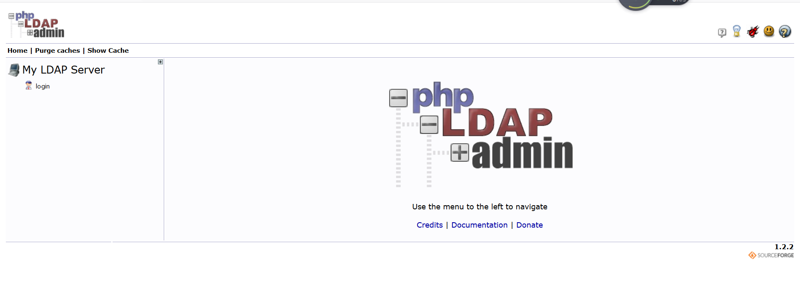

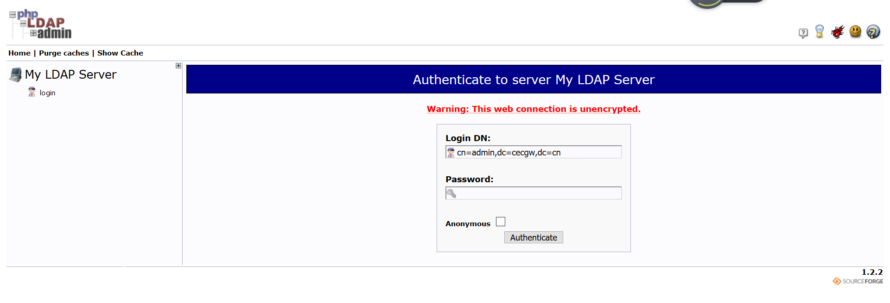

用户名密码为上述设置,即可登录.

添加用户初体验
--------------

1 点击 Create new entry here

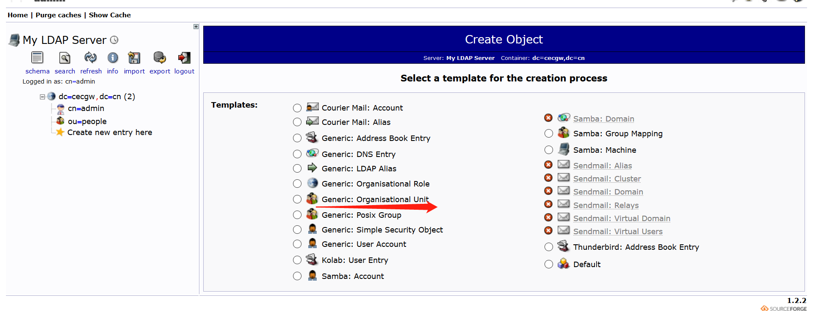

2 创建组 Generic: Posix Group

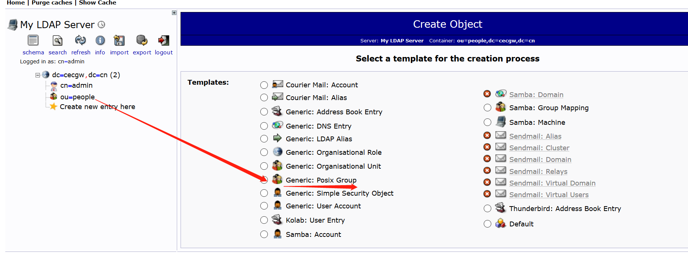

3 在改组下创建一个用户.

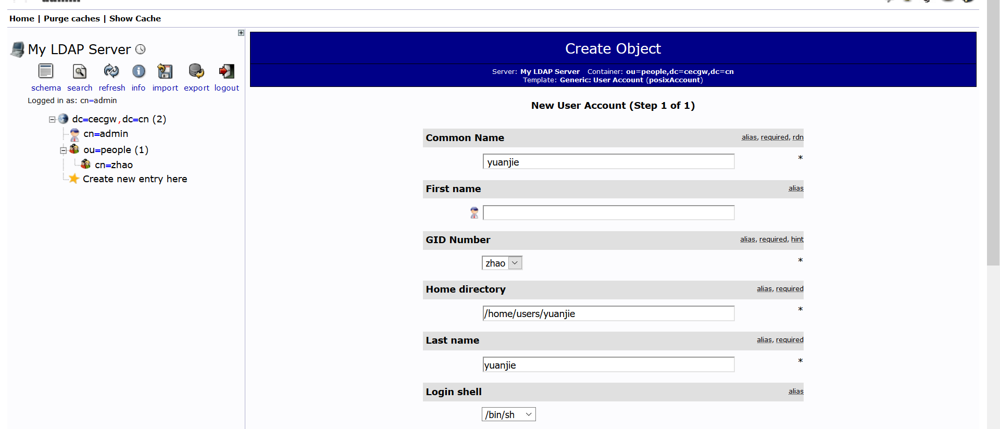

4 创建用户

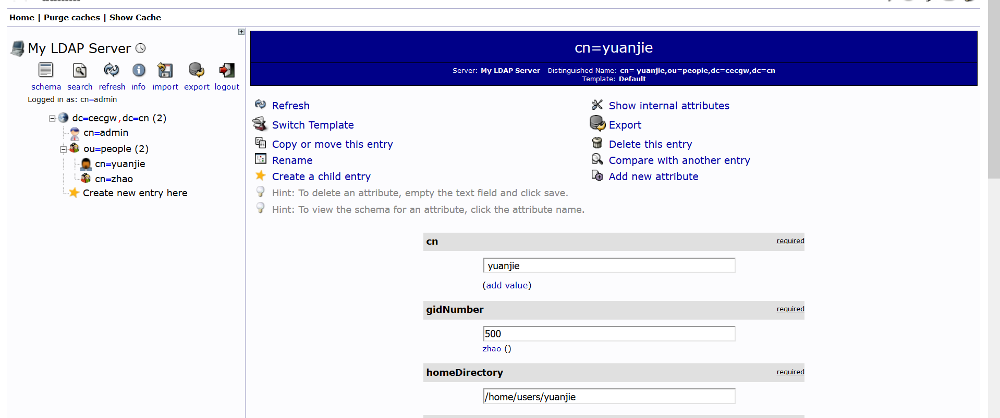

通过命令行检查一下是否后台已经添加.可退出登录，以该用户名密码登录web。

.. code-block:: console

	root@ubuntu:/home/cecgw# ldapsearch -x
	# extended LDIF
	#
	# LDAPv3
	# base <dc=cecgw,dc=cn> (default) with scope subtree
	# filter: (objectclass=*)
	# requesting: ALL
	#

	# cecgw.cn
	dn: dc=cecgw,dc=cn
	objectClass: top
	objectClass: dcObject
	objectClass: organization
	o: cecgw
	dc: cecgw

	# admin, cecgw.cn
	dn: cn=admin,dc=cecgw,dc=cn
	objectClass: simpleSecurityObject
	objectClass: organizationalRole
	cn: admin
	description: LDAP administrator

	# people, cecgw.cn
	dn: ou=people,dc=cecgw,dc=cn
	objectClass: organizationalUnit
	objectClass: top
	ou: people

	# zhao, people, cecgw.cn
	dn: cn=zhao,ou=people,dc=cecgw,dc=cn
	gidNumber: 500
	cn: zhao
	objectClass: posixGroup
	objectClass: top

	# yuanjie, people, cecgw.cn
	dn: cn=yuanjie,ou=people,dc=cecgw,dc=cn
	cn:: IHl1YW5qaWU=
	gidNumber: 500
	homeDirectory: /home/users/yuanjie
	sn: yuanjie
	loginShell: /bin/sh
	objectClass: inetOrgPerson
	objectClass: posixAccount
	objectClass: top
	uidNumber: 1000
	uid: yuanjie

	# search result
	search: 2
	result: 0 Success

	# numResponses: 6
	# numEntries: 5 
.. end

检查可以看到该用户已经入库.注意前台登录的输入参数为:cn=yuanjie,ou=people,dc=cecgw,dc=cn
输入密码即可.

Hive集成ldap完成验证
--------------------

默认安装完hive,使用beeline不需要密码即可登录，总让人有些不放心，我们将hive 与 ldap 集成,通过ldap验证的用户名及密码登录hive,可以起到安全认
证的作用。
拓扑情况: hive server在192.168.121.128  ldap server 在 192.168.121.131

修改hive配置信息.

.. code-block:: console

 <property>
        <name>hive.security.authorization.enabled</name>
        <value>true</value>
        <description>enableor disable the hive clientauthorization</description>
    </property>

    <property>
        <name>hive.security.authorization.createtable.owner.grants</name>
        <value>ALL</value>
        <description>theprivileges automatically granted to the ownerwhenever a table gets created. Anexample like "select,drop" willgrant select and drop privilege to theowner of the table</description>
    </property>

    <property>
        <name>hive.server2.authentication</name>
        <value>LDAP</value>
        <description>
          Expects one of [nosasl, none, ldap, kerberos, pam, custom].
          Client authentication types.
            NONE: no authentication check
            LDAP: LDAP/AD based authentication
            KERBEROS: Kerberos/GSSAPI authentication
            CUSTOM: Custom authentication provider
                    (Use with property hive.server2.custom.authentication.class)
            PAM: Pluggable authentication module
            NOSASL:  Raw transport
        </description>
    </property>
    
    <property>
        <name>hive.server2.authentication.ldap.url</name>
        <value>ldap://192.168.121.131:389</value>
    </property>

    <property>
        <name>hive.server2.authentication.ldap.baseDN</name>
        <value>ou=people,dc=cecgw,dc=cn</value>
    </property>

.. end

启动hive,进行测试验证.

.. code-block:: console

	hadoop@ubuntu:/opt/hive$ ./bin/hive --service metastore 1>/dev/null 2>&1 &
	[1] 8063
	hadoop@ubuntu:/opt/hive$ hive --service hiveserver2 1>/dev/null 2>&1 & 
	[2] 8116
        hadoop@ubuntu:/opt/hive/bin$ beeline
	Beeline version 2.3.4 by Apache Hive
	beeline> !connect jdbc:hive2://192.168.121.128:10000
	Connecting to jdbc:hive2://192.168.121.128:10000
	Enter username for jdbc:hive2://192.168.121.128:10000: yuanjie
	Enter password for jdbc:hive2://192.168.121.128:10000: *******
	20/04/24 18:02:21 [main]: WARN jdbc.HiveConnection: Failed to connect to 192.168.121.128:10000
	Unknown HS2 problem when communicating with Thrift server.
	Error: Could not open client transport with JDBC Uri: jdbc:hive2://192.168.121.128:10000: Peer indicated failure: Error validating the login (state=08S01,code=0)  # 输入错误的用户名和密码将无法登录.
        ===========================================
        输入正确的用户名和密码,即可查看:
        beeline> !connect jdbc:hive2://192.168.121.128:10000
	Connecting to jdbc:hive2://192.168.121.128:10000
	Enter username for jdbc:hive2://192.168.121.128:10000: CN=yuanjie,OU=people,DC=cecgw,DC=cn
	Enter password for jdbc:hive2://192.168.121.128:10000: ********
	Connected to: Apache Hive (version 2.3.4)
	Driver: Hive JDBC (version 2.3.4)
	Transaction isolation: TRANSACTION_REPEATABLE_READ
	0: jdbc:hive2://192.168.121.128:10000> show tables;
	+--------------+
	|   tab_name   |
	+--------------+
	| cec          |
	| cecgw        |
	| employees    |
	| hank         |
	| pokes        |
	| pokess       |
	| pokesss      |
	| pokessss     |
	| pokesssss    |
	| pokessssss   |
	| students     |
	| zhaoyuanjie  |
	+--------------+
	12 rows selected (0.388 seconds)

.. end

Hive集成ldap+ranger完成验证
---------------------------

虽然ranger 在访问控制层面提供了用户+用户组的方式，但作为一个恶意攻击者，完全可以以伪装的方式，伪装某个用户登录，从而造成安全问题，比如hadoop用户在登录hive时,通过伪造ubuntu用户登录，在没有认证的情况下，可以获取ubuntu用户权限,显然有安全隐患。
默认的ranger 获取用户是通过user_sync获取操作系统用户,采用的是操作系统的用户管理体系，而ldap是另外一套用户管理体系，这样在登录过程中，为了达到ldap的认证，需要输入ldap要求的认证初始化参数即：un=xx,ou=xx,cn=xx的形式，这样的参数显然ranger不能识别，导致ranger下发的用户策略用户名与hive认证不一致，导致通过ldap认证的用户，无法匹配ranger策略，主要原因是用户名不一致导致的.

这里有两种解决思路，ranger 使用ranger_user_sync来同步系统用户信息，我们可以使用一套用户管理体系，让ranger采用ldap框架来获取用户信息.这个相对比较统一一些，也是比较统一的一个思路。
另外一种思路为，我们将ldap user认证的所有信息，作为用户名，在ranger创建，并设置响应的安全策略，是一种较为取巧的办法，通过同步在ranger构建用户，达到输入信息一致的目的，我们采用思路二验证下想法。

步骤一：
在ranger 下创建名称为 CN=zhaoyuanjie,OU=people,DC=cecgw,DC=cn的用户.

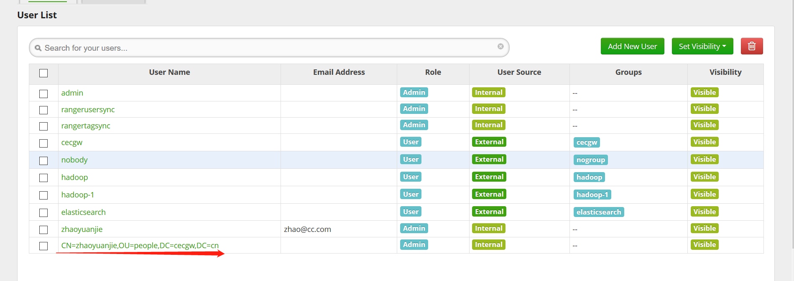

步骤二：

给CN=zhaoyuanjie,OU=people,DC=cecgw,DC=cn 赋予权限.

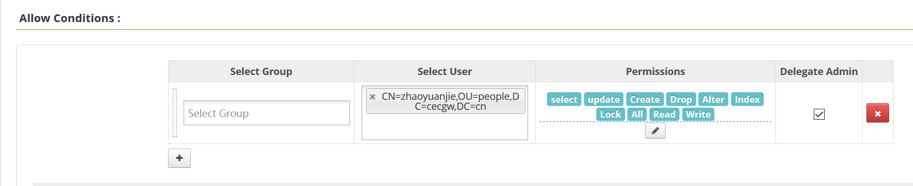

步骤三：登录hive,验证.

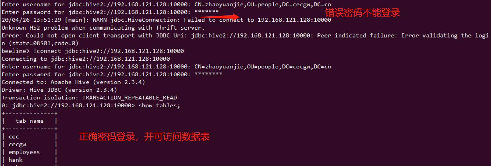

步骤四：查看ranger审计信息.

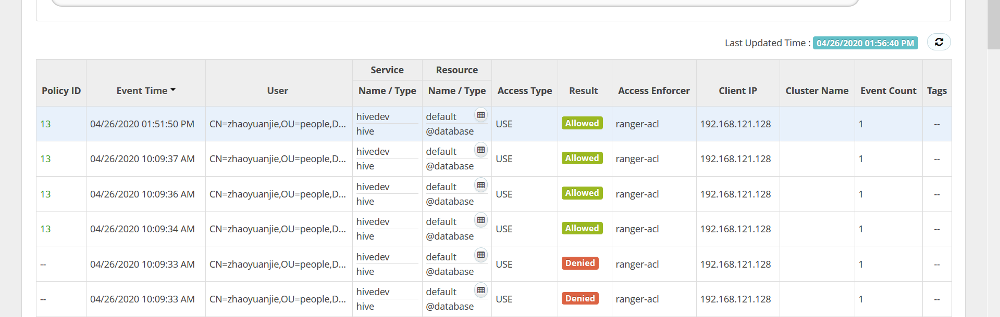

通过这种方式，我们可以解决hive用户认证的问题，同时解决ranger授权问题.

使用短名CN登录
--------------

如果需要使用短名CN直接登录HIVE，需要添加配置项如下：

.. code-block:: console

  <property>
    <name>hive.server2.authentication.ldap.baseDN</name>
    <value>ou=People,dc=cecgw,dc=cn</value>
    <description>LDAP base DN</description>
  </property>
  <property>
    <name>hive.server2.authentication.ldap.userDNPattern</name>
    <value>CN=%s,OU=People,DC=cecgw,DC=cn</value>
    <description>
      COLON-separated list of patterns to use to find DNs for users in this directory.
      Use %s where the actual group name is to be substituted for.
      For example: CN=%s,CN=Users,DC=subdomain,DC=domain,DC=com.
    </description>
  </property>

.. end

另外，需要注意：

.. note::
 For generic LDAP servers, you must use:
 hive.server2.authentication.ldap.baseDN 
 hive.server2.authentication.ldap.userDNPattern
 However, Active Directory (AD) does not require the above two options, they can be replaced by the following property:
 hive.server2.authentication.ldap.Domain

.. note::
	By default HiveServer2 performs the query processing as the user who submitted the query. But if the following parameter is set to false, the query will run as the user that the hiveserver2 process runs as.
	hive.server2.enable.doAs – Impersonate the connected user, default true. SET hive.server2.enable.doAs TO false. 否则执行mr运算报错.

LDAP 含义
---------

#. 目录树：在一个目录服务系统中，整个目录信息集可以表示为一个目录信息树，树中的每个节点是一个条目。

#. 条目：每个条目就是一条记录，每个条目有自己的唯一可区别的名称（DN）。

#. 对象类：与某个实体类型对应的一组属性，对象类是可以继承的，这样父类的必须属性也会被继承下来。

#. 属性：描述条目的某个方面的信息，一个属性由一个属性类型和一个或多个属性值组成，属性有必须属性和非必须属性。

.. code-block:: console

 dc      Domain Component        域名的部分，其格式是将完整的域名分成几部分，如域名为example.com变成dc=example,dc=com（一条记录的所属位置）
 uid     User Id                 用户ID songtao.xu（一条记录的ID）
 ou      Organization Unit       组织单位，组织单位可以包含其他各种对象（包括其他组织单元），如"oa组"（一条记录的所属组织）
 cn      Common Name             公共名称，如“Thomas Johansson”（一条记录的名称）
 sn      Surname                 姓，如"许"
 dn      Distinguished Name      "uid=songtao.xu,ou=oa组,dc=example,dc=com"，一条记录的位置（唯一）
 rdn     Relative dn             相对辨别名，类似于文件系统中的相对路径，它是与目录树结构无关的部分，如"uid=tom"或"cn= Thomas Johansson"

.. end

