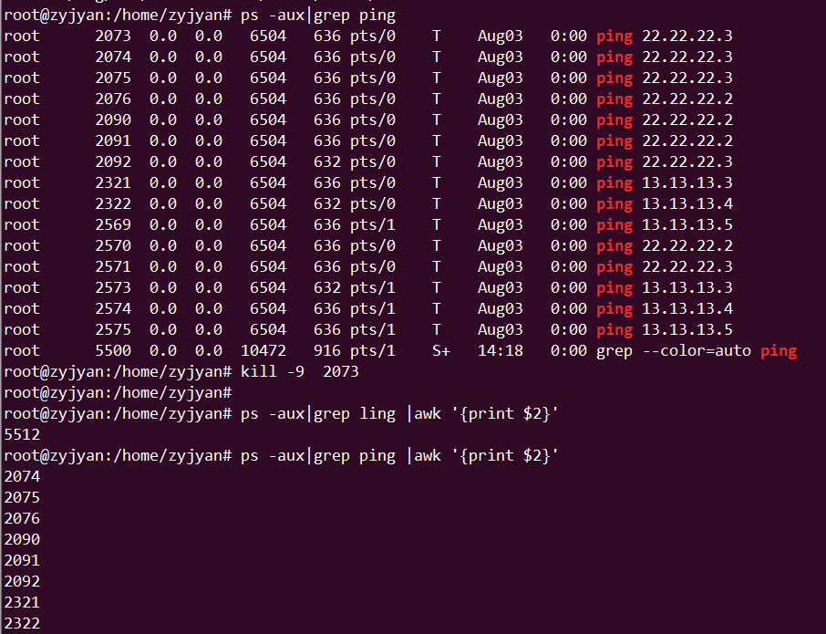

	Linux-Shell
~~~~~~~~~~~

修改Ubuntu网卡名称
------------------

.. code-block:: console

 vi nano /etc/default/grub
 找到GRUB_CMDLINE_LINUX=""
 改为GRUB_CMDLINE_LINUX="net.ifnames=0 biosdevname=0"
 然后sudo grub-mkconfig -o /boot/grub/grub.cfg
 重启后，网卡名称果然变成了eth0和wlan0
 修改后重启即可；

.. end

awk
---

.. code-block:: console

 for i in `ps -aux|grep ping |awk '{print $2}'`;  do kill -9 $i; done; 

.. end

find
----

.. code-block:: console

 # find /  -name "cecgw"

.. end

du
--

.. code-block:: console

 查看目录大小
 # du  -h --max-depth=1 /home/cecgw

.. end

linux用户和组
-------------
Linux 是个多用户多任务的分时操作系统，所有想要调用系统资源的用户都必须先向系统管理员申请一个账号，
然后通过这个账号进入系统。用户的账号一方面能帮助系统管理员对使用系统的用户进行跟踪，控制他们对系统资源的访问；
另一方面也能帮助用户组织文件，为用户提供安全性保护。每个账号都拥有一个唯一的用户名和用户密码。
用户在登录时键入正确的用户名和密码后，才能进入系统和自己的主目录。
一个用户可以存在于多个用户组中。

1、查看用户信息。

.. code-block:: console

root@ubuntu:~# vi /etc/passwd
root:x:0:0:root:/root:/bin/bash
daemon:x:1:1:daemon:/usr/sbin:/usr/sbin/nologin
bin:x:2:2:bin:/bin:/usr/sbin/nologin
sys:x:3:3:sys:/dev:/usr/sbin/nologin
sync:x:4:65534:sync:/bin:/bin/sync
games:x:5:60:games:/usr/games:/usr/sbin/nologin
man:x:6:12:man:/var/cache/man:/usr/sbin/nologin
lp:x:7:7:lp:/var/spool/lpd:/usr/sbin/nologin
mail:x:8:8:mail:/var/mail:/usr/sbin/nologin
news:x:9:9:news:/var/spool/news:/usr/sbin/nologin
uucp:x:10:10:uucp:/var/spool/uucp:/usr/sbin/nologin
proxy:x:13:13:proxy:/bin:/usr/sbin/nologin

文件中每行记录用冒号 : 分隔为 7 个字段，从左到右具体含义是：
用户名：密码占位符（x 表示用户需要密码登录）：用户标识号（UID）：组标识号（GID）：注释性描述：主目录：登录的 shell

.. end

2、查看密码文件。

.. code-block:: console

root@ubuntu:~# vi /etc/shadow
root:!:17882:0:99999:7:::
daemon:*:17001:0:99999:7:::
bin:*:17001:0:99999:7:::
sys:*:17001:0:99999:7:::
sync:*:17001:0:99999:7:::
games:*:17001:0:99999:7:::
man:*:17001:0:99999:7:::
lp:*:17001:0:99999:7:::
mail:*:17001:0:99999:7:::

文件中每行记录用冒号 : 分隔为 9 个字段，从左到右具体含义是：
用户名：加密口令：最后一次修改时间：最短有效天数：最长有效天数：过期前的警告时间：不活动时间：用户失效时间：暂时保留未使用

.. end

3、查看组信息文件。

.. code-block:: console

root@ubuntu:~# vi /etc/group
root:x:0:
daemon:x:1:
bin:x:2:
sys:x:3:
adm:x:4:syslog,cecgw
tty:x:5:
disk:x:6:
lp:x:7:
mail:x:8:

用户组的所有信息都存放在/etc/group文件中。将用户分组是Linux 系统中对用户进行管理及控制访问权限的一种手段。

每个用户都属于某个用户组；一个组中可以有多个用户，一个用户也可以属于不同的组。
当一个用户同时是多个组中的成员时，在/etc/passwd文件中记录的是用户所属的主组，也就是登录时所属的默认组，而其他组称为附加组。

用户要访问属于附加组的文件时，必须首先使用newgrp命令使自己成为所要访问的组中的成员。
用户组的所有信息都存放在/etc/group文件中。此文件的格式也类似于/etc/passwd文件，由冒号(:)隔开若干个字段，这些字段有：
组名:口令:组标识号:组内用户列表
"组名"是用户组的名称，由字母或数字构成。与/etc/passwd中的登录名一样，组名不能重复。
"口令"字段存放的是用户组加密后的口令字。一般Linux 系统的用户组都没有口令，即这个字段一般为空，或者是*。
"组标识号"与用户标识号类似，也是一个整数，被系统内部用来标识组。

.. end

lsof
----
linux哲学为“一切皆文件”. linux下文件类型包括：
1普通文件
2目录
3符号链接
4面向块的设备文件
5面向字符的设备文件
6管道和命名管道
7套接字

lsof是list open files的简称。

1、 查看当前所有打开文件。

.. code-block:: console

 root@ubuntu:/home/cecgw/readme/source# lsof |more
COMMAND    PID  TID             USER   FD      TYPE             DEVICE SIZE/OFF       NODE NAME
systemd      1                  root  cwd       DIR              252,0     4096          2 /
systemd      1                  root  rtd       DIR              252,0     4096          2 /
systemd      1                  root  txt       REG              252,0  1581360     131115 /lib/systemd/systemd
systemd      1                  root  mem       REG              252,0    18976     131700 /lib/x86_64-linux-gnu/libuuid.so.1.3.0
systemd      1                  root  mem       REG              252,0   262408     131575 /lib/x86_64-linux-gnu/libblkid.so.1.1.0
systemd      1                  root  mem       REG              252,0    14608     135552 /lib/x86_64-linux-gnu/libdl-2.23.so
lsof显示的结果，从左往右分别代表：打开该文件的程序名，进程id，用户，文件描述符，文件类型，设备，大小，iNode号，文件名。

.. end

2、列出被删除但占用空间的文件

.. code-block:: console

 root@ubuntu:~# lsof |grep deleted

.. end

3、恢复打开但被删除的文件。

以/home/cecgw/abc.txt 文件为例，通过linux窗口1打开该文件，然后通过另外一个窗口删除它(root用户)：

.. code-block:: console

root@ubuntu:/home/cecgw# lsof|grep abc.txt
vi        3025                  root    4u      REG              252,0    12288    4198167 /home/cecgw/.abc.txt.swp

可以找到进程id为3025的进程打开了该文件，每个进程在/proc下都有文件描述符打开的记录：

root@ubuntu:/home/cecgw# ls -l /proc/3025/fd
total 0
lrwx------ 1 root root 64 May 23 14:49 0 -> /dev/pts/1
lrwx------ 1 root root 64 May 23 14:49 1 -> /dev/pts/1
lrwx------ 1 root root 64 May 23 14:49 2 -> /dev/pts/1
lrwx------ 1 root root 64 May 23 14:49 4 -> /home/cecgw/.abc.txt.swp

这里就找到了被删除的abc.txt文件,文件描述符是4，我们把它重定向出来：

.. end

.. Note::
   
   For KAFKA。
