Ranger编译
----------

本次ranger编译版本为1.2.0，下载地址为http://mirrors.tuna.tsinghua.edu.cn/apache/ranger/1.2.0/apache-ranger-1.2.0.tar.gz

系统环境准备：
1.0 编译操作系统版本为ubuntu 1804，对apt源进行更新。

.. code-block:: console

 root@ubuntu:/home/cecgw# uname -a
 Linux ubuntu 4.15.0-50-generic #54-Ubuntu SMP Mon May 6 18:46:08 UTC 2019 x86_64 x86_64 x86_64 GNU/Linux
 root@ubuntu:/home/cecgw# apt-get update &&dist-upgrade # 对apt源进行更新。
 
.. end

1.1 编译过程中必要的软件包,java,python,gcc,maven,需提前安装好，java离线现在配置即可，其余采用apt-get install * 即可。

.. code-block:: console

	root@ubuntu:/home/cecgw# java -version
	java version "1.8.0_191"
	Java(TM) SE Runtime Environment (build 1.8.0_191-b12)
	Java HotSpot(TM) 64-Bit Server VM (build 25.191-b12, mixed mode)
	root@ubuntu:/home/cecgw# dpkg -l|grep maven
	ii  maven                                 3.6.0-1~18.04.1                   all          Java software project management and comprehension tool
	root@ubuntu:/home/cecgw# dpkg -l|grep gcc
	ii  gcc                                   4:7.4.0-1ubuntu2.2                amd64        GNU C compiler

.. end

 为提高编译包下载速度，添加maven源。
 
.. code-block:: console
 
 root@ubuntu:/home/cecgw# vi /etc/maven/settings.xml
   <mirrors>
    
    <mirror>
      <id>mirrorId</id>
      <mirrorOf>repositoryId</mirrorOf>
      <name>Human Readable Name for this Mirror.</name>
      <url>http://my.repository.com/repo/path</url>
    </mirror>
     -->
    <mirror>
      <id>aliyun</id>
      <mirrorOf>central</mirrorOf>
      <name>aliyun</name>
      <url>http://maven.aliyun.com/nexus/content/groups/public</url>
    </mirror>
    <mirror>
      <id>repo2</id>
      <mirrorOf>central</mirrorOf>
      <name>Human Readable Name for this Mirror.</name>
      <url>http://repo2.maven.org/maven2</url>
    </mirror>
    <mirror>
      <id>UK</id>
      <name>UK Central</name>
      <url>http://uk.maven.org/maven2</url>
      <mirrorOf>central</mirrorOf>
    </mirror>
    <mirror>
        <id>repo1</id>
        <mirrorOf>central</mirrorOf>
        <name>Human Readable Name for this Mirror.</name>
        <url>http://repo1.maven.org/maven2</url>
    </mirror>
    <mirror>
        <id>repo</id>
        <mirrorOf>central</mirrorOf>
        <name>Human Readable Name for this Mirror.</name>
        <url>http://repo.maven.apache.org/maven2</url>
    </mirror>
  </mirrors>
 
.. end 

1.2 将 apache-ranger-1.2.0.tar.gz 解压到/root目录下，使用root用户进行编译。

.. code-block:: console

  mvn compile package assembly:assembly install -DskipTests -Drat.skip=true 
  
  在执行过程中，会在如下目录生成相关的jar包。
  
  root@ubuntu:~/.m2/repository# ls
	ant                       ca                 commons-cli            commons-fileupload  dom4j       jline      oro        xml-apis
	antlr                     cglib              commons-codec          commons-httpclient  doxia       joda-time  regexp     xmlenc
	aopalliance               ch                 commons-collections    commons-io          info        junit      ring-cors  xmlpull
	asm                       classworlds        commons-configuration  commons-lang        io          log4j      sslext     xml-resolver
	avalon-framework          co                 commons-daemon         commons-logging     it          logkit     stax       xpp3
	backport-util-concurrent  com                commons-dbcp           commons-net         javax       mysql      tomcat
	bcel                      commons-beanutils  commons-digester       commons-pool        javolution  net        xalan
	be                        commons-chain      commons-el             commons-validator   jaxen       org        xerces

	
  root@ubuntu:~/.m2/repository/ca/juliusdavies/not-yet-commons-ssl/0.3.9# ls
 
	not-yet-commons-ssl-0.3.9.jar              not-yet-commons-ssl-0.3.9.pom              _remote.repositories
	not-yet-commons-ssl-0.3.9.jar.lastUpdated  not-yet-commons-ssl-0.3.9.pom.lastUpdated
	not-yet-commons-ssl-0.3.9.jar.sha1         not-yet-commons-ssl-0.3.9.pom.sha1

.. end 

.. note::
  如果在编译过程中，出现下载不了或者停顿的情况，如若在编译过程中遇到下载不了某些依赖包，可以手动下载后放到指定的目录；也可以暂停编 译，清除（rm -rf）停顿位置的locker文件，再重新从当前步骤编译，编译器会自动从其他源下载。继续编译命令为： mvn compile package assembly:assembly install -DskipTests -Drat.skip=true  -rf :credValidator （继续编译项）
  
  
  .. figure:: image/ranger-compile-success.png
   :width: 80%
   :align: center
   :alt: hivewebui 

编译完成后，会在/root/apache-ranger-1.2.0/target目录下生成应的jar包。即ranger安装包。

.. code-block:: console

	root@ubuntu:~/apache-ranger-1.2.0/target# ls
	antrun                            ranger-1.2.0-hdfs-plugin.zip      ranger-1.2.0-kylin-plugin.zip       ranger-1.2.0-src.zip
	archive-tmp                       ranger-1.2.0-hive-plugin.tar.gz   ranger-1.2.0-migration-util.tar.gz  ranger-1.2.0-storm-plugin.tar.gz
	maven-shared-archive-resources    ranger-1.2.0-hive-plugin.zip      ranger-1.2.0-migration-util.zip     ranger-1.2.0-storm-plugin.zip
	ranger-1.2.0-admin.tar.gz         ranger-1.2.0-kafka-plugin.tar.gz  ranger-1.2.0-ranger-tools.tar.gz    ranger-1.2.0-tagsync.tar.gz
	ranger-1.2.0-admin.zip            ranger-1.2.0-kafka-plugin.zip     ranger-1.2.0-ranger-tools.zip       ranger-1.2.0-tagsync.zip
	ranger-1.2.0-atlas-plugin.tar.gz  ranger-1.2.0-kms.tar.gz           ranger-1.2.0-solr-plugin.tar.gz     ranger-1.2.0-usersync.tar.gz
	ranger-1.2.0-atlas-plugin.zip     ranger-1.2.0-kms.zip              ranger-1.2.0-solr-plugin.zip        ranger-1.2.0-usersync.zip
	ranger-1.2.0-hbase-plugin.tar.gz  ranger-1.2.0-knox-plugin.tar.gz   ranger-1.2.0-sqoop-plugin.tar.gz    ranger-1.2.0-yarn-plugin.tar.gz
	ranger-1.2.0-hbase-plugin.zip     ranger-1.2.0-knox-plugin.zip      ranger-1.2.0-sqoop-plugin.zip       ranger-1.2.0-yarn-plugin.zip
	ranger-1.2.0-hdfs-plugin.tar.gz   ranger-1.2.0-kylin-plugin.tar.gz  ranger-1.2.0-src.tar.gz             version

.. end

至此，编译完成，得到部署ranger的基本安装包。

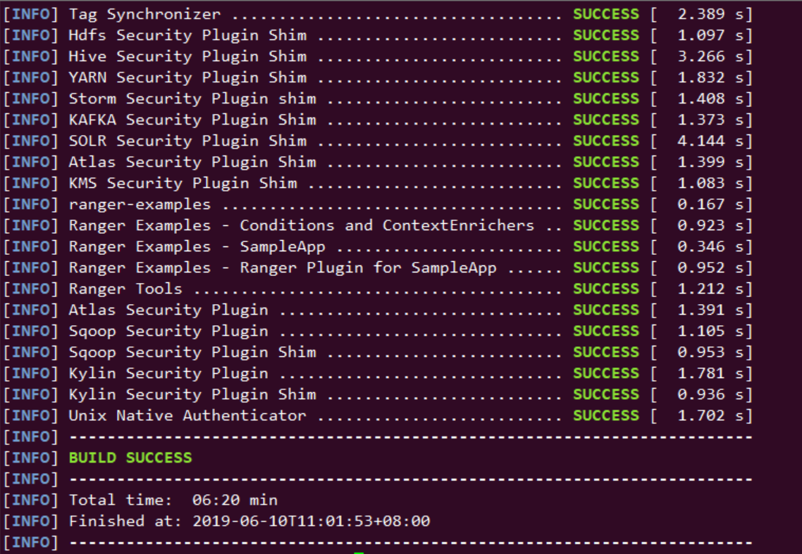
   
1.3 部署拓扑.

.. code-block:: console

                         ranger-server             allinone-bigdata
	java                        √                          √
	hadoop-namenode                                        √
	hadoop-datanode
	hive-server2                                           √                          
	hive-metadata                                          √                       
	hive-mysql
	solr                        √                        
	zookeeper                   √                          √
	ranger-user-sync            √                          √
	ranger-hdfs-plugin                                     √                          
	ranger-hive-plugin                                     √                          

.. end

Ranger安装
----------

软件准备：ranger-server端 需要安装mysql,java,solr,zookeeper.

1.0 安装java,配置root及cecgw用户java环境变量.(过程略)

1.1 安装mariadb并设置ranger用户名及密码.

.. code-block:: console

 apt-get install mariadb-server # 安装mariadb-server
 $sudo mysql -u root
	mysql> USE mysql;
	mysql> UPDATE user SET plugin='mysql_native_password' WHERE user='root';
	mysql> FLUSH PRIVILEGES;
	mysql> exit; # 设置密码登录
	MariaDB [(none)]> create database ranger;
	MariaDB [(none)]> GRANT ALL PRIVILEGES ON *.* TO 'rangeradmin'@'%'IDENTIFIED BY '1qaz2wsx' WITH GRANT OPTION; 
	MariaDB [(none)]> FLUSH PRIVILEGES; # 创建rangeradmin 并验证登录。

.. end

 修改mariadb默认字符集。

否则在后续按照会报“create table: Specified key was too long; max key length is 767 bytes”错误。

.. code-block:: console

    #将如下文件 utf8mb4 修改为utf8。
	root@ranger-server:/etc/mysql/mariadb.conf.d# grep 'utf8mb4'  ./ -R
	./50-mysql-clients.cnf:#default-character-set = utf8mb4
	./50-server.cnf:#character-set-server  = utf8mb4
	./50-server.cnf:#collation-server      = utf8mb4_general_ci
	./50-client.cnf:#default-character-set = utf8mb4
    #修改如下：
	root@ranger-server:/etc/mysql/mariadb.conf.d# grep 'utf8'  ./ -R
	./50-mysql-clients.cnf:default-character-set = utf8
	./50-mysql-clients.cnf:#default-character-set = utf8mb4
	./50-server.cnf:# utf8 4-byte character set. See also client.cnf
	./50-server.cnf:character-set-server  = utf8
	./50-server.cnf:collation-server      = utf8_general_ci
	./50-server.cnf:#character-set-server  = utf8mb4
	./50-server.cnf:#collation-server      = utf8mb4_general_ci
	./50-client.cnf:default-character-set = utf8
	./50-client.cnf:#default-character-set = utf8mb4
	# 重启mysql。
	service mysql restart
	
.. end

1.3 下载mysql-connector-java-5.1.47.tar.gz(https://dev.mysql.com/downloads/file/?id=480090),并解压到/opt目录下.

.. code-block:: console

	
	root@ubuntu:/opt# ls
	mysql-connector-java-5.1.47.jar  ranger-1.2.0-admin

.. end

1.4 在本地安装zookeeper，并正确配置，启动。(过程略).

1.5 下载solr并解压到 /opt目录下。本次安装下载的solr版本为8.1.1.

下载地址为：(https://www.apache.org/dyn/closer.lua/lucene/solr/8.1.1/solr-8.1.1-src.tgz) 

.. code-block:: console

	root@ranger-server:/opt#  cp /home/ubuntu/solr-8.1.1.tgz .
	root@ranger-server:/opt#  tar -xzvf solr-8.1.1.tgz 
	root@ranger-server:/opt#  mv solr-8.1.1 solr
	
.. end

1.5 修改sql文件，防止字段超长。

.. code-block:: console

	ubuntu@ranger-server:/opt/ranger-1.2.0-admin/db/mysql/optimized/current$ vi ranger_core_db_mysql.sql 
	在文件头添加：SET FOREIGN_KEY_CHECKS=0;
	在文件尾添加：SET FOREIGN_KEY_CHECKS=1;
	MariaDB [(none)]> show variables like '%innodb_large_prefix%';
	+---------------------+-------+
	| Variable_name       | Value |
	+---------------------+-------+
	| innodb_large_prefix | OFF   |
	+---------------------+-------+
	1 row in set (0.00 sec)

	MariaDB [(none)]> set global innodb_large_prefix=on;
	Query OK, 0 rows affected (0.00 sec)

	MariaDB [(none)]> show variables like '%innodb_file_format%';
	+--------------------------+-----------+
	| Variable_name            | Value     |
	+--------------------------+-----------+
	| innodb_file_format       | Antelope  |
	| innodb_file_format_check | ON        |
	| innodb_file_format_max   | Barracuda |
	+--------------------------+-----------+
	3 rows in set (0.00 sec)

	MariaDB [(none)]>  set global innodb_file_format=Barracuda;
	Query OK, 0 rows affected (0.00 sec)

.. end

1.6 配置ranger-server配置文件。

.. code-block:: console

	ubuntu@ranger-server:/opt/ranger-1.2.0-admin$ grep -vE  '^#|^$' install.properties 
	PYTHON_COMMAND_INVOKER=python
	DB_FLAVOR=MYSQL
	SQL_CONNECTOR_JAR=/opt/mysql-connector-java-5.1.47.jar #配置合适路径
	db_root_user=root # mysql 数据库root用户
	db_root_password=1qaz2wsx # mysql 数据库root 用户密码
	db_host=localhost # mysql 数据库 ip地址
	db_ssl_enabled=false 
	db_ssl_required=false
	db_ssl_verifyServerCertificate=false
	db_ssl_auth_type=2-way
	javax_net_ssl_keyStore=
	javax_net_ssl_keyStorePassword=
	javax_net_ssl_trustStore=
	javax_net_ssl_trustStorePassword=
	db_name=ranger # ranger使用的数据库名称
	db_user=rangeradmin # 连接 ranger数据库的用户名
	db_password=1qaz2wsx # rangeradmin 用户密码
	rangerAdmin_password=
	rangerTagsync_password=
	rangerUsersync_password=
	keyadmin_password=
	audit_store=solr  # 日志存储采用的数据库名称 在此使用solr
	audit_solr_urls=http://ranger-server:8983/solr/ranger_audits  # solr 访问地址 
	audit_solr_user=solr # 访问solr的用户名
	audit_solr_password=solr #访问solr的密码
	audit_solr_zookeepers=ranger-server:2181  # solr 使用的zookeeper地址
	policymgr_external_url=http://localhost:6080 #策略地址
	policymgr_http_enabled=true
	policymgr_https_keystore_file=
	policymgr_https_keystore_keyalias=rangeradmin
	policymgr_https_keystore_password=
	policymgr_supportedcomponents=
	unix_user=cecgw # linux 用户名
	unix_user_pwd=1qaz2wsx # linux 密码
	unix_group=cecgw # ubuntu 用户组 
	authentication_method=NONE
	remoteLoginEnabled=true
	authServiceHostName=localhost
	authServicePort=5151
	ranger_unixauth_keystore=keystore.jks
	ranger_unixauth_keystore_password=password
	ranger_unixauth_truststore=cacerts
	ranger_unixauth_truststore_password=changeit
	xa_ldap_url=
	xa_ldap_userDNpattern=
	xa_ldap_groupSearchBase=
	xa_ldap_groupSearchFilter=
	xa_ldap_groupRoleAttribute=
	xa_ldap_base_dn=
	xa_ldap_bind_dn=
	xa_ldap_bind_password=
	xa_ldap_referral=
	xa_ldap_userSearchFilter=
	xa_ldap_ad_domain=
	xa_ldap_ad_url=
	xa_ldap_ad_base_dn=
	xa_ldap_ad_bind_dn=
	xa_ldap_ad_bind_password=
	xa_ldap_ad_referral=
	xa_ldap_ad_userSearchFilter=
	spnego_principal=
	spnego_keytab=
	token_valid=30
	cookie_domain=
	cookie_path=/
	admin_principal=
	admin_keytab=
	lookup_principal=
	lookup_keytab=
	hadoop_conf=/etc/hadoop/conf
	sso_enabled=false
	sso_providerurl=https://127.0.0.1:8443/gateway/knoxsso/api/v1/websso
	sso_publickey=
	RANGER_ADMIN_LOG_DIR=$PWD
	RANGER_PID_DIR_PATH=/var/run/ranger
	XAPOLICYMGR_DIR=$PWD
	app_home=$PWD/ews/webapp
	TMPFILE=$PWD/.fi_tmp
	LOGFILE=$PWD/logfile
	LOGFILES="$LOGFILE"
	JAVA_BIN='java'
	JAVA_VERSION_REQUIRED='1.7'
	JAVA_ORACLE='Java(TM) SE Runtime Environment'
	mysql_core_file=db/mysql/optimized/current/ranger_core_db_mysql.sql
	mysql_audit_file=db/mysql/xa_audit_db.sql
	oracle_core_file=db/oracle/optimized/current/ranger_core_db_oracle.sql
	oracle_audit_file=db/oracle/xa_audit_db_oracle.sql
	postgres_core_file=db/postgres/optimized/current/ranger_core_db_postgres.sql
	postgres_audit_file=db/postgres/xa_audit_db_postgres.sql
	sqlserver_core_file=db/sqlserver/optimized/current/ranger_core_db_sqlserver.sql
	sqlserver_audit_file=db/sqlserver/xa_audit_db_sqlserver.sql
	sqlanywhere_core_file=db/sqlanywhere/optimized/current/ranger_core_db_sqlanywhere.sql
	sqlanywhere_audit_file=db/sqlanywhere/xa_audit_db_sqlanywhere.sql
	cred_keystore_filename=$app_home/WEB-INF/classes/conf/.jceks/rangeradmin.jceks

.. end

1.8 配置ranger-solr配置文件,并启动solr.

1.8.1 配置ranger-server配置文件.

.. code-block:: console

	root@ranger-server:/opt/ranger-1.2.0-admin/contrib/solr_for_audit_setup#  grep -vE  '^#|^$' install.properties 
	SOLR_USER=cecgw
	SOLR_GROUP=cecgw
	MAX_AUDIT_RETENTION_DAYS=90
	SOLR_INSTALL=false
	SOLR_DOWNLOAD_URL=
	SOLR_INSTALL_FOLDER=/opt/solr
	SOLR_RANGER_HOME=/opt/solr/ranger_audit_server
	SOLR_RANGER_PORT=6083
	SOLR_DEPLOYMENT=standalone
	SOLR_RANGER_DATA_FOLDER=/opt/solr/ranger_audit_server/data
	SOLR_ZK=
	SOLR_HOST_URL=http://`hostname -f`:${SOLR_RANGER_PORT}
	SOLR_SHARDS=1
	SOLR_REPLICATION=1
	SOLR_LOG_FOLDER=/var/log/solr/ranger_audits
	SOLR_RANGER_COLLECTION=ranger_audits
	SOLR_MAX_MEM=2g

.. end

配置完成后，执行setip.sh文件.

.. code-block:: console
	root@ranger-server:/opt/ranger-1.2.0-admin/contrib/solr_for_audit_setup# ./setup.sh 
	./setup.sh: line 29: log: command not found
	Wed Jul 24 09:47:19 HKT 2019|INFO|Configuring standalone instance
	Wed Jul 24 09:47:19 HKT 2019|INFO|Copying Ranger Audit Server configuration to /opt/solr/ranger_audit_server
	Wed Jul 24 09:47:20 HKT 2019|INFO|Done configuring Solr for Apache Ranger Audit
	Wed Jul 24 09:47:20 HKT 2019|INFO|Solr HOME for Ranger Audit is /opt/solr/ranger_audit_server
	Wed Jul 24 09:47:20 HKT 2019|INFO|Data folder for Audit logs is /opt/solr/ranger_audit_server/data
	Wed Jul 24 09:47:20 HKT 2019|INFO|To start Solr run /opt/solr/ranger_audit_server/scripts/start_solr.sh
	Wed Jul 24 09:47:20 HKT 2019|INFO|To stop Solr run /opt/solr/ranger_audit_server/scripts/stop_solr.sh
	Wed Jul 24 09:47:20 HKT 2019|INFO|After starting Solr for RangerAudit, it will listen at 6083. E.g http://ranger-server:6083
	Wed Jul 24 09:47:20 HKT 2019|INFO|Configure Ranger to use the following URL http://ranger-server:6083/solr/ranger_audits
	Wed Jul 24 09:47:20 HKT 2019|INFO| ** NOTE: If Solr is Secured then solrclient JAAS configuration has to be added to Ranger Admin and Ranger Plugin properties
	Wed Jul 24 09:47:20 HKT 2019|INFO| ** Refer documentation on how to configure Ranger for audit to Secure Solr
	########## Done ###################
	Created file /opt/solr/ranger_audit_server/install_notes.txt with instructions to start and stop
	###################################
	
.. end

执行完成后，将在下生成ranger_audit_server文件夹.

1.8.2 使用cecgw用户启动zookeeper.

1.8.3 检查操作系统limits参数，并调整.

.. code-block:: console

	cecgw@ranger-server:/opt/zookeeper-3.4.12/bin$ ulimit -a
	core file size          (blocks, -c) 0
	data seg size           (kbytes, -d) unlimited
	scheduling priority             (-e) 0
	file size               (blocks, -f) unlimited
	pending signals                 (-i) 23753
	max locked memory       (kbytes, -l) 16384
	max memory size         (kbytes, -m) unlimited
	open files                      (-n) 1024
	pipe size            (512 bytes, -p) 8
	POSIX message queues     (bytes, -q) 819200
	real-time priority              (-r) 0
	stack size              (kbytes, -s) 8192
	cpu time               (seconds, -t) unlimited
	max user processes              (-u) 23753
	virtual memory          (kbytes, -v) unlimited
	file locks                      (-x) unlimited

.. end

调整limits参数.

.. code-block:: console

	使用root 用户修改：

	vi /etc/security/limits.conf  #在文件尾添加：
	cecgw soft nofile 65535
	cecgw hard nofile 65535
	cecgw soft nproc 65535
	cecgw hard nproc 65535
	
	vi vi /etc/pam.d/su # 确保如下未被注释
    session    required   pam_limits.so

    退出当前shell,重新使用cecgw用户连入检查.

	Last login: Wed Jul 24 09:33:31 2019 from 192.168.121.1
	cecgw@ranger-server:~$ ulimit -a
	core file size          (blocks, -c) 0
	data seg size           (kbytes, -d) unlimited
	scheduling priority             (-e) 0
	file size               (blocks, -f) unlimited
	pending signals                 (-i) 23753
	max locked memory       (kbytes, -l) 16384
	max memory size         (kbytes, -m) unlimited
	open files                      (-n) 65535
	pipe size            (512 bytes, -p) 8
	POSIX message queues     (bytes, -q) 819200
	real-time priority              (-r) 0
	stack size              (kbytes, -s) 8192
	cpu time               (seconds, -t) unlimited
	max user processes              (-u) 65535
	virtual memory          (kbytes, -v) unlimited
	file locks                      (-x) unlimited

.. end

1.8.4 使用cecgw用户启动 solr。

.. code-block:: console

	cecgw@ranger-server:/opt/solr/bin$ ./solr start -e cloud -z ranger-server:2181 -noprompt

	Welcome to the SolrCloud example!

	Starting up 2 Solr nodes for your example SolrCloud cluster.

	Creating Solr home directory /opt/solr/example/cloud/node1/solr
	Cloning /opt/solr/example/cloud/node1 into
	   /opt/solr/example/cloud/node2

	Starting up Solr on port 8983 using command:
	"/opt/solr/bin/solr" start -cloud -p 8983 -s "/opt/solr/example/cloud/node1/solr" -z ranger-server:2181

	Waiting up to 180 seconds to see Solr running on port 8983 [-]  
	Started Solr server on port 8983 (pid=2357). Happy searching!

		
	Starting up Solr on port 7574 using command:
	"/opt/solr/bin/solr" start -cloud -p 7574 -s "/opt/solr/example/cloud/node2/solr" -z ranger-server:2181

	Waiting up to 180 seconds to see Solr running on port 7574 [\]  
	Started Solr server on port 7574 (pid=2585). Happy searching!
																																		 INFO  - 2019-07-24 10:20:29.153; org.apache.solr.common.cloud.ConnectionManager; zkClient has connected
	INFO  - 2019-07-24 10:20:29.183; org.apache.solr.common.cloud.ZkStateReader; Updated live nodes from ZooKeeper... (0) -> (2)
	INFO  - 2019-07-24 10:20:29.228; org.apache.solr.client.solrj.impl.ZkClientClusterStateProvider; Cluster at ranger-server:2181 ready
	Created collection 'gettingstarted' with 2 shard(s), 2 replica(s) with config-set 'gettingstarted'

	Enabling auto soft-commits with maxTime 3 secs using the Config API

	POSTing request to Config API: http://localhost:8983/solr/gettingstarted/config
	{"set-property":{"updateHandler.autoSoftCommit.maxTime":"3000"}}
	Successfully set-property updateHandler.autoSoftCommit.maxTime to 3000

	SolrCloud example running, please visit: http://localhost:8983/solr

.. end

1.8.5 创建ranger_audits collection.

.. code-block:: console

	cecgw@ranger-server:/opt/solr/bin$ ./solr create_collection -c ranger_audits -d /opt/solr/ranger_audit_server/ranger_audits/conf  -shards 1 -replicationFactor 1
	Created collection 'ranger_audits' with 1 shard(s), 1 replica(s) with config-set 'ranger_audits'

.. end

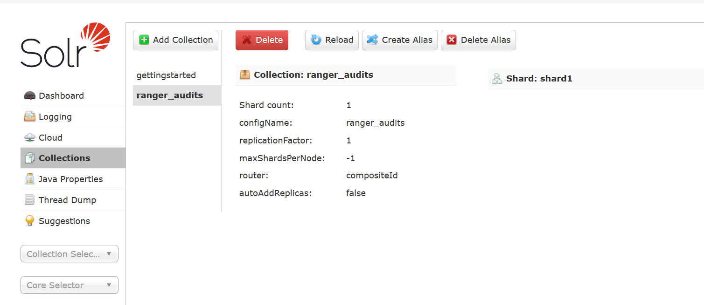
   
1.9 启动 ranger_server.

1.9.1 使用root执行.

.. code-block:: console

	root@ranger-server:/opt/ranger-1.2.0-admin# ./setup.sh 
	2019-07-24 10:32:28,143   --------- Running Ranger PolicyManager Web Application Install Script --------- 
	2019-07-24 10:32:28,146  [I] uname=Linux
	2019-07-24 10:32:28,148  [I] hostname=ranger-server
	2019-07-24 10:32:28,152  [I] DB_FLAVOR=MYSQL
	2019-07-24 10:32:28,154  [I] Audit source=solr
	2019-07-24 10:32:28,157  [I] Checking distribution name..
	........
	2019-07-24 10:33:21,726  [JISQL] /usr/lib/jdk/bin/java  -cp /opt/mysql-connector-java-5.1.47.jar:/opt/ranger-1.2.0-admin/jisql/lib/* org.apache.util.sql.Jisql -driver mysqlconj -cstring jdbc:mysql://localhost/ranger -u 'rangeradmin' -p '********' -noheader -trim -c \; -query "SELECT version();"
	2019-07-24 10:33:22,197  [I] Checking connection passed.
	Installation of Ranger PolicyManager Web Application is completed.

.. end

1.9.2 启动ranger-server.

.. code-block:: console

	root@ranger-server:/opt/ranger-1.2.0-admin# ranger-admin start
	Starting Apache Ranger Admin Service
	Apache Ranger Admin Service with pid 9918 has started.

.. end

启动成功后，可通过 http:6080端口访问，使用admin:admin登录.

Ranger使用
----------

我们将以hdfs以及hive为例，展示ranger使用.

前置条件，安装大数据集群。

部署拓扑
++++++++

.. code-block:: console

                         ranger-server             allinone-bigdata
	java                        √                          √
	hadoop-namenode                                        √
	hadoop-datanode
	hive-server2                                           √                          
	hive-metadata                                          √                       
	hive-mysql
	solr                        √                        
	zookeeper                   √                          √
	ranger-user-sync            √                          √
	ranger-hdfs-plugin                                     √                          
	ranger-hive-plugin                                     √                          

.. end

ranger tag-user-sync服务安装及使用
++++++++++++++++++++++++++++++++++

1.0 在ranger-server节点安装ranger-sync-service.

.. code-block:: console

	root@ranger-server:/opt/ranger-1.2.0-usersync# tar -xzvf /home/cecgw/ranger-1.2.0-usersync.tar.gz -C .

.. end

1.1 配置ranger-sync配置文件.

.. code-block:: console

	root@ranger-server:/opt/ranger-1.2.0-usersync# grep -vE  '^#|^$' install.properties 
	ranger_base_dir = /etc/ranger
	POLICY_MGR_URL = http://ranger-server:6080
	SYNC_SOURCE = unix
	MIN_UNIX_USER_ID_TO_SYNC = 500
	MIN_UNIX_GROUP_ID_TO_SYNC = 500
	SYNC_INTERVAL = 
	unix_user=root #
	unix_group=root #
	rangerUsersync_password=1qaz2wsx # !注意与控制台配置的密码一致.
	usersync_principal=
	usersync_keytab=
	hadoop_conf=/etc/hadoop/conf
	CRED_KEYSTORE_FILENAME=/etc/ranger/usersync/conf/rangerusersync.jceks
	AUTH_SSL_ENABLED=false
	AUTH_SSL_KEYSTORE_FILE=/etc/ranger/usersync/conf/cert/unixauthservice.jks
	AUTH_SSL_KEYSTORE_PASSWORD=UnIx529p
	AUTH_SSL_TRUSTSTORE_FILE=
	AUTH_SSL_TRUSTSTORE_PASSWORD=
	ROLE_ASSIGNMENT_LIST_DELIMITER = &
	USERS_GROUPS_ASSIGNMENT_LIST_DELIMITER = :
	USERNAME_GROUPNAME_ASSIGNMENT_LIST_DELIMITER = ,
	GROUP_BASED_ROLE_ASSIGNMENT_RULES =
	SYNC_LDAP_URL = 
	SYNC_LDAP_BIND_DN = 
	SYNC_LDAP_BIND_PASSWORD = 
	SYNC_LDAP_DELTASYNC = 
	SYNC_LDAP_SEARCH_BASE = 
	SYNC_LDAP_USER_SEARCH_BASE = 
	SYNC_LDAP_USER_SEARCH_SCOPE = sub
	SYNC_LDAP_USER_OBJECT_CLASS = person
	SYNC_LDAP_USER_SEARCH_FILTER =
	SYNC_LDAP_USER_NAME_ATTRIBUTE = cn
	SYNC_LDAP_USER_GROUP_NAME_ATTRIBUTE = memberof,ismemberof
	SYNC_LDAP_USERNAME_CASE_CONVERSION=lower
	SYNC_LDAP_GROUPNAME_CASE_CONVERSION=lower
	logdir=logs
	USERSYNC_PID_DIR_PATH=/var/run/ranger
	SYNC_GROUP_SEARCH_ENABLED=
	SYNC_GROUP_USER_MAP_SYNC_ENABLED=
	SYNC_GROUP_SEARCH_BASE=
	SYNC_GROUP_SEARCH_SCOPE=
	SYNC_GROUP_OBJECT_CLASS=
	SYNC_LDAP_GROUP_SEARCH_FILTER=
	SYNC_GROUP_NAME_ATTRIBUTE=
	SYNC_GROUP_MEMBER_ATTRIBUTE_NAME=
	SYNC_PAGED_RESULTS_ENABLED=
	SYNC_PAGED_RESULTS_SIZE=
	SYNC_LDAP_REFERRAL =ignore

.. end

1.2 执行setup.sh文件.

.. code-block:: console

	root@ranger-server:/opt/ranger-1.2.0-usersync# ./setup.sh 
	Direct Key not found:hadoop_conf
	Direct Key not found:ranger_base_dir
	Direct Key not found:USERSYNC_PID_DIR_PATH
	Direct Key not found:rangerUsersync_password

	Warning:
	The JKS keystore uses a proprietary format. It is recommended to migrate to PKCS12 which is an industry standard format using "keytool -importkeystore -srckeystore /etc/ranger/usersync/conf/cert/unixauthservice.jks -destkeystore /etc/ranger/usersync/conf/cert/unixauthservice.jks -deststoretype pkcs12".
	log4j:WARN No appenders could be found for logger (org.apache.hadoop.util.Shell).
	log4j:WARN Please initialize the log4j system properly.
	log4j:WARN See http://logging.apache.org/log4j/1.2/faq.html#noconfig for more info.
	SLF4J: Failed to load class "org.slf4j.impl.StaticLoggerBinder".
	SLF4J: Defaulting to no-operation (NOP) logger implementation
	SLF4J: See http://www.slf4j.org/codes.html#StaticLoggerBinder for further details.
	usersync.ssl.key.password has been successfully created.
	org.apache.hadoop.security.alias.JavaKeyStoreProvider has been updated.
	log4j:WARN No appenders could be found for logger (org.apache.hadoop.util.Shell).
	log4j:WARN Please initialize the log4j system properly.
	log4j:WARN See http://logging.apache.org/log4j/1.2/faq.html#noconfig for more info.
	SLF4J: Failed to load class "org.slf4j.impl.StaticLoggerBinder".
	SLF4J: Defaulting to no-operation (NOP) logger implementation
	SLF4J: See http://www.slf4j.org/codes.html#StaticLoggerBinder for further details.
	ranger.usersync.ldap.bindalias has been successfully created.
	org.apache.hadoop.security.alias.JavaKeyStoreProvider has been updated.
	log4j:WARN No appenders could be found for logger (org.apache.hadoop.util.Shell).
	log4j:WARN Please initialize the log4j system properly.
	log4j:WARN See http://logging.apache.org/log4j/1.2/faq.html#noconfig for more info.
	SLF4J: Failed to load class "org.slf4j.impl.StaticLoggerBinder".
	SLF4J: Defaulting to no-operation (NOP) logger implementation
	SLF4J: See http://www.slf4j.org/codes.html#StaticLoggerBinder for further details.
	usersync.ssl.truststore.password has been successfully created.
	org.apache.hadoop.security.alias.JavaKeyStoreProvider has been updated.
	log4j:WARN No appenders could be found for logger (org.apache.hadoop.util.Shell).
	log4j:WARN Please initialize the log4j system properly.
	log4j:WARN See http://logging.apache.org/log4j/1.2/faq.html#noconfig for more info.
	SLF4J: Failed to load class "org.slf4j.impl.StaticLoggerBinder".
	SLF4J: Defaulting to no-operation (NOP) logger implementation
	SLF4J: See http://www.slf4j.org/codes.html#StaticLoggerBinder for further details.
	ranger.usersync.policymgr.password has been successfully created.
	org.apache.hadoop.security.alias.JavaKeyStoreProvider has been updated.
	WARNING: Unix Authentication Program (/opt/ranger-1.2.0-usersync/native/pamCredValidator.uexe) is not available for setting chmod(4550), chown(root:root) 
	Creating ranger-usersync-env-logdir.sh file
	Creating ranger-usersync-env-hadoopconfdir.sh file
	Creating ranger-usersync-env-piddir.sh file
	Creating ranger-usersync-env-confdir.sh file
	WARN: core-site.xml file not found in provided hadoop conf path...

.. end

1.3 启动user-sync 服务.

.. code-block:: console

	root@ranger-server:/opt/ranger-1.2.0-usersync# ./ranger-usersync-services.sh start
	Starting Apache Ranger Usersync Service
	Apache Ranger Usersync Service with pid 10131 has started.

.. end

1.4 检查服务是否运行成功.

登录ranger管理控制台，检查是否同步操作系统用户到ranger-server.

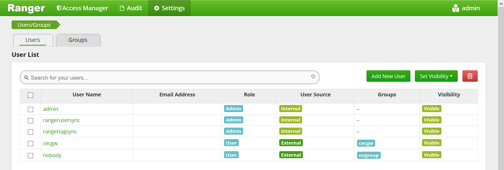

1.5 在其他节点安装步骤同上.

ranger-hdfs-hook服务安装及使用
++++++++++++++++++++++++++++++

安装节点，hadoop namenode节点.
前置条件：hadoop 正常运行.

1.0 在hadoop namenode节点编辑core-site.xml文件，添加如下内容，重启hadoop集群：

.. code-block:: console

	<property>
	<name>hadoop.proxyuser.hadoop.hosts</name>
	<value>*</value>
	</property>
	<property>
	<name>hadoop.proxyuser.hadoop.groups</name>
	<value>*</value>
	</property>

.. end

1.1 在hadoop节点部署ranger-1.2.0-hdfs-plugin.

.. code-block:: console

	tar -xzvf /home/cecgw/ranger-1.2.0-hdfs-plugin.tar.gz -C /opt

.. end

1.2 配置plugin配置文件.

.. code-block:: console

	root@ubuntu:/opt/ranger-hook/ranger-1.2.0-hdfs-plugin# grep -vE  '^#|^$' install.properties 
	POLICY_MGR_URL=http://192.168.121.131:6080 # ranger server 
	REPOSITORY_NAME=hadoopdev #注意需要与ranger 控制台添加的hdfs service 名称一致.
	COMPONENT_INSTALL_DIR_NAME=/opt/hadoop-2.7.7 # hadoop 安装目录
	XAAUDIT.SOLR.ENABLE=true
	XAAUDIT.SOLR.URL=http://192.168.121.131:8983/solr/ranger_audits # solr服务API.
	XAAUDIT.SOLR.USER=NONE
	XAAUDIT.SOLR.PASSWORD=NONE
	XAAUDIT.SOLR.ZOOKEEPER=NONE
	XAAUDIT.SOLR.FILE_SPOOL_DIR=/var/log/hadoop/hdfs/audit/solr/spool
	XAAUDIT.HDFS.ENABLE=false
	XAAUDIT.HDFS.HDFS_DIR=hdfs://__REPLACE__NAME_NODE_HOST:8020/ranger/audit
	XAAUDIT.HDFS.FILE_SPOOL_DIR=/var/log/hadoop/hdfs/audit/hdfs/spool
	XAAUDIT.HDFS.AZURE_ACCOUNTNAME=__REPLACE_AZURE_ACCOUNT_NAME
	XAAUDIT.HDFS.AZURE_ACCOUNTKEY=__REPLACE_AZURE_ACCOUNT_KEY
	XAAUDIT.HDFS.AZURE_SHELL_KEY_PROVIDER=__REPLACE_AZURE_SHELL_KEY_PROVIDER
	XAAUDIT.HDFS.AZURE_ACCOUNTKEY_PROVIDER=__REPLACE_AZURE_ACCOUNT_KEY_PROVIDER
	XAAUDIT.HDFS.IS_ENABLED=false
	XAAUDIT.HDFS.DESTINATION_DIRECTORY=hdfs://__REPLACE__NAME_NODE_HOST:8020/ranger/audit/%app-type%/%time:yyyyMMdd%
	XAAUDIT.HDFS.LOCAL_BUFFER_DIRECTORY=__REPLACE__LOG_DIR/hadoop/%app-type%/audit
	XAAUDIT.HDFS.LOCAL_ARCHIVE_DIRECTORY=__REPLACE__LOG_DIR/hadoop/%app-type%/audit/archive
	XAAUDIT.HDFS.DESTINTATION_FILE=%hostname%-audit.log
	XAAUDIT.HDFS.DESTINTATION_FLUSH_INTERVAL_SECONDS=900
	XAAUDIT.HDFS.DESTINTATION_ROLLOVER_INTERVAL_SECONDS=86400
	XAAUDIT.HDFS.DESTINTATION_OPEN_RETRY_INTERVAL_SECONDS=60
	XAAUDIT.HDFS.LOCAL_BUFFER_FILE=%time:yyyyMMdd-HHmm.ss%.log
	XAAUDIT.HDFS.LOCAL_BUFFER_FLUSH_INTERVAL_SECONDS=60
	XAAUDIT.HDFS.LOCAL_BUFFER_ROLLOVER_INTERVAL_SECONDS=600
	XAAUDIT.HDFS.LOCAL_ARCHIVE_MAX_FILE_COUNT=10
	XAAUDIT.SOLR.IS_ENABLED=true
	XAAUDIT.SOLR.MAX_QUEUE_SIZE=1
	XAAUDIT.SOLR.MAX_FLUSH_INTERVAL_MS=1000
	XAAUDIT.SOLR.SOLR_URL=http://192.168.121.131:8983/solr/ranger_audits
	SSL_KEYSTORE_FILE_PATH=/etc/hadoop/conf/ranger-plugin-keystore.jks
	SSL_KEYSTORE_PASSWORD=myKeyFilePassword
	SSL_TRUSTSTORE_FILE_PATH=/etc/hadoop/conf/ranger-plugin-truststore.jks
	SSL_TRUSTSTORE_PASSWORD=changeit
	CUSTOM_USER=hdfs
	CUSTOM_GROUP=hadoop

.. end

1.3 启动ranger-hdfs-plugin，并重启hadoop.

.. code-block:: console

	root@ubuntu:/opt/ranger-hook/ranger-1.2.0-hdfs-plugin# ./enable-hdfs-plugin.sh 
	Custom group is available, using default user and custom group.
	+ Wed Jul 24 14:10:40 HKT 2019 : hadoop: lib folder=/opt/hadoop-2.7.7/share/hadoop/hdfs/lib conf folder=/opt/hadoop-2.7.7/etc/hadoop
	+ Wed Jul 24 14:10:40 HKT 2019 : Saving /opt/hadoop-2.7.7/etc/hadoop/ranger-hdfs-audit.xml to /opt/hadoop-2.7.7/etc/hadoop/.ranger-hdfs-audit.xml.20190724-141040 ...
	+ Wed Jul 24 14:10:41 HKT 2019 : Saving /opt/hadoop-2.7.7/etc/hadoop/ranger-hdfs-security.xml to /opt/hadoop-2.7.7/etc/hadoop/.ranger-hdfs-security.xml.20190724-141040 ...
	+ Wed Jul 24 14:10:41 HKT 2019 : Saving /opt/hadoop-2.7.7/etc/hadoop/ranger-policymgr-ssl.xml to /opt/hadoop-2.7.7/etc/hadoop/.ranger-policymgr-ssl.xml.20190724-141040 ...
	+ Wed Jul 24 14:10:41 HKT 2019 : Saving current config file: /opt/hadoop-2.7.7/etc/hadoop/hdfs-site.xml to /opt/hadoop-2.7.7/etc/hadoop/.hdfs-site.xml.20190724-141040 ...
	+ Wed Jul 24 14:10:41 HKT 2019 : Saving current config file: /opt/hadoop-2.7.7/etc/hadoop/ranger-hdfs-audit.xml to /opt/hadoop-2.7.7/etc/hadoop/.ranger-hdfs-audit.xml.20190724-141040 ...
	+ Wed Jul 24 14:10:42 HKT 2019 : Saving current config file: /opt/hadoop-2.7.7/etc/hadoop/ranger-hdfs-security.xml to /opt/hadoop-2.7.7/etc/hadoop/.ranger-hdfs-security.xml.20190724-141040 ...
	+ Wed Jul 24 14:10:42 HKT 2019 : Saving current config file: /opt/hadoop-2.7.7/etc/hadoop/ranger-policymgr-ssl.xml to /opt/hadoop-2.7.7/etc/hadoop/.ranger-policymgr-ssl.xml.20190724-141040 ...
	+ Wed Jul 24 14:10:42 HKT 2019 : Saving lib file: /opt/hadoop-2.7.7/share/hadoop/hdfs/lib/ranger-hdfs-plugin-impl to /opt/hadoop-2.7.7/share/hadoop/hdfs/lib/.ranger-hdfs-plugin-impl.20190724141042 ...
	+ Wed Jul 24 14:10:42 HKT 2019 : Saving lib file: /opt/hadoop-2.7.7/share/hadoop/hdfs/lib/ranger-hdfs-plugin-shim-1.2.0.jar to /opt/hadoop-2.7.7/share/hadoop/hdfs/lib/.ranger-hdfs-plugin-shim-1.2.0.jar.20190724141042 ...
	+ Wed Jul 24 14:10:42 HKT 2019 : Saving lib file: /opt/hadoop-2.7.7/share/hadoop/hdfs/lib/ranger-plugin-classloader-1.2.0.jar to /opt/hadoop-2.7.7/share/hadoop/hdfs/lib/.ranger-plugin-classloader-1.2.0.jar.20190724141042 ...
	+ Wed Jul 24 14:10:42 HKT 2019 : Saving current JCE file: /etc/ranger/hadoopdev/cred.jceks to /etc/ranger/hadoopdev/.cred.jceks.20190724141042 ...
	+ Wed Jul 24 14:10:44 HKT 2019 : Saving current JCE file: /etc/ranger/hadoopdev/cred.jceks to /etc/ranger/hadoopdev/.cred.jceks.20190724141044 ...
	Ranger Plugin for hadoop has been enabled. Please restart hadoop to ensure that changes are effective.	

.. end

1.4 通过管理控制台注册hdfs-plugin 服务.

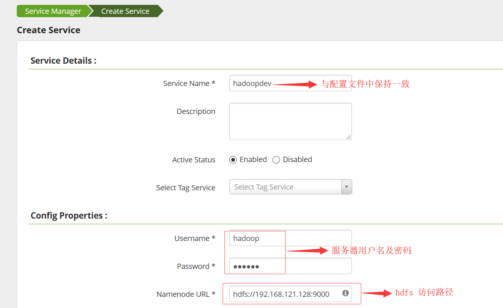

1.5 验证注册是否成功.

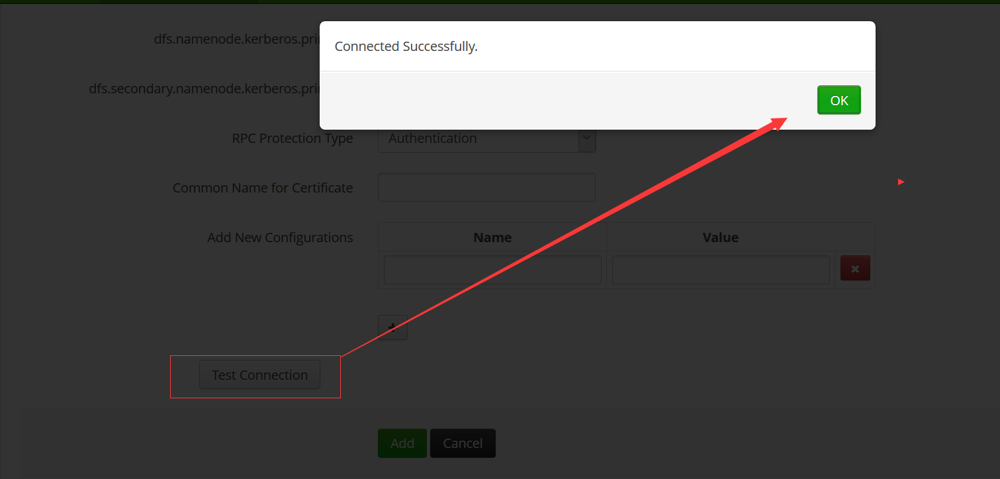

1.6 验证hdfs策略控制.

1.6.1 通过hdfs hadoop 用户创建测试目录,并赋予700权限.

.. code-block:: console

   hdfs dfs -mkdir /hdfs-hook
   hdfs dfs -chmod 700 /hdfs-hook
   hdfs dfs -put /home/hadoop/zhaoyuanjie /hdfs-hook
   hdfs dfs -ls /hdfs-hook
   hdfs dfs -chmod -R 700  /hdfs-hook
   hdfs dfs -ls /hdfs-hook

   Found 1 items
   -rwx------   1 hadoop supergroup         37 2019-07-24 14:23 /hdfs-hook/zhaoyuanjie
   
.. end

1.6.2 通过管理控制台设置该文件夹的访问控制权限.

设置hadoop对/hdfs-hook的可读可写可执行权限.

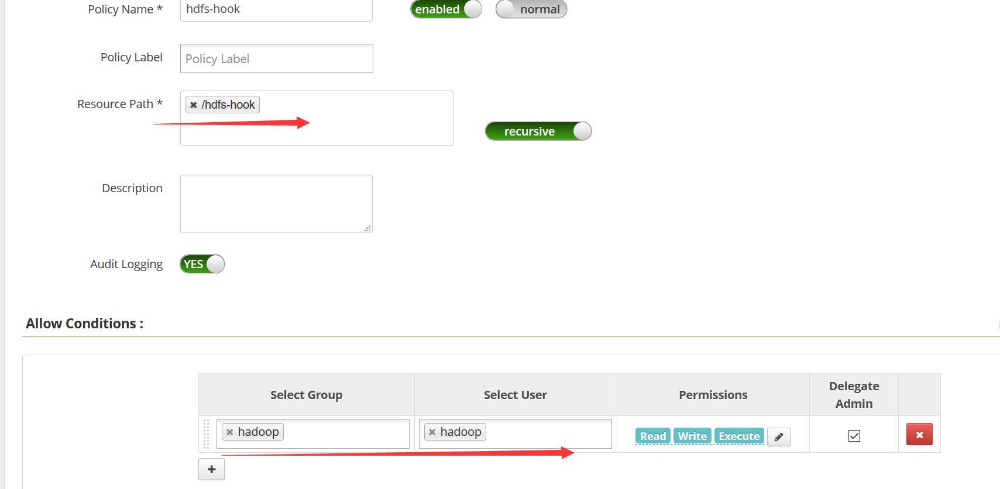
   
1.6.3 尝试使用cecgw用户访问该文件,拒绝，并查看审计日志.

.. code-block:: console

	cecgw@ubuntu:/opt/hadoop-2.7.7/etc/hadoop$ hdfs dfs -ls /hdfs-hook
	ls: Permission denied: user=cecgw, access=READ_EXECUTE, inode="/hdfs-hook":hadoop:supergroup:d---------

.. end

审计日志情况如下:

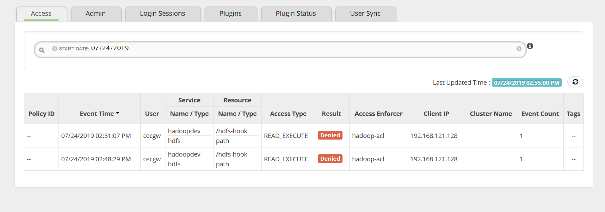

1.6.3 前端控制台添加cecgw用户对该文件的访问控制权限.

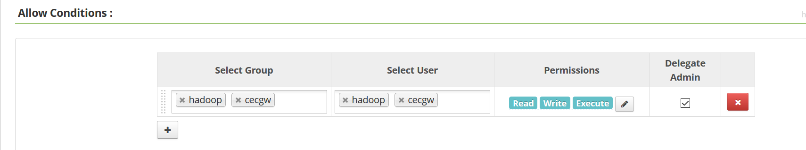

1.6.4 后端验证是否具备可读权限.验证可知，策略生效.

.. code-block:: console

	cecgw@ubuntu:/opt/hadoop-2.7.7/etc/hadoop$ hdfs dfs -ls /hdfs-hook
	Found 1 items
	----------   1 hadoop supergroup         37 2019-07-24 14:23 /hdfs-hook/zhaoyuanjie

.. end

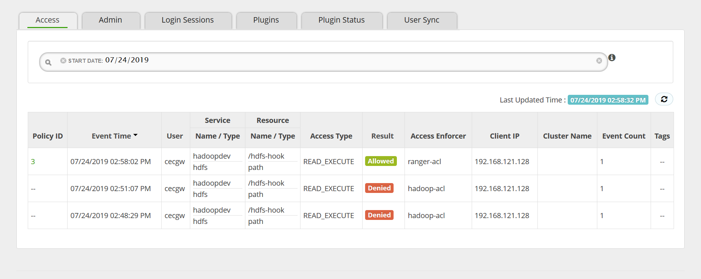

至此，hdfs-pluin 验证完毕.

ranger-hive-hook服务安装及使用
++++++++++++++++++++++++++++++

前置条件. hive正常运行.
安装节点. hive server2节点.

.. code-block:: console

	hadoop@ubuntu:/opt/hive/bin$ hive --service metastore 1>/dev/null 2>&1 &
	[1] 7899
	hadoop@ubuntu:/opt/hive/bin$ hive --service hiveserver2 1>/dev/null 2>&1 &
	[2] 7976
	hadoop@ubuntu:/opt/hive/bin$ netstat -anp|grep 10002
	(Not all processes could be identified, non-owned process info
	 will not be shown, you would have to be root to see it all.)
	tcp        0      0 0.0.0.0:10002           0.0.0.0:*               LISTEN      7976/java       
	hadoop@ubuntu:/opt/hive/bin$ 
	hadoop@ubuntu:/opt/hive/bin$ 
	hadoop@ubuntu:/opt/hive/bin$ netstat -anp|grep 10000
	(Not all processes could be identified, non-owned process info
	 will not be shown, you would have to be root to see it all.)
	tcp        0      0 0.0.0.0:10000           0.0.0.0:*               LISTEN      7976/java     

.. end

1.0 解压plugin到指定目录.

.. code-block:: console

	tar -xzvf /home/cecgw/ranger-1.2.0-hive-plugin.tar.gz -C /opt/ranger-hook

.. end

1.1 修改hive-hook 配置文件.

.. code-block:: console

	hadoop@ubuntu:/opt/ranger-hook/ranger-1.2.0-hive-plugin$ grep -vE  '^#|^$' install.properties 
	POLICY_MGR_URL=http://192.168.121.131:6080 # ranger-api 
	REPOSITORY_NAME=hivedev # 注意与控制台配置服务一致.
	COMPONENT_INSTALL_DIR_NAME=/opt/hive # hive 安装路径
	XAAUDIT.SOLR.FILE_SPOOL_DIR=/var/log/hive/audit/solr/spool 
	XAAUDIT.SOLR.ENABLE=true
	XAAUDIT.SOLR.URL=http://192.168.121.131:8983/solr/ranger_audits # solr api 
	XAAUDIT.SOLR.USER=NONE
	XAAUDIT.SOLR.PASSWORD=NONE
	XAAUDIT.SOLR.ZOOKEEPER=NONE
	XAAUDIT.HDFS.ENABLE=false
	XAAUDIT.HDFS.HDFS_DIR=hdfs://__REPLACE__NAME_NODE_HOST:8020/ranger/audit # solr api 
	XAAUDIT.HDFS.FILE_SPOOL_DIR=/var/log/hive/audit/hdfs/spool
	XAAUDIT.HDFS.AZURE_ACCOUNTNAME=__REPLACE_AZURE_ACCOUNT_NAME
	XAAUDIT.HDFS.AZURE_ACCOUNTKEY=__REPLACE_AZURE_ACCOUNT_KEY
	XAAUDIT.HDFS.AZURE_SHELL_KEY_PROVIDER=__REPLACE_AZURE_SHELL_KEY_PROVIDER
	XAAUDIT.HDFS.AZURE_ACCOUNTKEY_PROVIDER=__REPLACE_AZURE_ACCOUNT_KEY_PROVIDER
	XAAUDIT.HDFS.IS_ENABLED=false
	XAAUDIT.HDFS.DESTINATION_DIRECTORY=hdfs://__REPLACE__NAME_NODE_HOST:8020/ranger/audit/%app-type%/%time:yyyyMMdd%
	XAAUDIT.HDFS.LOCAL_BUFFER_DIRECTORY=__REPLACE__LOG_DIR/hive/audit/%app-type%
	XAAUDIT.HDFS.LOCAL_ARCHIVE_DIRECTORY=__REPLACE__LOG_DIR/hive/audit/archive/%app-type%
	XAAUDIT.HDFS.DESTINTATION_FILE=%hostname%-audit.log
	XAAUDIT.HDFS.DESTINTATION_FLUSH_INTERVAL_SECONDS=900
	XAAUDIT.HDFS.DESTINTATION_ROLLOVER_INTERVAL_SECONDS=86400
	XAAUDIT.HDFS.DESTINTATION_OPEN_RETRY_INTERVAL_SECONDS=60
	XAAUDIT.HDFS.LOCAL_BUFFER_FILE=%time:yyyyMMdd-HHmm.ss%.log
	XAAUDIT.HDFS.LOCAL_BUFFER_FLUSH_INTERVAL_SECONDS=60
	XAAUDIT.HDFS.LOCAL_BUFFER_ROLLOVER_INTERVAL_SECONDS=600
	XAAUDIT.HDFS.LOCAL_ARCHIVE_MAX_FILE_COUNT=10
	XAAUDIT.SOLR.IS_ENABLED=ture
	XAAUDIT.SOLR.MAX_QUEUE_SIZE=1
	XAAUDIT.SOLR.MAX_FLUSH_INTERVAL_MS=1000
	XAAUDIT.SOLR.SOLR_URL=http://192.168.121.131:8983/solr/ranger_audits # solr api 
	SSL_KEYSTORE_FILE_PATH=/etc/hive/conf/ranger-plugin-keystore.jks
	SSL_KEYSTORE_PASSWORD=myKeyFilePassword
	SSL_TRUSTSTORE_FILE_PATH=/etc/hive/conf/ranger-plugin-truststore.jks
	SSL_TRUSTSTORE_PASSWORD=changeit
	UPDATE_XAPOLICIES_ON_GRANT_REVOKE=true
	CUSTOM_USER=hadoop 
	CUSTOM_GROUP=hadoop

.. end

1.2 启动hive-plugin.

.. code-block:: console

	root@ubuntu:/opt/ranger-hook/ranger-1.2.0-hive-plugin# ./enable-hive-plugin.sh 
	Custom user and group is available, using custom user and group.
	+ Wed Jul 24 15:55:29 HKT 2019 : hive: lib folder=/opt/hive/lib conf folder=/opt/hive/conf
	+ Wed Jul 24 15:55:29 HKT 2019 : Saving /opt/hive/conf/ranger-hive-audit.xml to /opt/hive/conf/.ranger-hive-audit.xml.20190724-155529 ...
	+ Wed Jul 24 15:55:29 HKT 2019 : Saving /opt/hive/conf/ranger-hive-security.xml to /opt/hive/conf/.ranger-hive-security.xml.20190724-155529 ...
	+ Wed Jul 24 15:55:29 HKT 2019 : Saving /opt/hive/conf/ranger-policymgr-ssl.xml to /opt/hive/conf/.ranger-policymgr-ssl.xml.20190724-155529 ...
	+ Wed Jul 24 15:55:29 HKT 2019 : Saving current config file: /opt/hive/conf/hiveserver2-site.xml to /opt/hive/conf/.hiveserver2-site.xml.20190724-155529 ...
	+ Wed Jul 24 15:55:29 HKT 2019 : Saving current config file: /opt/hive/conf/ranger-hive-audit.xml to /opt/hive/conf/.ranger-hive-audit.xml.20190724-155529 ...
	+ Wed Jul 24 15:55:29 HKT 2019 : Saving current config file: /opt/hive/conf/ranger-hive-security.xml to /opt/hive/conf/.ranger-hive-security.xml.20190724-155529 ...
	+ Wed Jul 24 15:55:30 HKT 2019 : Saving current config file: /opt/hive/conf/ranger-policymgr-ssl.xml to /opt/hive/conf/.ranger-policymgr-ssl.xml.20190724-155529 ...
	+ Wed Jul 24 15:55:30 HKT 2019 : Saving lib file: /opt/hive/lib/ranger-hive-plugin-impl to /opt/hive/lib/.ranger-hive-plugin-impl.20190724155530 ...
	+ Wed Jul 24 15:55:30 HKT 2019 : Saving lib file: /opt/hive/lib/ranger-hive-plugin-shim-1.2.0.jar to /opt/hive/lib/.ranger-hive-plugin-shim-1.2.0.jar.20190724155530 ...
	+ Wed Jul 24 15:55:30 HKT 2019 : Saving lib file: /opt/hive/lib/ranger-plugin-classloader-1.2.0.jar to /opt/hive/lib/.ranger-plugin-classloader-1.2.0.jar.20190724155530 ...
	+ Wed Jul 24 15:55:33 HKT 2019 : Saving current JCE file: /etc/ranger/hivedev/cred.jceks to /etc/ranger/hivedev/.cred.jceks.20190724155533 ...
	Ranger Plugin for hive has been enabled. Please restart hive to ensure that changes are effective.

.. end

1.3 在控制台注册hivedev服务.

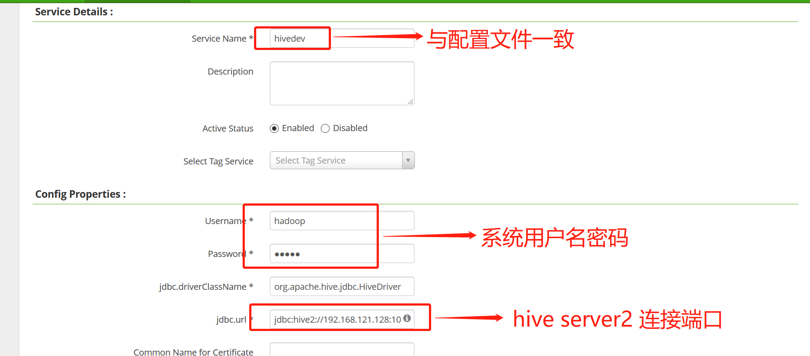

1.4 注册成功后，点击连接，显示成功.

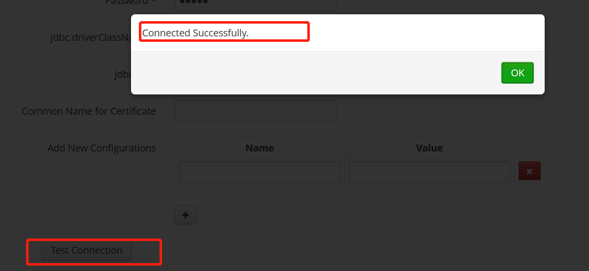
   
1.5 管理控制台配置hive策略.

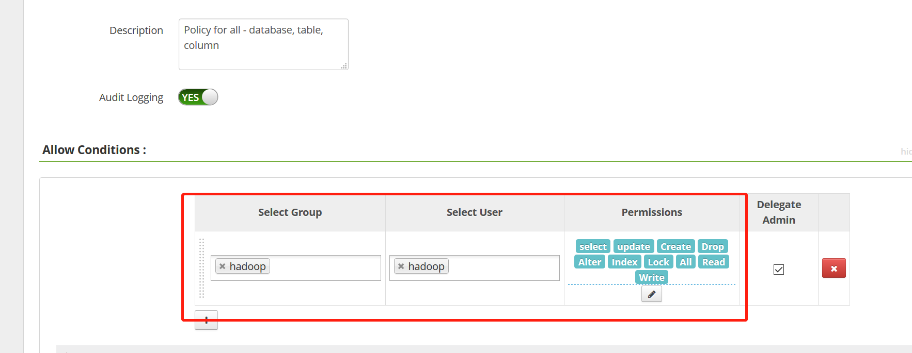

1.6 后端访问查看.

.. code-block:: console

	hadoop@ubuntu:/opt/hive/bin$ beeline -n hadoop -u jdbc:hive2://localhost:10000
	Connecting to jdbc:hive2://localhost:10000
	Connected to: Apache Hive (version 2.3.4)
	Driver: Hive JDBC (version 2.3.4)
	Transaction isolation: TRANSACTION_REPEATABLE_READ
	Beeline version 2.3.4 by Apache Hive
	0: jdbc:hive2://localhost:10000> show tables;
	+------------+
	|  tab_name  |
	+------------+
	| employees  |
	| pokes      |
	+------------+

.. end

1.7 查看访问控制日志.

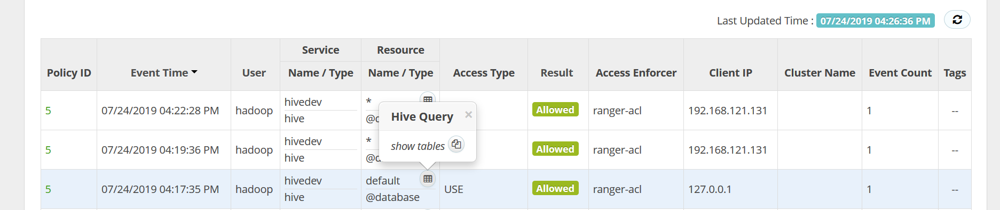
   
访问控制验证完毕，进一步，可验证行过滤及脱敏功能.

ranger-hbase-hook服务安装及使用
+++++++++++++++++++++++++++++++

ranger 版本2.0  ranger-hook 2.0版本， hbase 2.1.1版本。

1.0 解压软件包。

.. code-block:: console

	root@big-1:/opt/ranger-hook# tar -xzvf ranger-2.0.0-hbase-plugin.tar.gz  #解压ranger-2.0.0-hbase-plugin.tar.gz至安装目录。

.. end

1.1 修改hbase-hook 配置文件.

.. code-block:: console

	root@big-1:/opt/ranger-hook/ranger-2.0.0-hbase-plugin# grep -vE  '^#|^$' install.properties 
	POLICY_MGR_URL=http://ranger-admin:6080 # ranger server 地址.
	REPOSITORY_NAME=hbasedev # hbase server 服务名称.
	COMPONENT_INSTALL_DIR_NAME=/opt/hbase # hbase 服务安装目录.
	XAAUDIT.SUMMARY.ENABLE=true 
	XAAUDIT.SOLR.ENABLE=true
	XAAUDIT.SOLR.URL=http://ranger-admin:8983/solr/ranger_audits # solr 地址
	XAAUDIT.SOLR.USER=NONE
	XAAUDIT.SOLR.PASSWORD=NONE
	XAAUDIT.SOLR.ZOOKEEPER=NONE
	XAAUDIT.SOLR.FILE_SPOOL_DIR=/var/log/hbase/audit/solr/spool
	XAAUDIT.HDFS.ENABLE=false
	XAAUDIT.HDFS.HDFS_DIR=hdfs://__REPLACE__NAME_NODE_HOST:8020/ranger/audit
	XAAUDIT.HDFS.FILE_SPOOL_DIR=/var/log/hbase/audit/hdfs/spool
	XAAUDIT.HDFS.AZURE_ACCOUNTNAME=__REPLACE_AZURE_ACCOUNT_NAME
	XAAUDIT.HDFS.AZURE_ACCOUNTKEY=__REPLACE_AZURE_ACCOUNT_KEY
	XAAUDIT.HDFS.AZURE_SHELL_KEY_PROVIDER=__REPLACE_AZURE_SHELL_KEY_PROVIDER
	XAAUDIT.HDFS.AZURE_ACCOUNTKEY_PROVIDER=__REPLACE_AZURE_ACCOUNT_KEY_PROVIDER
	XAAUDIT.HDFS.IS_ENABLED=false
	XAAUDIT.HDFS.DESTINATION_DIRECTORY=hdfs://__REPLACE__NAME_NODE_HOST:8020/ranger/audit/%app-type%/%time:yyyyMMdd%
	XAAUDIT.HDFS.LOCAL_BUFFER_DIRECTORY=__REPLACE__LOG_DIR/hbase/audit/%app-type%
	XAAUDIT.HDFS.LOCAL_ARCHIVE_DIRECTORY=__REPLACE__LOG_DIR/hbase/audit/archive/%app-type%
	XAAUDIT.HDFS.DESTINTATION_FILE=%hostname%-audit.log
	XAAUDIT.HDFS.DESTINTATION_FLUSH_INTERVAL_SECONDS=900
	XAAUDIT.HDFS.DESTINTATION_ROLLOVER_INTERVAL_SECONDS=86400
	XAAUDIT.HDFS.DESTINTATION_OPEN_RETRY_INTERVAL_SECONDS=60
	XAAUDIT.HDFS.LOCAL_BUFFER_FILE=%time:yyyyMMdd-HHmm.ss%.log
	XAAUDIT.HDFS.LOCAL_BUFFER_FLUSH_INTERVAL_SECONDS=60
	XAAUDIT.HDFS.LOCAL_BUFFER_ROLLOVER_INTERVAL_SECONDS=600
	XAAUDIT.HDFS.LOCAL_ARCHIVE_MAX_FILE_COUNT=10
	XAAUDIT.SOLR.IS_ENABLED=true # 设置为true
	XAAUDIT.SOLR.MAX_QUEUE_SIZE=1
	XAAUDIT.SOLR.MAX_FLUSH_INTERVAL_MS=1000
	XAAUDIT.SOLR.SOLR_URL=http://ranger-admin:6083/solr/ranger_audits # solr api 接口地址.
	SSL_KEYSTORE_FILE_PATH=/etc/hbase/conf/ranger-plugin-keystore.jks
	SSL_KEYSTORE_PASSWORD=myKeyFilePassword
	SSL_TRUSTSTORE_FILE_PATH=/etc/hbase/conf/ranger-plugin-truststore.jks
	SSL_TRUSTSTORE_PASSWORD=changeit
	UPDATE_XAPOLICIES_ON_GRANT_REVOKE=true
	CUSTOM_USER=hadoop-1 # hadoop 用户名 
	CUSTOM_GROUP=hadoop-1 # hadoop 用户组 

.. end

1.2 将hook 文件夹拷贝并复制到hbase 其他所有节点.

1.3 在各个节点启动hbase hook.

.. code-block:: console

	root@big-1:/opt/ranger-hook/ranger-2.0.0-hbase-plugin# ./enable-hbase-plugin.sh 

.. end

1.4 在服务控制台注册hbasedev服务.

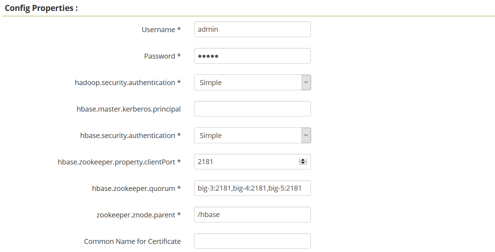
   
1.5 测试hbasedev是否连接成功.

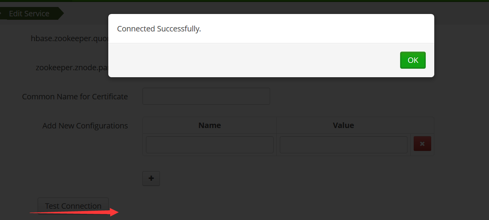

1.6 在各个节点重启hbase 服务.

1.7 查看服务注册情况.

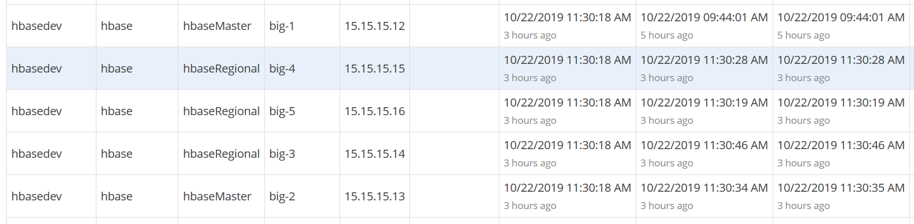

1.8 测试使用,使用hadoop-1用户，在hbase中创建表.

.. code-block:: console

	hbase(main):002:0>  create 't1',{NAME => 'f1', VERSIONS => 3},{NAME => 'f2', VERSIONS => 1};
	hbase(main):003:0* list
	Created table t1
	Took 2.7758 seconds                                                                                                                        
	TABLE                                                                                                                                      
	t1                                                                                                                                         
	1 row(s)
	Took 0.0154 seconds                                                                                                                        
	=> ["t1"]

.. end

使用ubuntu 用户创建表,被拒绝.

.. code-block:: console

hbase(main):093:0> create 'hbase_test',  {NAME=>'cf1'},{NAME=>'cf2'}

ERROR: org.apache.hadoop.hbase.security.AccessDeniedException: Insufficient permissions for user 'ubuntu' (action=create)

.. end

1.9 查看策略及日志生成情况.

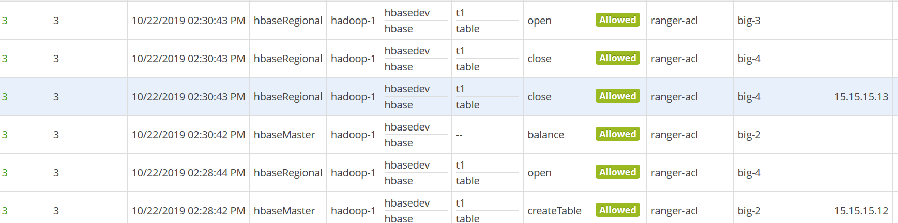

   
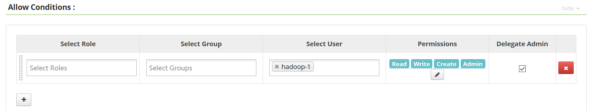

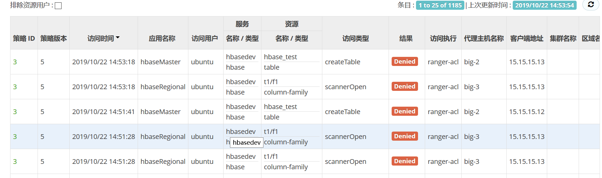

ranger+atlas联动
++++++++++++++++

ranger+atlas可以实现基于标签的访问控制实施。atlas通过动态数据发现，在atlas前段将所要实施访问控制策略的字段定义标签后，可
通过与ranger联动，实现基于标签的访问控制。

本次验证以hive为例进行验证。前提条件：atlas服务正常，大数据集群服务正常，ranger服务正常.

在ranger-srever服务端，安装ranger-tagsync服务.

1.0 解压软件包.

.. code-block:: console

	root@ranger-server:/opt# tar -xzvf /home/cecgw/ranger-1.2.0-tagsync.tar.gz -C .

.. end

1.1 配置相关配置文件.

.. code-block:: console

	root@ranger-server:/opt/ranger-1.2.0-tagsync$ grep -vE  '^#|^$' install.properties 
	TAG_DEST_RANGER_ENDPOINT = http://ranger-server:6080 # ranger server 地址
	TAG_DEST_RANGER_SSL_CONFIG_FILENAME =
	TAG_SOURCE_ATLAS_ENABLED = true
	TAG_SOURCE_ATLAS_KAFKA_BOOTSTRAP_SERVERS = slaver-4:9092 # atlas kafka地址
	TAG_SOURCE_ATLAS_KAFKA_ZOOKEEPER_CONNECT = slaver-4:2181 # atlas zookeeper kafka使用地址
	TAG_SOURCE_ATLAS_KAFKA_ENTITIES_GROUP_ID = ranger_entities_consumer
	TAG_SOURCE_ATLAS_KAFKA_SERVICE_NAME = kafka
	TAG_SOURCE_ATLAS_KAFKA_SECURITY_PROTOCOL = PLAINTEXTSASL
	TAG_SOURCE_ATLAS_KERBEROS_PRINCIPAL =
	TAG_SOURCE_ATLAS_KERBEROS_KEYTAB =
	TAG_SOURCE_ATLASREST_ENABLED = true
	TAG_SOURCE_ATLASREST_ENDPOINT = http://atlas:21000 # atlas server地址
	TAG_SOURCE_ATLASREST_DOWNLOAD_INTERVAL_IN_MILLIS = 900000
	TAG_SOURCE_ATLASREST_USERNAME = admin  # atlas登录用户名
	TAG_SOURCE_ATLASREST_PASSWORD = admin  # atlas 登录密码
	TAG_SOURCE_FILE_ENABLED = true
	TAG_SOURCE_FILE_FILENAME = /etc/ranger/data/tags.json
	TAG_SOURCE_FILE_CHECK_INTERVAL_IN_MILLIS = 60000
	TAGSYNC_ATLAS_TO_RANGER_SERVICE_MAPPING=primary,hive,hivedev # 与ranger控制台设置的服务保持一致
	TAGSYNC_ATLAS_CUSTOM_RESOURCE_MAPPERS=
	TAGSYNC_KEYSTORE_FILENAME = /etc/ranger/tagsync/conf/rangertagsync.jceks
	TAG_SOURCE_ATLASREST_KEYSTORE_FILENAME = /etc/ranger/tagsync/conf/atlasuser.jceks
	TAG_SOURCE_ATLASREST_SSL_CONFIG_FILENAME =
	unix_user=ranger
	unix_group=ranger
	rangerTagsync_password=
	logdir = log
	TAGSYNC_PID_DIR_PATH=/var/run/ranger
	is_secure = false
	tagsync_principal=
	tagsync_keytab=
	hadoop_conf=/etc/hadoop/conf	

.. end

   
1.2 启动相关服务.

在启动之前，检查kafka消费情况.

.. code-block:: console

	cecgw@atlas:/opt/kafka/bin$ ./kafka-consumer-groups.sh --new-consumer --bootstrap-server atlas:9092 --list ATLAS_ENTITIES
	The [new-consumer] option is deprecated and will be removed in a future major release.The new consumer is used by default if the [bootstrap-server] option is provided.
	Note: This will not show information about old Zookeeper-based consumers.
	atlas

.. end

启动之前，可看到消费者只有一个.

启动服务.

.. code-block:: console

	root@ranger-server:/opt/ranger-1.2.0-tagsync# ./setup.sh 

	INFO: Installing ranger-tagsync .....

	INFO: Direct Key not found:rangerTagsync_password
	INFO: Direct Key not found:is_secure
	INFO: Direct Key not found:TAGSYNC_PID_DIR_PATH
	log4j:WARN No appenders could be found for logger (org.apache.hadoop.util.Shell).
	log4j:WARN Please initialize the log4j system properly.
	log4j:WARN See http://logging.apache.org/log4j/1.2/faq.html#noconfig for more info.
	SLF4J: Failed to load class "org.slf4j.impl.StaticLoggerBinder".
	SLF4J: Defaulting to no-operation (NOP) logger implementation
	SLF4J: See http://www.slf4j.org/codes.html#StaticLoggerBinder for further details.
	tagadmin.user.password has been successfully created.
	org.apache.hadoop.security.alias.JavaKeyStoreProvider has been updated.
	log4j:WARN No appenders could be found for logger (org.apache.hadoop.util.Shell).
	log4j:WARN Please initialize the log4j system properly.
	log4j:WARN See http://logging.apache.org/log4j/1.2/faq.html#noconfig for more info.
	SLF4J: Failed to load class "org.slf4j.impl.StaticLoggerBinder".
	SLF4J: Defaulting to no-operation (NOP) logger implementation
	SLF4J: See http://www.slf4j.org/codes.html#StaticLoggerBinder for further details.
	atlas.user.password has been successfully created.
	org.apache.hadoop.security.alias.JavaKeyStoreProvider has been updated.
	INFO: Creating ranger-tagsync-env-hadoopconfdir.sh file
	INFO: Creating ranger-tagsync-env-piddir.sh file
	WARN: core-site.xml file not found in provided hadoop conf path...

	INFO: Completed ranger-tagsync installation.....

	root@ranger-server:/opt/ranger-1.2.0-tagsync# ls
	conf       dist                lib  ranger-tagsync              ranger-tagsync-upload.sh  setup.sh   updatetagadminpassword.py
	conf.dist  install.properties  log  ranger-tagsync-services.sh  setup.py                  templates  version
    ----------------------------------------------------------------------------------
	root@ranger-server:/opt/ranger-1.2.0-tagsync# ./ranger-tagsync-services.sh start
	Starting Apache Ranger Tagsync Service
	Apache Ranger Tagsync Service with pid 3474 has started.

.. end

在启动之后，再次检查kafka消费情况.

.. code-block:: console

	cecgw@atlas:/opt/kafka/bin$ ./kafka-consumer-groups.sh --new-consumer --bootstrap-server atlas:9092 --list ATLAS_ENTITIES
	The [new-consumer] option is deprecated and will be removed in a future major release.The new consumer is used by default if the [bootstrap-server] option is provided.
	Note: This will not show information about old Zookeeper-based consumers.
	atlas
	ranger_entities_consumer # 启动tag sync后，新生成消费者.

.. end

1.3 前台创建新的tag服务.

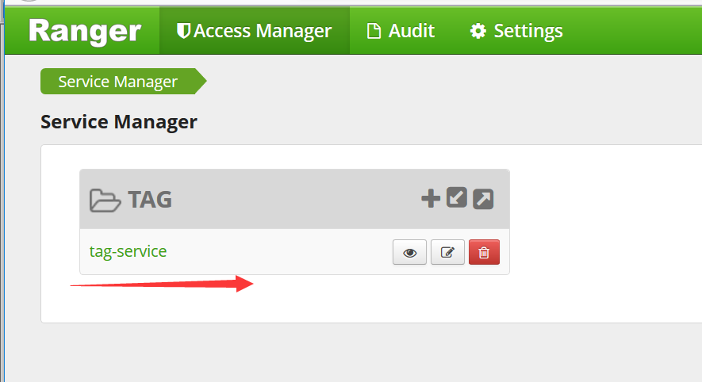
   
1.4 关联hivedev服务.

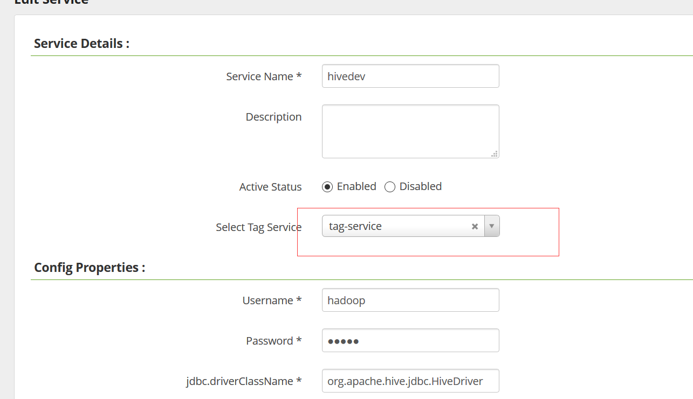

1.5 atlas端标记字段标签；在此我们同时标记两个表两个字段. 给hive中的students表class以及hank表name标记senstive敏感tag.

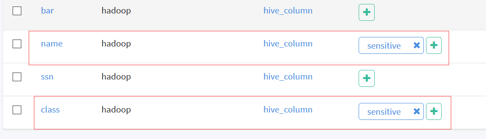
   
1.6 在ranger端设置该标签与策略之间的关联关系.

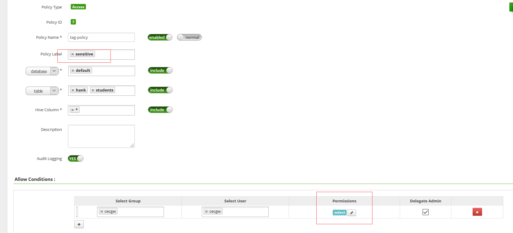

1.7 后端访问相关数据库.

.. code-block:: console

	0: jdbc:hive2://localhost:10000> select * from hank;
	+-----------+------------+
	| hank.ssn  | hank.name  |
	+-----------+------------+
	| 16        | john       |
	| 17        | robert     |
	| 18        | andrew     |
	| 19        | katty      |
	| 27        | edward     |
	| 29        | alan       |
	| 31        | kerry      |
	| 34        | tom        |
	| 35        | zack       |
	+-----------+------------+

.. end 

1.8 检查审计日志生成.

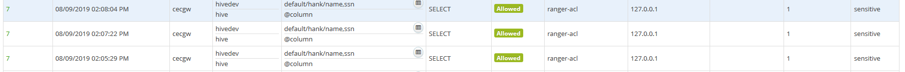
   

   
