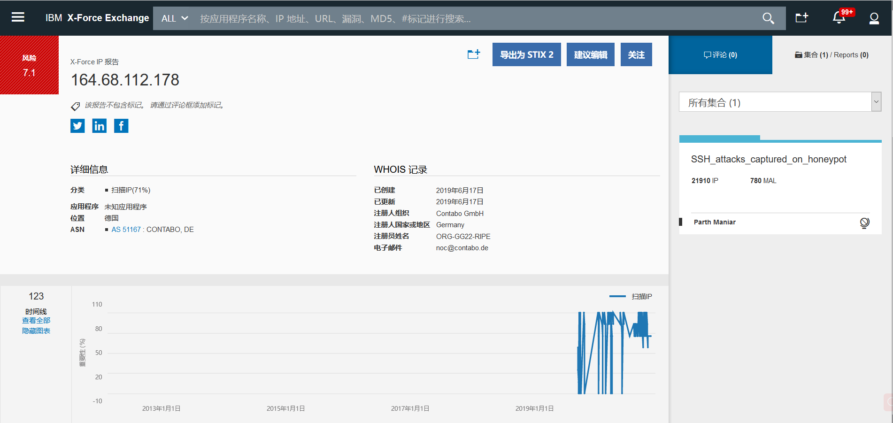
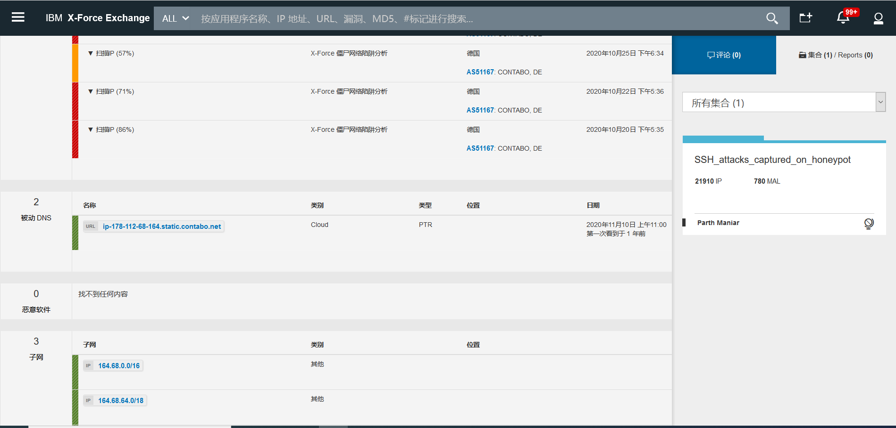

SECURITY BY OneAndOnly
~~~~~~~~~~~~~~~~~~~~~~

IP威胁情报信息
--------------

威胁情报系统的构建核心在数据获取、威胁情报IP数据模型构建、以及开放可持续的系统架构。基于IP地址的恶意威胁情报个人认为可从2个维度定义其描述语言.

#.  一类是从通用安全角度威胁胁模型出发，如DDOS\扫描\CC等对信息系统造成安全威胁,此类威胁情报更注重情报的时效性、数据质量、威胁类型及威胁优先级判定、以及该IP的事件脉络信息.包括现有或新威胁或危害的事件脉络、作用机制、迹象指标、影响破坏和可行的建议.
#. 另外一类，也可从业务角度模型出发，如网络欺诈\赌博\色情等，可能对用户业务造成安全隐患。此外针对IP地址的通用属性信息如地理位置、运营商、ASN等基础属性数据是基础信息模型.

在数据获取的过程中，调研大部分国内外知名的开源情报系统，均采用几类情报数据获取方式：

#. 依赖部署在客户或者互联网络上的自有安全设备(如HONEYPOT、IDS、FIREWALL、WAF、EDR等), 判定威胁情报数据，并形成自己的情报库.

#. 依赖公开IP情报库，开源版本较少.

#. 依赖奖金激励计划，供公众提交.

#. 跨机构威胁情报数据交换.

比较知名的情报平台调研。
 
#. IBM xforce(`https://exchange.xforce.ibmcloud.com/`). 页面查询版可免费试用一个月. API 接口调用需要商用授权许可.

#. 微步在线(`https://x.threatbook.cn/`). 页面版本检索每天限制1000条. 频率限制30/min. API接口需商用授权许可.

#. 360威胁情报(`https://ti.360.cn`). API需要授权.

#. wellfedintelligence `https://wellfedintelligence.com/.` 需申请.

#. `reputation.alienvault.com/reputation.data` 大概6W恶意IP地址信息. 国家\地区\经纬度信息.

#. CrowdStrike `https://www.crowdstrike.com/` 下一代端点保护、威胁情报和服务提供商。CrowdStrike Falcon主机名和IP情报,须直接从 CrowdStrike 购买 CrowdStrike 源. 

#. FIREEYE `https://www.fireeye.com/mandiant/threat-intelligence/threat-intelligence-subscriptions.html` 提供API,需商业授权.并主动防御新兴网络威胁。需从FireEye购买iSight 源.

#. proofpoint `https://www.proofpoint.com/us/resources/data-sheets/emerging-threats-intelligence`. 购买.

#. webroot `https://www.webroot.com/us/en/business/threat-intelligence/internet/ip-reputation` 购买.

.. Note::
 情报数据基于数据交易和自身安全服务逐步完善.

IP情报信息数据模型调研及设计
----------------------------

01基本信息数据模型
==================

.. code-block:: console

	carrier-------> 运营商
	country-------> 国家
	country_code--> 国家代码
	province------> 省
	city----------> 城市
	lng-----------> 经度
	lat-----------> 纬度

.. end

02判定的威胁类型数据模型
========================

.. code-block:: console

	C2----------> 	远控
	Botnet------> 	僵尸网络
	Hijacked----> 	劫持
	Phishing----> 	钓鱼
	Malware-----> 	恶意软件
	Exploit-----> 	漏洞利用
	Scanner-----> 	扫描
	Zombie------> 	傀儡机
	Spam--------> 	垃圾邮件
	Suspicious--> 	可疑
	Compromised-> 	失陷主机
	Whitelist---> 	白名单
	Brute Force-> 	暴力破解
	Proxy-------> 	代理

.. end

其中:

#. Suspicious（可疑）分类细化如下：

.. code-block:: console

 MiningPool----> 	矿池
 CoinMiner-----> 	私有矿池

.. end

#. C2（远控）分类细分如下：

.. code-block:: console

	Sinkhole C2---------------> 	安全机构接管 C2	
	Brute Force--------------->    （暴力破解）分类
	SSH Brute Force-----------> 	SSH暴力破解
	FTP Brute Force-----------> 	FTP暴力破解
	SMTP Brute Force----------> 	SMTP暴力破解
	Http Brute Force----------> 	HTTP AUTH暴力破解
	Web Login Brute Force-----> 	撞库

.. end

#. Proxy（代理）分类细分如下：

.. code-block:: console

	HTTP Proxy------> 	HTTP Proxy
	HTTP Proxy In---> 	HTTP代理入口
	HTTP Proxy Out--> 	HTTP代理出口
	Socks Proxy-----> 	Socks代理
	Socks Proxy In--> 	Socks代理入口
	Socks Proxy Out-> 	Socks代理出口
	VPN-------------> 	VPN代理
	VPN In----------> 	VPN入口
	VPN Out---------> 	VPN出口
	Tor-------------> 	Tor代理
	Tor Proxy In----> 	Tor入口
	Tor Proxy Out---> 	Tor出口

.. end

03标签信息
==========

.. code-block:: console

 tags_type：标签类别，如"industry(行业)"、"gangs（团伙）"、"virus_family（家族）"等。
 tags：具体的攻击团伙或安全事件标签，例如：APT、海莲花等。

.. end

04情报信息
==========

.. code-block:: console

    source--------------> 情报来源。
    find_time-----------> 发现时间。
    update_time---------> 更新时间。
    confidence----------> 可信度评分。
    expired-------------> 布尔类型，false代表情报仍在有效期，true表示情报已过期。
    intel_types---------> 威胁类型，是一个数组，数组的元素取值见" 威胁类型全集"。
    intel_tags----------> 该条情报的标签信息，包含相关攻击团伙或安全事件等。JSON数组，每个item的字段定义同"tag_classes"。
    open_source---------> 情报数据来源.
	mirc.com
	danger.rulez.sk
	alexa.com
	binarydefense.com
	blocklist.de
	cinsscore.com
	sslbl.abuse.ch
	phishtank.com
	packetmail.net
	spamhaus.org
	vxvault.net
	alienvault.com
	nothink.org
	feodotracker.abuse.ch
	openphish.com
	hosts-file.net
        微步在线
        360
        齐安信
        ..........

.. end

05样本信息
==========

.. code-block:: console

       sha256----------> 文件hash
       scan_time-------> 检测时间
       ratio-----------> 检出率
       malware_type----> 恶意类型
       malware_family--> 恶意家族

.. end

06 asn 信息（自治系统号码，是全球分配大型网络系统编号，全球唯一，通过查询一组IP所属的AS号码，可以准确确定它是那个运营商)
========================================================================================================================

.. code-block:: console

	ASN------>号码
	info-----> ASN名称 + ASN归属公司 + RIR登记区域
	rank-----> 风险值

.. end

07 开放端口信息
===============

.. code-block:: console

     port------> IP开放的端口号
     module----> 应用协议
     product---> 应用名称
     version---> 应用版本
     detail----> 应用详情

.. end

08 证书信息
===========

.. code-block:: console

    protocol--------------> 协议。
    port------------------> 端口信息。
    period----------------> 证书在IP上使用的时期。
    digital_certificate---> 证书详情。

.. end

09 反向域名记录
===============

.. code-block:: console

 [a,b,c,d]

.. end

10 情报更新时间
===============

 情报的最近更新时间。

11 反查当前域名数量 
==================

 NUM

12 IP应用场景
=============

.. code-block:: console

	CDN 	            		CDN 	        该IP可以追溯到特定的内容分发网络
	University 	        	学校单位 	统一由中国教育和科研计算机网（CERNET）分配到各院校或科研机构的IP
	Mobile Network 	    		移动网络 	2/3/4/5G网络使用的基站IP
	Unused 	            		已路由-未使用 	该IP已经分配给特定的机构且出现在网络路由信息中，但还没有在网络中被使用
	Unrouted 	        	已分配-未路由 	该IP已经分配给特定的机构，但还没有在网络路由信息中
	WLAN 	            		WLAN 	        该IP被提供商作为商业WIFI的出口使用
	Anycast 	                Anycast 	该IP被应用于特定的互联网任播技术(如Google的8.8.8.8)
	Infrastructure 	    	       基础设施 	该IP作为网络路由器的接口IP出现在互联网中
	Internet Exchange   	       交换中心 	该IP可以追溯到特定的交换平台
	Company 	               企业专线 	该IP对应到某公司的办公内网，IP地址一般固定，用户群体趋于固定
	Hosting 	               数据中心 	该IP可以追溯到特定的数据中心
	Satellite Communication        卫星通信 	该IP可以追溯到特定的卫星通讯机构
	Residence 	               住宅用户         通过ADSL方式拨号接入互联网的方式，一些小型的公共场所（如快捷酒店、餐馆）也属于这种情况
	Special Export 	               专用出口 	该IP隶属某一IDC，但被分配给二级运营商使用，用户基数非常大
	Institution 		       组织机构 	该IP可以追溯到拥有自有AS号的非运营商机构
	Cloud Provider 		       云厂商 	该IP可以追溯到云厂商

.. end

13 当前绑定的域名
=================

 当前绑定域名情况

14 IP逆向历史域名情况
=====================

IP逆向历史域名情况[]

15 IP信誉信息
============

is_malicious 是否为恶意IP。布尔类型，true代表恶意，false代表非恶意。

16 IP可信度信息
==============

 通过情报来源及可信度模型判别出来的恶意可信度程度，分 "low（低）"，"medium（中）"，"high（高）" 三档来标识。

17 严重级别
============

  表示该情报的危害程度，分为"critical（严重）"，"high（高）"，"medium（中）"，"low（低）"，"info（无危胁）"5种程度类型。

18 whois信息
============

.. code-block:: console

    registrar_name----->域名服务商
    name_server-------->域名服务器（以|分隔） y.name.com 
    registrant_name---->注册者
    registrant_email---> 注册邮箱
    registrant_company->注册机构
    registrant_address->地址
    registrant_phone--->电话
    cdate:-------------> 注册时间
    udate:-------------> 更新时间
    edate:-------------> 过期时间
    alexa:-------------> Alexa排名

.. end

19 分配属性信息
===============

.. code-block:: console

	Bogon 	保留地址
	FullBogon 	未启用IP
	Gateway 	网关
	IDC 	IDC服务器
	Dynamic IP 	动态IP
	Edu 	教育
	DDNS 	动态域名
	Mobile 	移动基站
	Search Engine Crawler 	搜索引擎爬虫
	CDN 	CDN服务器
	Advertisement 	广告
	DNS 	DNS服务器
	BTtracker 	BT服务器
	Backbone 	骨干网

.. end

.. Note::

.. Note::
   
   For KAFKA。
