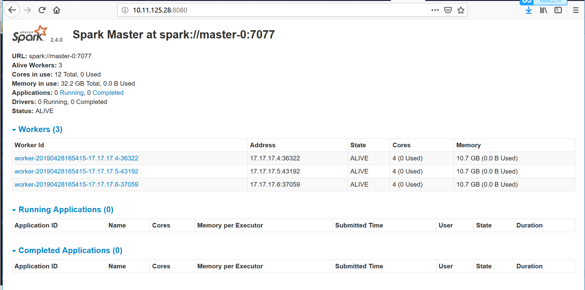
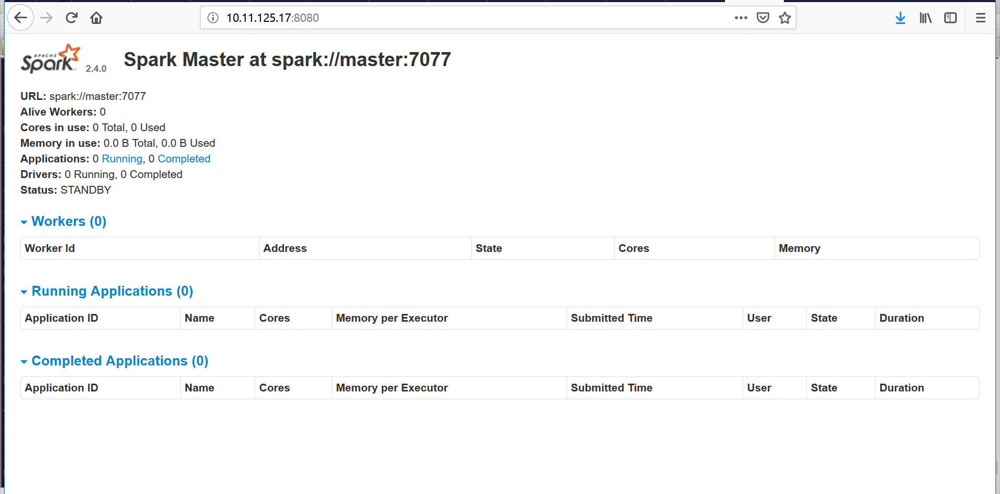

SPARK安装
~~~~~~~~~~~~~~~~~~~~~

单机版本安装
------------
安装环境：ubuntu_16.04+scala_2.12+java_8u191
前置条件：安装java hadoop scala
单机版本安装步骤
1.获取软件安装包。`点此获得软件包下载地址 <http://spark.apache.org/downloads.html>`_.

.. note::

 官方网址提供了如下软件下载版本:
 Source code: Spark 源码，需要编译才能使用；
 
 Pre-build with user-provided Hadoop: 属于“Hadoop free”版，可应用到任意Hadoop 版本；
 
 Pre-build for Hadoop 2.7 and later: 基于Hadoop 2.7的预先编译版，需要与本机安装的Hadoop版本对应，可选的还有Hadoop 2.6、Hadoop 2.4、Hadoop 2.3、Hadoop1.x、CDH4。

 Pre-build with scala 2.12 and user-provide Apache Hadoop.
 
 前面已经自己安装了Hadoop和scala，所以，在“Choose a package type”后面需要选择 "Pre-build with scala 2.12 and user-provide Apache Hadoop."，因为这个选项的Spark可以应用于任意Hadoop版本，所以，就可以应用到我们已经安装的Hadoop版本。然后，点击“Download Spark”后面的"spark-2.4.0-bin-without-hadoop-scala-2.12.tgz"下载即可。
 
 Spark部署模式主要有四种：Local模式（单机模式）、Standalone模式（使用Spark自带的简单集群管理器）、YARN模式（使用YARN作为集群管理器）和Mesos模式（使用Mesos作为集群管理器）。
 这里介绍Local模式（单机模式）的 Spark安装。我们选择Spark 2.4版本，并且假设当前使用用户名hadoop登录了Linux操作系统。

.. end

2.解压软件包到安装目录，设置的安装目录为/opt。

.. code-block:: console

 # root@ubuntu:/opt# tar -xzvf /home/cecgw/spark-2.4.0-bin-without-hadoop-scala-2.12.tgz -C /opt
 # root@ubuntu:/opt# mv spark-2.4.0-bin-without-hadoop-scala-2.12/ spark

.. end

3. 给文件赋予访问权限.前提，已经创建hadoop用户。

.. code-block:: console

  chown -R hadoop:hadoop spark

.. end

4. 修改spark 配置文件,并配置spark环境变量。

.. code-block:: console

  root@ubuntu:/opt/spark# cp ./conf/spark-env.sh.template ./conf/spark-env.sh
  root@ubuntu:/opt/spark# vi ./conf/spark-env.sh
  export SPARK_DIST_CLASSPATH=$(/opt/hadoop-2.7.7/bin/hadoop classpath)

  ################################
  配置环境变量：
  vi /home/hadoop/.bashrc
  # set spark environment
  export SPARK_HOME=/opt/spark
  export PATH=$PATH:$SPARK_HOME/bin

.. end

有了上面的配置信息以后，Spark就可以把数据存储到Hadoop分布式文件系统HDFS中，也可以从HDFS中读取数据。如果没有配置上面信息，Spark就只能读写本地数据，无法读写HDFS数据。
配置完成后就可以直接使用，不需要像Hadoop运行启动命令。

5. 验证测试.

.. code-block:: console

 验证1：
 root@ubuntu:/opt/spark# bin/run-example SparkPi 2>&1 | grep "Pi is"
 Pi is roughly 3.13639568197841
 验证2：
 启动进入spark-shell交互式执行环境
	root@ubuntu:/opt/spark# ./bin/spark-shell 
	2018-12-20 16:18:38 WARN  NativeCodeLoader:62 - Unable to load native-hadoop library for your platform... using builtin-java classes where applicable
	Setting default log level to "WARN".
	To adjust logging level use sc.setLogLevel(newLevel). For SparkR, use setLogLevel(newLevel).
	Spark context Web UI available at http://ubuntu:4040
	Spark context available as 'sc' (master = local[*], app id = local-1545293927526).
	Spark session available as 'spark'.
	Welcome to
	      ____              __
	     / __/__  ___ _____/ /__
	    _\ \/ _ \/ _ `/ __/  '_/
	   /___/ .__/\_,_/_/ /_/\_\   version 2.4.0
	      /_/
		 
	Using Scala version 2.12.7 (Java HotSpot(TM) 64-Bit Server VM, Java 1.8.0_191)
	Type in expressions to have them evaluated.
	Type :help for more information.

	scala> 3+5
	res0: Int = 8

	scala> :quit

   验证3：Spark是否可以正常访问Ubuntu系统中的本地文件

	hadoop@ubuntu:/opt/spark$ ./bin/spark-shell 
	2018-12-20 16:25:54 WARN  NativeCodeLoader:62 - Unable to load native-hadoop library for your platform... using builtin-java classes where applicable
	Setting default log level to "WARN".
	To adjust logging level use sc.setLogLevel(newLevel). For SparkR, use setLogLevel(newLevel).
	Spark context Web UI available at http://ubuntu:4040
	Spark context available as 'sc' (master = local[*], app id = local-1545294360530).
	Spark session available as 'spark'.
	Welcome to
	      ____              __
	     / __/__  ___ _____/ /__
	    _\ \/ _ \/ _ `/ __/  '_/
	   /___/ .__/\_,_/_/ /_/\_\   version 2.4.0
	      /_/
		 
	Using Scala version 2.12.7 (Java HotSpot(TM) 64-Bit Server VM, Java 1.8.0_191)
	Type in expressions to have them evaluated.
	Type :help for more information.

	scala> val line=sc.textFile("file:///home/cecgw/sparktext.txt")
	line: org.apache.spark.rdd.RDD[String] = file:///home/cecgw/sparktext.txt MapPartitionsRDD[1] at textFile at <console>:24

	scala> println(line.count())
	3                                                                               

	scala> 
  说明可以访问本地文件。
  验证4：Spark是否能够正常访问Hadoop中的HDFS
  前提：hadoop正常运行。
  上传文件到HADOOP.
  hadoop@ubuntu:/home/cecgw$ hsdf dfs -mkdir -p /user/hadoop
  hadoop@ubuntu:/home/cecgw$ hdfs dfs -mkdir -p /user/hadoop
  hadoop@ubuntu:/home/cecgw$ hdfs dfs -put ./sparktext.txt /user/hadoop
  hadoop@ubuntu:/home/cecgw$ hdfs dfs -cat /user/hadoop/sparktext.txt
  i am cc
  you are ready
  are you ready?
 在Ubuntu的终端中启动进入spark-shell交互式执行环境，去测试Spark读取HDFS数据是否成功:

 scala> val line=sc.textFile("hdfs://localhost:9000/user/hadoop/sparktext.txt")
 line: org.apache.spark.rdd.RDD[String] = hdfs://localhost:9000/user/hadoop/sparktext.txt MapPartitionsRDD[3] at textFile at <console>:24

 scala> println(line.count())
 3                                                                               

 scala>
 测试成功，可以读取到hdfs上数据。
 需要注意的是，如果我们以hadoop用户登录spark-shell，可以将val line=sc.textFile("hdfs://localhost:9000/user/hadoop/sparktext.txt") 路径简化为 val line=sc.textFile("/user/hadoop/sparktext.txt") OR val line=sc.textFile("sparktext.txt"),均可通过验证。
 但如果以root 用户登录spark-shell，则需要全路径方可访问。

.. end

至此，单机版完成安装。

分布式安装
----------

安装环境：ubuntu_16.04+scala_2.12+java_8u191
前置条件：安装java hadoop scala

部署环境情况

.. code-block:: console

               master    master-0  slaver-1  slaver-2     slaver-3 
 java_8u191     √         √          √          √            √
 hadoop       namenode    namenode  datanode  datanode     datanode
 scala          √         √          √          √            √ 
 zookeeper                             √          √            √ 
 spark         master    master-ha  slaver    slaver       slaver
    
安装scala
=========

1.获取软件安装包。`点此获得软件包下载地址 <https://www.scala-lang.org/download/>`_.
2.解压软件包到安装目录，设置的安装目录为/opt。

.. code-block:: console

 # tar -xzvf scala-2.12.1.tgz -C /opt
 # mv scala-2.12.1.tgz scala

.. end

3. 给文件赋予访问权限.前提，已经创建hadoop用户。

.. code-block:: console

  chown -R hadoop:hadoop scala

.. end

4. 配置环境变量。并使配置生效。

.. code-block:: console

  # vi /home/hadoop/.bashrc # 在文件末尾追加：
    export SCALA_HOME=/opt/scala
    export PATH=.:$PATH:$JAVA_HOME/bin:$SCALA_HOME/bin
  # source /home/hadoop/.bashrc

.. end

5. 验证测试.

.. code-block:: console

  hadoop@ubuntu:/opt$ scala
  Welcome to Scala 2.12.1 (Java HotSpot(TM) 64-Bit Server VM, Java 1.8.0_191).
  Type in expressions for evaluation. Or try :help.

  scala> 4+5
  res0: Int = 9

  scala> :quit
  hadoop@ubuntu:/opt$ scala -version
  Scala code runner version 2.12.1 -- Copyright 2002-2016, LAMP/EPFL and Lightbend, Inc.

.. end

6. 安装上述步骤，在其他节点安装scala。

安装spark
=========

1. 获取软件安装包。`点此获得软件包下载地址 <http://spark.apache.org/downloads.html>`_.

2.解压软件包到安装目录，设置的安装目录为/opt。

.. code-block:: console

 # root@ubuntu:/opt# tar -xzvf /home/cecgw/spark-2.4.0-bin-without-hadoop-scala-2.12.tgz -C /opt
 # root@ubuntu:/opt# mv spark-2.4.0-bin-without-hadoop-scala-2.12/ spark

.. end

3. 给文件赋予访问权限.前提，已经创建hadoop用户。

.. code-block:: console

  chown -R hadoop:hadoop spark

.. end

4. 修改spark 配置文件,并配置spark环境变量。

.. code-block:: console

  root@master:/opt/spark/conf# cp spark-env.sh.template spark-env.sh
  
  root@master:/opt/spark/conf# cp spark-defaults.conf.template spark-defaults.conf
  
  root@master:/opt/spark/conf# vi spark-env.sh
  export SPARK_DIST_CLASSPATH=$(/opt/hadoop-2.7.7/bin/hadoop classpath)
  JAVA_HOME=/usr/lib/jdk
  SCALA_HOME=/opt/scala
  HADOOP_CONF_DIR=/opt/hadoop-2.7.7/etc/hadoop
  HADOOP_HOME=/opt/hadoop-2.7.7
  SPARK_DAEMON_JAVA_OPTS="-Dspark.deploy.recoveryMode=ZOOKEEPER -Dspark.deploy.zookeeper.url=slaver-1:2181,slaver-2:2181,slaver-3:2181 -Dspark.deploy.zookeeper.dir=/spark"
  
  root@master:/opt/spark/conf# cp slaves.template slaves
  
  root@master:/opt/spark/conf# vi slaves
  # A Spark Worker will be started on each of the machines listed below.
  slaver-1
  slaver-2
  slaver-3
 
.. end

5. 配置spark 环境变量

.. code-block:: console

	root@master:/opt/spark/conf# vi /home/hadoop-1/.bashrc 
	export SPARK_HOME=/opt/spark
    export PATH=$PATH:$SPARK_HOME/bin
	
	root@master:/opt/spark/conf# su hadoop-1
	hadoop-1@master:/opt/spark/conf$ source /home/hadoop-1/.bashrc 

.. end

6. 将安装包复制到其他节点。并修改文件权限。同时按上述步骤配置环境变量。

7. 启动spark。

在master节点使用hadoop用户启动spark.

.. code-block:: console

	hadoop-1@master:/opt/spark/sbin$ ./start-all.sh 
	starting org.apache.spark.deploy.master.Master, logging to /opt/spark/logs/spark-hadoop-1-org.apache.spark.deploy.master.Master-1-master.out
	slaver-2: starting org.apache.spark.deploy.worker.Worker, logging to /opt/spark/logs/spark-hadoop-1-org.apache.spark.deploy.worker.Worker-1-slaver-2.out
	slaver-1: starting org.apache.spark.deploy.worker.Worker, logging to /opt/spark/logs/spark-hadoop-1-org.apache.spark.deploy.worker.Worker-1-slaver-1.out
	slaver-3: starting org.apache.spark.deploy.worker.Worker, logging to /opt/spark/logs/spark-hadoop-1-org.apache.spark.deploy.worker.Worker-1-slaver-3.out

.. end

可通过界面查看spark 集群状态。

   

8. 使用spark-shell交互式执行环境验证。

.. code-block:: console

 验证1：
 root@ubuntu:/opt/spark# bin/run-example SparkPi 2>&1 | grep "Pi is"
 Pi is roughly 3.13639568197841
 
 验证2：
 启动进入spark-shell交互式执行环境
	root@ubuntu:/opt/spark# ./bin/spark-shell 
	2018-12-20 16:18:38 WARN  NativeCodeLoader:62 - Unable to load native-hadoop library for your platform... using builtin-java classes where applicable
	Setting default log level to "WARN".
	To adjust logging level use sc.setLogLevel(newLevel). For SparkR, use setLogLevel(newLevel).
	Spark context Web UI available at http://ubuntu:4040
	Spark context available as 'sc' (master = local[*], app id = local-1545293927526).
	Spark session available as 'spark'.
	Welcome to
	      ____              __
	     / __/__  ___ _____/ /__
	    _\ \/ _ \/ _ `/ __/  '_/
	   /___/ .__/\_,_/_/ /_/\_\   version 2.4.0
	      /_/
		 
	Using Scala version 2.12.7 (Java HotSpot(TM) 64-Bit Server VM, Java 1.8.0_191)
	Type in expressions to have them evaluated.
	Type :help for more information.

	scala> 3+5
	res0: Int = 8

	scala> :quit

   验证3：Spark是否可以正常访问Ubuntu系统中的本地文件

	hadoop-1@master:/opt/spark/bin$ spark-shell 
	2019-04-28 17:30:38 WARN  NativeCodeLoader:62 - Unable to load native-hadoop library for your platform... using builtin-java classes where applicable
	Setting default log level to "WARN".
	To adjust logging level use sc.setLogLevel(newLevel). For SparkR, use setLogLevel(newLevel).
	Spark context Web UI available at http://master:4040
	Spark context available as 'sc' (master = local[*], app id = local-1556443850765).
	Spark session available as 'spark'.
	Welcome to
		  ____              __
		 / __/__  ___ _____/ /__
		_\ \/ _ \/ _ `/ __/  '_/
	   /___/ .__/\_,_/_/ /_/\_\   version 2.4.0
		  /_/
			 
	Using Scala version 2.12.7 (Java HotSpot(TM) 64-Bit Server VM, Java 1.8.0_191)
	Type in expressions to have them evaluated.
	Type :help for more information.

	scala> val line=sc.textFile("file:///home/ubuntu/new-1-0.log")
	line: org.apache.spark.rdd.RDD[String] = file:///home/ubuntu/new-1-0.log MapPartitionsRDD[1] at textFile at <console>:24

	scala> println(line.count())
	26670                                                                           

	scala>
  说明可以访问本地文件。
  
  验证4：Spark是否能够正常访问Hadoop中的HDFS
  前提：hadoop正常运行。
  上传文件到HADOOP.
  hadoop@ubuntu:/home/cecgw$ hsdf dfs -mkdir -p /user/hadoop
  hadoop@ubuntu:/home/cecgw$ hdfs dfs -mkdir -p /user/hadoop
  hadoop@ubuntu:/home/cecgw$ hdfs dfs -put ./new-1-0.log  /user/hadoop

 在Ubuntu的终端中启动进入spark-shell交互式执行环境，去测试Spark读取HDFS数据是否成功:

 scala> val line=sc.textFile("hdfs://cluster-cecgw/user/hadoop/new-1-0.log")
 line: org.apache.spark.rdd.RDD[String] = hdfs://cluster-cecgw/user/hadoop/new-1-0.log MapPartitionsRDD[3] at textFile at <console>:24

 scala> println(line.count())
 26670                                                                               

 scala>
 测试成功，可以读取到hdfs上数据。
 需要注意的是，如果我们以hadoop用户登录spark-shell，可以将val line=sc.textFile("hdfs://cluster-cecgw/user/hadoop/new-1-0.log") 路径简化为 val line=sc.textFile("/user/hadoop/new-1-0.log") OR val line=sc.textFile("new-1-0.log"),均可通过验证。
 但如果以root 用户登录spark-shell，则需要全路径方可访问。
 
.. end

.. Note::
   
   
   Pre-version。
